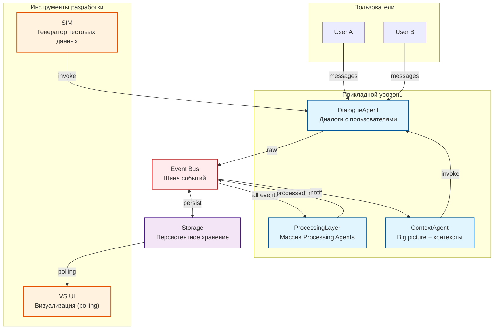

# Архитектура Team Assistant

**Дата:** 2025-01-24
**Статус:** Черновик для обсуждения

---

## 1. Введение

### 1.1 Цель проекта

Сервис коллективной работы на базе AI, где инструмент формируется вокруг естественных коммуникаций, а не человек подстраивается под инструмент.

**Ключевая идея:**
- Каждый участник взаимодействует со своим AI-ассистентом
- Ассистенты обмениваются информацией через общую шину
- Структуры (задачи, сроки, связи) формируются автоматически

### 1.2 Проблема

Существующие инструменты (Trello, task trackers) требуют адаптации к заданным онтологиям. Люди устают от необходимости "жить" в системе и откатываются к примитивным средствам (Google Docs, чаты).

### 1.3 Решение

Инверсия модели: минимальный порог входа через естественный диалог, онтология формируется под команду.

### 1.4 Стратегия разработки

**Сначала:** ядро системы + визуализация для отладки
**Потом:** фронтенд для пользователей (Telegram-бот, приложение)

**Приоритеты на старте:**
- ✅ Проверка гипотезы (< 50 пользователей)
- ✅ **Наблюдаемость** — люди должны видеть что происходит
- ✅ Симуляция для тестирования без реальных пользователей
- ✅ Скорость разработки

---

## 2. Общая архитектура

### 2.1 Схема системы



#### Описание компонентов

**DialogueAgent:**
- Принимает сообщения от пользователей и формирует ответы
- Инициирует диалог сам (по задачам от системы, через ContextAgent.invoke)
- Сигнализирует о завершении диалога (по сообщению или таймауту)
- Публикует фрагменты диалогов в Event Bus с пометкой `raw`

**ProcessingLayer:**
- Содержит массив Processing Agents с общим интерфейсом
- Наблюдает за всеми событиями в Event Bus
- Публикует результаты: `processed` (для других агентов) или `notification` (для пользователей)

**ContextAgent:**
- Отвечает за big picture в целом для группы
- Управляет частными контекстами, привязанными к пользователям
- Подписан на `notification` события
- Принимает решение о доставке через DialogueAgent.invoke

**Event Bus:**
- In-memory pub/sub с персистентностью в Storage
- Топики: `raw`, `processed`, `notification`

### 2.2 Уровни абстракции

**Прикладной уровень:**
- Dialogue & Context Agents — диалоговая система
- Processing Agents — подключаемые модули обработки
- SIM — генератор тестовых данных
- VS UI — визуализация

**Event Bus:**
- Шина событий для коммуникации между модулями
- pub/sub с персистентностью в Storage

**Инфраструктурный уровень:**
- Storage — персистентное хранение всех данных

---

## 3. Детальное описание модулей

### 3.1 Dialogue & Context Agents (диалоговая система)

**Назначение:** Ведение диалогов с пользователями, фиксация фрагментов диалогов для обработки.

#### 3.1.1 DialogueAgent

**Единый инстанс:**
- Один DialogueAgent управляет всеми диалогами одновременно
- Каждый диалог идентифицируется по `user_id`
- Агент хранит состояние активных диалогов в памяти

**Точки активации:**

**1. Входящее сообщение от пользователя — `invoke(user_id, message)`**
- Основной триггер для диалога
- Агент генерирует ответ через LLM
- Сохраняет сообщения в Storage
- Накапливает фрагмент диалога

**2. Проверка таймаутов — `check_timeouts(timeout_minutes, timestamp)`**
- Вызывается периодически внешним scheduler или внутри агента
- Загружает истории всех активных диалогов
- Для каждого диалога проверяет время последней коммуникации
- Если время > `timeout_minutes`:
  - Фиксирует фрагмент диалога
  - Публикует в Event Bus с пометкой `raw`
  - Обновляет состояние буфера диалога для следующей сессии
- Возвращает список диалогов, превышающих таймаут

#### 3.1.2 ContextAgent

**Назначение:** отвечает за big picture в целом для группы, а также более частные контексты, привязанные к пользователям.
принимает сообщения из шины данных, и решает, что и как отправлять пользователю, используя DialogueAgent.

**Поток:**
```
ProcessingAgent → Event Bus: notification (желание что-то сообщить)
    → ContextAgent подписан на notification события
    → ContextAgent видит более широкую картину:
      - Все notification события от разных ProcessingAgents
      - История диалога с пользователем
      - Другие события в шине
    → ContextAgent принимает решение: что доставлять, как формулировать
    → ContextAgent вызывает DialogueAgent.invoke(user_id, message)
```

---

### 3.2 Processing Agents (подключаемые модули)

**Назначение:** Обработка данных из Event Bus, публикация результатов обработки: "processed" 
(для результатов, предназначенных для использования другими агентами) или "notification" - уведомления, 
предназначенные для донесения до пользователей.

**Архитектурные принципы:**
- **Подключаемые через интерфейс** — единый контракт для всех агентов
- Каждый агент имеет свой **state** и **memory** (см. Storage раздел)
- Все используют LLM (SGR Agent Core или другие подходы)
- **Агенты видят узкий контекст** — решают на основе того, что знают

**Интерфейс:**
- `start() / stop()` — lifecycle методы
- `process(message, context) -> ProcessingResult` — обработка события
- `get_state() / save_state()` — управление состоянием (опционально)

**Примеры агентов:**

**TaskManager:**
- Отслеживает задачи и сроки
- Ведет базу задач (создание, обновление, закрытие)
- Публикует notification о приближении сроков

**ContextManager:**
- Отслеживает движение информации между пользователях
- Определяет что из входящих данных может быть полезно конкретному пользователю
- Анализирует контекст каждого пользователя (текущий фокус, роль)
- Публикует notification о релевантной информации

**Развитие системы агентов:**
- Сначала: рамочная система с интерфейсом `IProcessingAgent`
- Когда рамочная система готова: отдельная ветка разработки агентов
- Tech Lead НЕ занимается составом агентов

---

### 3.3 Event Bus

**Назначение:** Шина событий для коммуникации между модулями.

**Реализация:**
- In-memory pub/sub (EventEmitter pattern)
- Персистентность в Storage (все события сохраняются)
- Топики: `raw`, `processed`, `notification`

**Интерфейс:**

```python
class IEventBus(ABC):
    """Шина событий"""

    async def publish(self, topic: Topic, message: BusMessage) -> MessageId:
        """Публикация события"""

    async def subscribe(self, topic: Topic, handler: Handler) -> Subscription:
        """Подписка на события"""

    async def get_history(self, topic: Topic, filter: Filter) -> list[BusMessage]:
        """Чтение истории событий"""
```

**Соотношение с Storage:**
- Event Bus — коммуникация между модулями
- Event Bus использует Storage для сохранения событий

---

### 3.4 Storage

**Назначение:** Персистентное хранение всех данных системы.

**Архитектурный подход:**
- **Универсальный низкоуровневый интерфейс** — IStorage не зависит от бизнес-логики
- **Repository pattern** — бизнес-модули используют типизированные репозитории поверх Storage

**Сущности:**

| Сущность | Описание |
|----------|----------|
| `messages` | Сообщения пользователей (диалоги) |
| `events` | События из Event Bus (для VS UI и replay) |
| `agent_conversations` | Истории диалогов processing agents (SGR) |
| `agent_data` | Рабочие данные для processing agents (например, `tasks`, `notes`) |

**Dev/Prod:**
- Dev: SQLite (файл, ноль деплоя, JSON поддержка)
- Prod: YDB или другое решение (соотв. рос. законодательству)

**ADR:** Будет отдельное решение по выбору БД для продакшена.

---

### 3.5 SIM (Simulation Layer)

**Назначение:** Эмуляция пользователей для тестирования без реальных людей.

**Компоненты:**
- `SIM.profiles` — профили виртуальных пользователей (роль, характер, зона ответственности)
- `SIM.scenario` — события внешнего мира как триггеры
- `SIM.engine` — генератор: профиль + событие → сообщение

**Качество сообщений:**
- ≥ 2-3 конкретных факта (имена, сроки, суммы)
- Эмоциональная окраска или проблема
- ❌ "Обсудили задачу, всё хорошо"
- ✅ "Иван из закупок сообщил об отставании поставки X на 2 недели"

**Интеграция:**
SIM вызывает `DialogueAgent.invoke(user_id, message)` как обычный пользователь.

**Поток данных:**
```
SIM Engine → DialogueAgent.invoke() → ... → Event Bus (raw) → ProcessingAgents
```

---

### 3.6 VS UI (Visualization Service)

**Назначение:** Наглядная визуализация для наблюдаемости.

**Общие рамки:**
- Polling API для получения данных
- Timeline + swimlanes как основные виды
- Agent reasoning traces для отладки

**Детальная архитектура:** См. `00_docs/architecture/visualization.md`

---

## 4. Event Tracking Strategy

### 4.1 Разница между Event Bus и Tracking

**Event Bus:**
- События для коммуникации между модулями
- Пример: фрагмент диалога с пометкой `raw` → для ProcessingAgents
- Сохраняются в Storage для replay

**Event Tracking (наблюдаемость):**
- События для визуализации в VS UI
- Пример: `message_received`, `notification_sent`
- Сохраняются отдельно для timeline

### 4.2 Гибридный подход VS DataSource

**Прямой трекинг** — для событий, которых нет в основном storage:
- `notification_generated`
- `dialogue_fragment_published`

**Извлечение из storage** — для основных данных:
- Messages → конвертируем в timeline events
- Event Bus events → добавляем в timeline
- Agent conversations (agent_conversations) → reasoning traces

### 4.3 Event Tracker

Аналог Amplitude SDK — фиксирует события для визуализации.

**Основные события:**
- `message_received / message_sent`
- `dialogue_fragment_published`
- `notification_generated / notification_sent`

---

## 5. Технологический стек

### 5.1 Backend

| Компонент | Технология | Обоснование |
|-----------|------------|-------------|
| **Язык** | Python | Лучшая экосистема для LLM |
| **Framework** | FastAPI | Async, type hints, auto OpenAPI |
| **LLM Integration** | SGR Agent Core | Schema-Guided Reasoning фреймворк |
| **Storage Dev** | SQLite | Файл, ноль деплоя, JSON поддержка |
| **Storage Prod** | YDB (TBD) | ADR позже |
| **Event Bus** | In-memory + persistence | EventEmitter + Storage |

### 5.2 LLM Provider Layer

Слой с ретраями для rate limits:
```python
class LLMProviderWithRetry:
    async def complete(self, prompt: str) -> str:
        return await self._retry_with_backoff(
            lambda: self.base_provider.complete(prompt)
        )

    async def _retry_with_backoff(self, func):
        # Exponential backoff: 2, 4, 8, 16, 32 сек
        ...
```

**Провайдеры:**
- OpenAI
- Anthropic

### 5.3 Frontend (VS UI)

**Требования:**
- Наглядность
- Простота разработки
- Timeline + swimlanes

**Детали:** См. `00_docs/architecture/visualization.md`

---

## 6. SGR Agent Core Integration

### 6.1 Что такое SGR

**SGR = Schema-Guided Reasoning**

Фреймворк для создания AI-агентов с явным reasoning через structured JSON schemas.

**Цикл агента:**
1. **Reasoning Phase** — LLM структурированно отвечает какой tool вызывать
2. **Select Action Phase** — выбор tool
3. **Action Phase** — выполнение tool

### 6.2 Использование в проекте

**Processing Agents на базе SGR:**
- Reasoning: анализ через LLM
- Action: сохранение/обновление в базе через tool
- Reasoning trace возвращается в `ProcessingResult`

**Conversation storage:**
- SGR хранит conversation в памяти агента
- Наш storage сохраняет для персистентности
- Кто вызывает сохранение — на усмотрение Tech Lead (периодически, после action, при stop)

**Reasoning traces для VS UI:**
- Reasoning phase возвращает структуру
- Сохраняется для визуализации через events.track()
- Где вызывается — внутри process() или через callback — на усмотрение Tech Lead

---

## 7. Ограничения и требования

### 7.1 Технические

- **Масштаб:** < 50 пользователей на MVP
- **Deployment:** Локальная разработка без сложной инфры
- **Data persistence:** SQLite для dev, продакшен — TBD

### 7.2 Бизнес

- **Наблюдаемость** — критично для демонстрации
- **Симуляция** — обязательно для тестов без реальных пользователей
- **LLM costs** — кэширование там где возможно

---

## 8. Потоки данных

### 8.1 От пользователя в систему

```
User → DialogueAgent
    → Storage: сообщения
    → [отсечка] → EventBus (raw: фрагмент диалога)
    → ProcessingAgent
    → EventBus (processed, notification) → Storage
```

### 8.2 От системы к пользователю (уведомления)

```
EventBus (raw/processed) → ProcessingAgent
    → [агент решил: уведомить User-B]
    → EventBus (notification)
    → ContextAgent
    → [принимает решение на основе широкого контекста]
    → DialogueAgent → User-B
```

---

## 9. Принципы разработки

### 9.1 MVP-first

- Простейшая работающая система
- Избегать over-engineering
- Сложность — только когда необходимость доказана

### 9.2 Observability-first

- Каждое действие → событие в timeline
- VS UI показывает "что происходит"
- Reasoning агентов должен быть видим

### 9.3 Порты и адаптеры

```python
# Интерфейсы
class IStorage(ABC): ...
class IEventBus(ABC): ...
class IProcessingAgent(ABC): ...
class ILLMProvider(ABC): ...


```

### 9.4 Интерфейсы для расширения

**Processing Agents:**
- Единый интерфейс `IProcessingAgent`
- Подключение через регистрацию в системе
- State management через Storage
- Когда рамочная система готова — отдельная ветка разработки агентов

---

