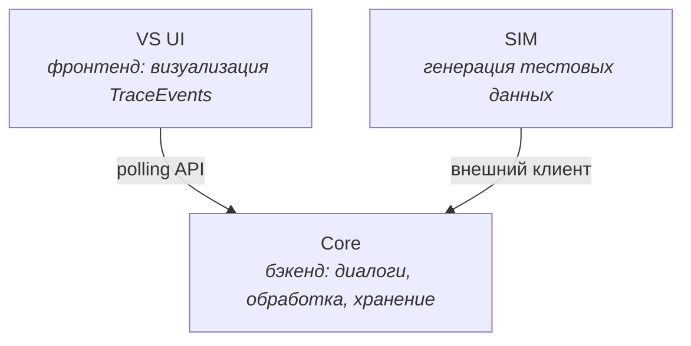
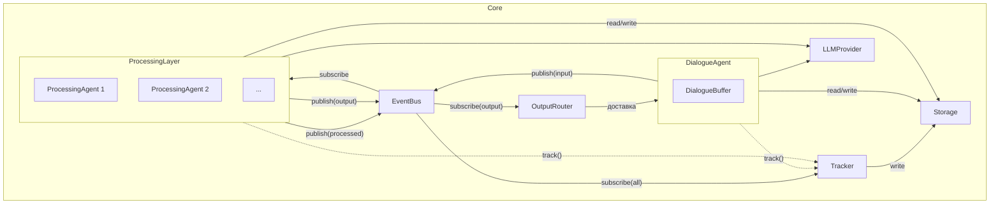
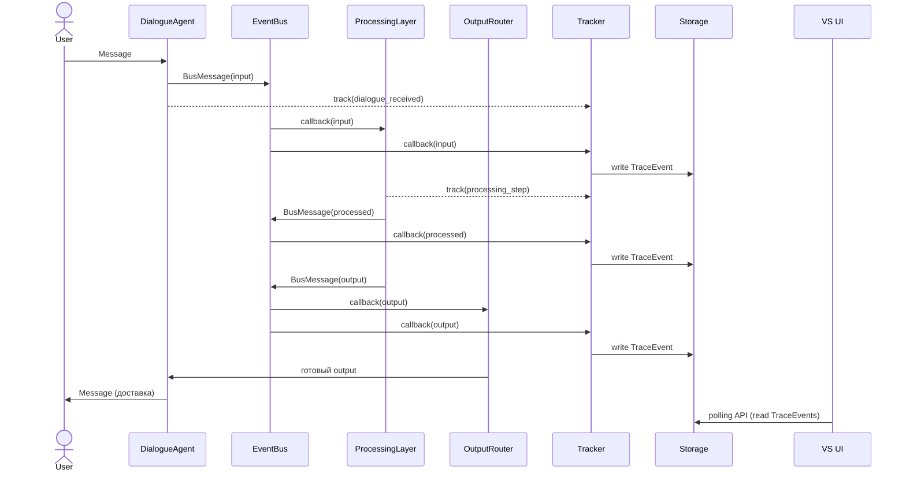

# Core Components — компоненты базового слоя

> Этот документ определяет структурные отношения между понятиями,
> описанными в glossary.md. Здесь фиксируется: что внутри чего,
> кто с кем взаимодействует, и через какие механизмы.
>
> Уровень детализации: ответственности, входы/выходы, зависимости,
> паттерны коммуникации. Сигнатуры интерфейсов и структуры данных —
> в отдельных документах.
>
> **Границы документа:** здесь зафиксирован архитектурный скелет —
> компоненты, без которых система не работает. Реализационные компоненты
> (фабрики, адаптеры, конкретные ProcessingAgents и т.д.) появляются
> на этапе детальной спецификации и не требуют описания на этом уровне.

---

## 1. Верхнеуровневая декомпозиция

Система состоит из трёх независимо развёртываемых частей:

- **Core** — основная логика системы
- **VS UI** — визуализация, получает данные через polling API из Core
- **SIM** — генератор тестовых данных, взаимодействует с Core как внешний клиент

VS UI и SIM не зависят друг от друга. Оба зависят от Core.

---

## 2. Внутренняя структура Core

### Компоненты Core и их ранг

**Компоненты верхнего уровня** (архитектурный скелет):
- DialogueAgent
- EventBus
- ProcessingLayer
- OutputRouter
- Tracker
- Storage
- LLMProvider

**Вложенные** (существуют внутри компонента верхнего уровня):
- DialogueBuffer — внутри DialogueAgent
- ProcessingAgent (конкретные экземпляры) — внутри ProcessingLayer

Конкретные ProcessingAgents (ContextAgent и другие) определяются
на уровне детальной спецификации, а не архитектурного скелета.

---

## 3. Компоненты: ответственности и взаимодействия

### DialogueAgent

**Ответственность:**
Управление всеми Dialogues. Приём Messages от Users, генерация
ответов через LLMProvider, буферизация и публикация в EventBus.
Доставка output-содержимого пользователям (получает от OutputRouter).

**Входы:**
- Messages от Users (внешний вход)
- Готовый к доставке output от OutputRouter

**Выходы:**
- Messages для Users (внешний выход)
- BusMessages с topic: input в EventBus (буферизованный фрагмент диалога)

**Зависимости:**
- LLMProvider — для генерации ответов
- EventBus — для публикации input
- Storage — для персистентности DialogueState
- Tracker — для явной записи TraceEvents

**Внутренняя структура:**
Содержит DialogueBuffer для каждого активного Dialogue.
Buffer накапливает Messages и публикует их как Payload в BusMessage
по таймауту или при завершении смыслового блока.

---

### EventBus

**Ответственность:**
Центральный механизм обмена BusMessages между компонентами.
Pub/sub с push-моделью.

**Входы:**
- BusMessages от любого компонента-публикатора

**Выходы:**
- BusMessages к подписчикам (callback)

**Зависимости:**
- Storage — для персистентности (опционально, решение отложено)

**Паттерн:**
Компоненты подписываются на конкретные Topics. При публикации
BusMessage в Topic, EventBus вызывает callback'и всех подписчиков
этого Topic. Доставка асинхронная.

---

### ProcessingLayer

**Ответственность:**
Управление жизненным циклом ProcessingAgents. Запуск, остановка,
регистрация агентов. Сам не обрабатывает данные — делегирует агентам.

**Входы:**
- Конфигурация (какие агенты запускать)

**Выходы:**
- Нет прямых выходов; агенты внутри публикуют в EventBus самостоятельно

**Зависимости:**
- EventBus — передаёт агентам для подписки и публикации
- Storage — передаёт агентам для доступа к AgentState
- LLMProvider — передаёт агентам при необходимости
- Tracker — передаёт агентам для явной записи TraceEvents

**Внутренняя структура:**
Содержит набор ProcessingAgents. Каждый агент:
- Подписывается на определённые Topics
- Обрабатывает входящие BusMessages
- Публикует результаты (topic: processed или output)
- Хранит своё состояние в AgentState

Агенты работают независимо друг от друга.
Между ними нет прямого взаимодействия — только через EventBus.

---

### OutputRouter

**Ответственность:**
Предобработка output-потока перед доставкой пользователям.
Находится между EventBus (topic: output) и DialogueAgent.

**Входы:**
- BusMessages с topic: output (через подписку на EventBus)

**Выходы:**
- Готовый к доставке output → DialogueAgent

**Зависимости:**
- EventBus — для получения output
- DialogueAgent — для доставки пользователям
- Storage — при необходимости (контекст для принятия решений)
- LLMProvider — при необходимости (переформулирование)

**Функции:**
- Адресация (кому доставить, если output не имеет явного адресата)
- Агрегация (объединение связанных output-сообщений)
- Дедупликация (предотвращение информационного шума)
- Переформулирование (адаптация под контекст получателя)

---

### Tracker

**Ответственность:**
Создание TraceEvents на основе всей активности системы.
Мост между основной логикой и слоем наблюдаемости.

**Два канала получения данных:**

1. **Подписка на EventBus** (пассивный) — автоматически фиксирует
   все BusMessages, проходящие через шину
2. **Прямые вызовы из компонентов** (активный) — компоненты явно
   вызывают Tracker для записи событий, не проходящих через EventBus
   (внутренние состояния, этапы обработки, диагностика).
   По аналогии с Amplitude SDK: в коде в нужных точках размещается
   вызов, фиксирующий событие и связанные с ним данные.

**Выходы:**
- TraceEvents в Storage

**Зависимости:**
- EventBus — для подписки на все Topics
- Storage — для записи TraceEvents

**Ограничение:**
Tracker не фильтрует. Он записывает всё.
Фильтрация — ответственность VS UI.

---

### Storage

**Ответственность:**
Персистентное хранение всех данных системы.

**Хранит:**
- Messages (реплики диалогов)
- DialogueState (состояние диалогов для восстановления)
- AgentState (состояние ProcessingAgents, включая SGR-трейсы)
- TraceEvents (записи наблюдаемости)

**Зависимости:**
- Нет зависимостей от других компонентов Core

**Доступ:**
- Внутри Core: прямой вызов (все компоненты обращаются к Storage)
- Из VS UI: через polling API (Core предоставляет HTTP-эндпоинты)

---

### LLMProvider

**Ответственность:**
Абстракция доступа к языковым моделям. Скрывает детали провайдера,
модели и формата взаимодействия.

**Входы:**
- Запросы от DialogueAgent, ProcessingAgents, OutputRouter

**Выходы:**
- Ответы от LLM

**Зависимости:**
- Внешние LLM API (OpenAI, Anthropic и т.д.)

---

## 4. Потоки данных — сводка

---

## 5. Открытые вопросы

- **Персистентность EventBus:** нужно ли сохранять BusMessages
  в Storage для replay? Или достаточно TraceEvents? Отложено.

- **Инициализация:** порядок запуска компонентов Core и обработка
  зависимостей при старте. Определится в scenarios.md.
