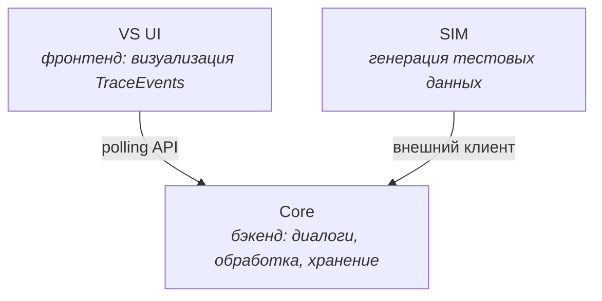
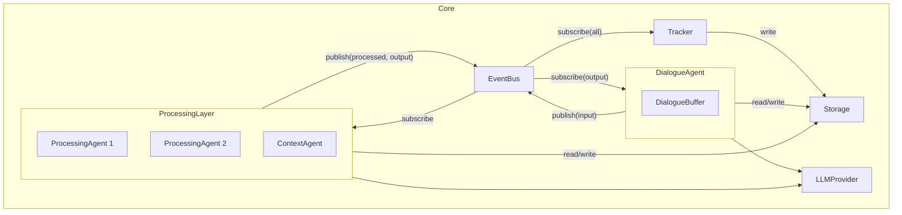
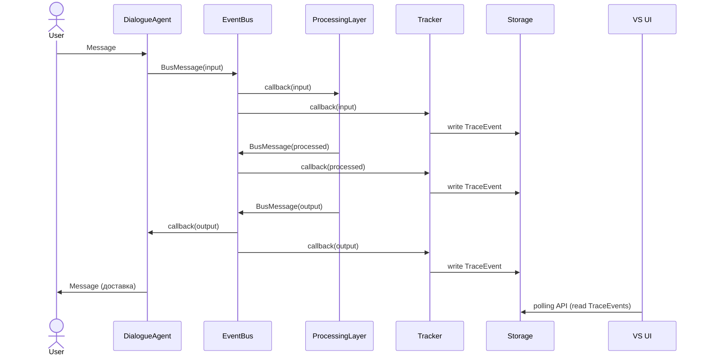

# Core Components — компоненты базового слоя

> Этот документ определяет структурные отношения между понятиями,
> описанными в glossary.md. Здесь фиксируется: что внутри чего,
> кто с кем взаимодействует, и через какие механизмы.
>
> Уровень детализации: ответственности, входы/выходы, зависимости,
> паттерны коммуникации. Сигнатуры интерфейсов и структуры данных —
> в отдельных документах.

---

## 1. Верхнеуровневая декомпозиция

Система состоит из трёх независимо развёртываемых частей:

- **Core** — основная логика системы
- **VS UI** — визуализация, получает данные через polling API из Core
- **SIM** — генератор тестовых данных, взаимодействует с Core как внешний клиент

VS UI и SIM не зависят друг от друга. Оба зависят от Core.

---

## 2. Внутренняя структура Core

### Компоненты Core и их ранг

Не все понятия из глоссария являются компонентами одного уровня.
Ниже — явная иерархия:

**Компоненты верхнего уровня** (самостоятельные единицы внутри Core):
- DialogueAgent
- EventBus
- ProcessingLayer
- Tracker
- Storage
- LLMProvider

**Вложенные компоненты** (существуют внутри компонента верхнего уровня):
- DialogueBuffer — внутри DialogueAgent
- ProcessingAgent (конкретные экземпляры) — внутри ProcessingLayer
- ContextAgent — конкретный ProcessingAgent внутри ProcessingLayer

**Роли** (ответственность, не обязательно отдельный компонент):
- OutputRouter — роль, которую может выполнять ContextAgent,
  отдельный ProcessingAgent или выделенный компонент

---

## 3. Компоненты: ответственности и взаимодействия

### DialogueAgent

**Ответственность:**
Управление всеми Dialogues. Приём Messages от Users, генерация
ответов через LLMProvider, буферизация и публикация в EventBus.
Доставка output-содержимого пользователям.

**Входы:**
- Messages от Users (внешний вход)
- BusMessages с topic: output от EventBus (для доставки пользователям)

**Выходы:**
- Messages для Users (внешний выход)
- BusMessages с topic: input в EventBus (буферизованный фрагмент диалога)

**Зависимости:**
- LLMProvider — для генерации ответов
- EventBus — для публикации input и получения output
- Storage — для персистентности DialogueState

**Внутренняя структура:**
Содержит DialogueBuffer для каждого активного Dialogue.
Buffer накапливает Messages и публикует их как Payload в BusMessage
по таймауту или при завершении смыслового блока.

---

### EventBus

**Ответственность:**
Центральный механизм обмена BusMessages между компонентами.
Pub/sub с push-моделью.

**Входы:**
- BusMessages от любого компонента-публикатора

**Выходы:**
- BusMessages к подписчикам (callback)

**Зависимости:**
- Storage — для персистентности (опционально, решение отложено)

**Паттерн:**
Компоненты подписываются на конкретные Topics. При публикации
BusMessage в Topic, EventBus вызывает callback'и всех подписчиков
этого Topic. Доставка асинхронная.

---

### ProcessingLayer

**Ответственность:**
Управление жизненным циклом ProcessingAgents. Запуск, остановка,
регистрация агентов. Сам не обрабатывает данные — делегирует агентам.

**Входы:**
- Конфигурация (какие агенты запускать)

**Выходы:**
- Нет прямых выходов; агенты внутри публикуют в EventBus самостоятельно

**Зависимости:**
- EventBus — передаёт агентам для подписки и публикации
- Storage — передаёт агентам для доступа к AgentState
- LLMProvider — передаёт агентам при необходимости

**Внутренняя структура:**
Содержит набор ProcessingAgents. Каждый агент:
- Подписывается на определённые Topics
- Обрабатывает входящие BusMessages
- Публикует результаты (topic: processed или output)
- Хранит своё состояние в AgentState

Агенты работают независимо друг от друга.
Между ними нет прямого взаимодействия — только через EventBus.

---

### ContextAgent (конкретный ProcessingAgent)

**Ответственность:**
Формирование и поддержание общей картины по Team.
Потенциально — роль OutputRouter (решение отложено).

**Входы:**
- BusMessages с topic: input и processed (через EventBus)

**Выходы:**
- BusMessages с topic: processed (обновления контекста)
- BusMessages с topic: output (если выполняет роль OutputRouter)

**Зависимости:**
- EventBus, Storage, LLMProvider (через ProcessingLayer)

---

### Tracker

**Ответственность:**
Создание TraceEvents на основе всей активности системы.
Единственный мост между основной логикой и слоем наблюдаемости.

**Входы:**
- Все BusMessages (подписан на все Topics в EventBus)

**Выходы:**
- TraceEvents в Storage

**Зависимости:**
- EventBus — для подписки на все Topics
- Storage — для записи TraceEvents

**Ограничение:**
Tracker не фильтрует. Он записывает всё.
Фильтрация — ответственность VS UI.

---

### Storage

**Ответственность:**
Персистентное хранение всех данных системы.

**Хранит:**
- Messages (реплики диалогов)
- DialogueState (состояние диалогов для восстановления)
- AgentState (состояние ProcessingAgents, включая SGR-трейсы)
- TraceEvents (записи наблюдаемости)

**Зависимости:**
- Нет зависимостей от других компонентов Core

**Доступ:**
- Внутри Core: прямой вызов (все компоненты обращаются к Storage)
- Из VS UI: через polling API (Core предоставляет HTTP-эндпоинты)

---

### LLMProvider

**Ответственность:**
Абстракция доступа к языковым моделям. Скрывает детали провайдера,
модели и формата взаимодействия.

**Входы:**
- Запросы от DialogueAgent и ProcessingAgents

**Выходы:**
- Ответы от LLM

**Зависимости:**
- Внешние LLM API (OpenAI, Anthropic и т.д.)

---

## 4. Потоки данных — сводка

---

## 5. Открытые вопросы

- **OutputRouter:** определён как роль, но не как компонент.
  Реализация (ContextAgent, отдельный агент, или выделенный компонент)
  определится по результатам практики.

- **Персистентность EventBus:** нужно ли сохранять BusMessages
  в Storage для replay? Или достаточно TraceEvents? Отложено.

- **Инициализация:** порядок запуска компонентов Core и обработка
  зависимостей при старте. Определится в scenarios.md.
