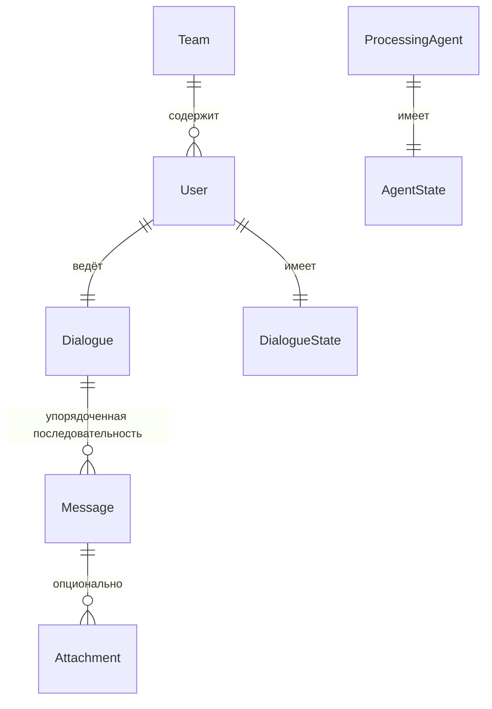

# Data Model — архитектурная модель данных

> Этот документ собирает ключевые сущности системы в единую картину:
> связи между ними, ограничения, разделение на персистентные и транзиентные.
>
> Определения терминов — в glossary.md.
> Ответственности компонентов, работающих с этими сущностями — в components.md.
>
> Уровень детализации: сущности, связи, инварианты.
> Точные схемы хранения и форматы сериализации — решения реализации.

---

## 1. Связи между сущностями

Сущности, не имеющие прямых связей с другими:
- **TraceEvent** — самодостаточная запись; содержит полные данные,
  а не ссылки на другие сущности
- **BusMessage** — транзиентная единица; существует только в момент
  прохождения через EventBus

---

## 2. Сущности

### Team

Группа Users, работающих в общем контексте.

**Содержит:** идентификатор, набор Users.

---

### User

Участник Team, ведущий Dialogue с системой.

**Содержит:** идентификатор, принадлежность к Team.

**Связи:** входит в один Team, имеет один Dialogue, имеет один DialogueState.

---

### Dialogue

Непрерывный диалог между User и AI-ассистентом.

**Содержит:** идентификатор, ссылка на User,
упорядоченная последовательность Messages.

**Инвариант:** один User — один Dialogue.

---

### Message

Одна реплика внутри Dialogue.

**Содержит:** роль (user, assistant, system), текстовое содержимое,
опциональные Attachments, временна́я метка, порядковая позиция в Dialogue.

**Связи:** принадлежит одному Dialogue, может иметь Attachments.

---

### Attachment

Опциональное дополнение к Message.

**Содержит:** тип (файл, изображение, аудио и т.д.), данные или ссылка.

**Связи:** принадлежит одному Message.

---

### DialogueState

Персистентное состояние Dialogue, достаточное для восстановления
DialogueBuffer при перезапуске системы.

**Содержит:** ссылка на User/Dialogue, информация о том,
какие Messages уже опубликованы в EventBus (граница буфера).

**Инвариант:** один User — один DialogueState.

---

### AgentState

Персистентное состояние ProcessingAgent.

**Содержит:** идентификатор агента, key-value данные,
SGR-трейсы (логи рассуждений) в формате JSON.

**Инвариант:** каждый агент хранит состояние изолированно;
агенты не имеют доступа к состоянию друг друга.

---

### BusMessage

Единица межкомпонентной коммуникации в EventBus.

**Содержит:** Topic (input / processed / output),
типизированный Payload, метаданные (id, timestamp, source).

**Транзиентная сущность:** существует в памяти,
потребляется подписчиками и не сохраняется.

**Payload варьируется по Topic:**
- input — фрагмент диалога (Messages из буфера)
- processed — результат обработки (структура зависит от агента)
- output — содержимое для доставки пользователю

---

### TraceEvent

Единичная запись наблюдаемости.

**Содержит:** тип события, временна́я метка, актор (кто породил),
данные для отображения (полные, не ссылки).

**Самодостаточность:** TraceEvent содержит всю информацию,
необходимую для отображения в VS UI. Tracker вкладывает
полные данные (текст сообщений, SGR-трейсы, содержимое output),
а не идентификаторы для последующего разрешения.

**Append-only:** TraceEvents только добавляются, не модифицируются.

---

## 3. Персистентность

| Сущность | Хранение | Примечание |
|----------|----------|------------|
| Team, User | Storage (SQLite) | Конфигурационные данные |
| Message | Storage | Все реплики всех Dialogues |
| Attachment | Storage | Данные или ссылки |
| DialogueState | Storage | Для восстановления буфера |
| AgentState | Storage | Для восстановления агентов |
| TraceEvent | Storage | Append-only, для VS UI |
| BusMessage | В памяти | Не сохраняется; потребляется и исчезает |
| DialogueBuffer | В памяти | Восстанавливается из Messages + DialogueState |
| Подписки EventBus | В памяти | Пересоздаются при bootstrap |

---

## 4. Ключевые инварианты

- Один User принадлежит одному Team
- Один User имеет один Dialogue и один DialogueState
- Messages внутри Dialogue упорядочены
- AgentState изолирован: агенты не разделяют состояние
- TraceEvents — append-only, самодостаточны (полные данные, не ссылки)
- BusMessages транзиентны — после потребления подписчиками не существуют

---

## 5. Открытые вопросы

- **Персистентность BusMessages.** Нужен ли replay BusMessages
  для восстановления после сбоя? Или достаточно DialogueState + AgentState?
  (Вопрос поднят в components.md, раздел 5.)

- **Ротация TraceEvents.** TraceEvents содержат полные данные,
  объём растёт. Нужна ли ротация или временно́е окно для MVP?
  (Вопрос поднят в visualization/overview.md, раздел 7.)
