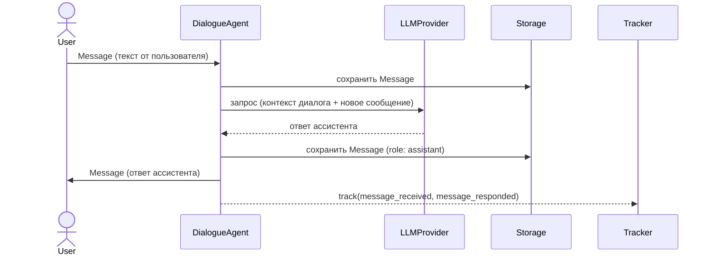
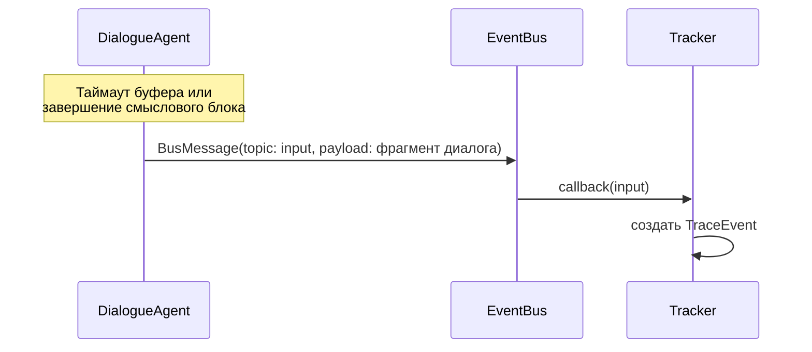
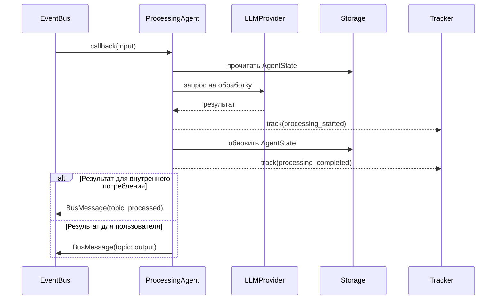
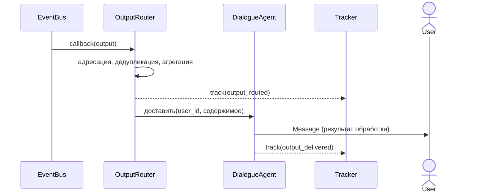
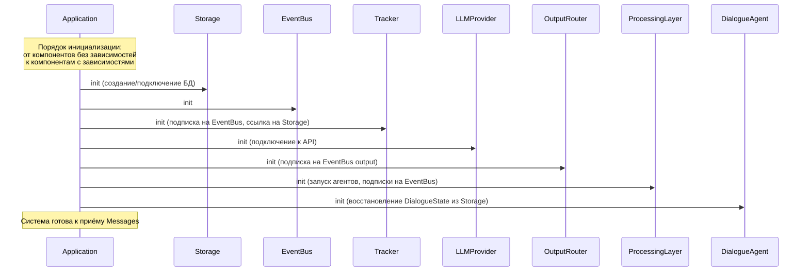
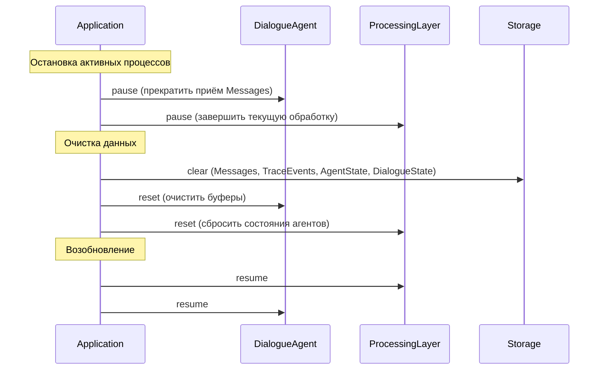
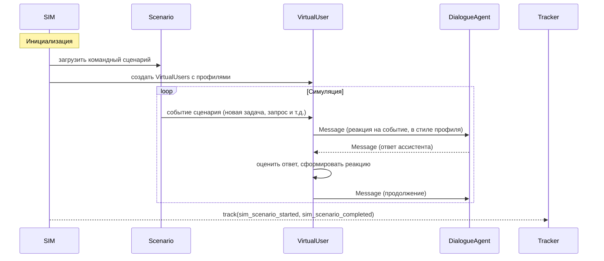

# Core Scenarios — ключевые сценарии

> Этот документ описывает, как компоненты из components.md работают вместе
> в реальных ситуациях. Каждый сценарий — это поток данных от начала до конца.
>
> Уровень детализации: последовательность шагов, какие компоненты участвуют,
> что передаётся между ними. Конкретные структуры данных — в data_model.md.

---

## Сценарий A: Основной поток

Пользователь отправляет сообщение, система обрабатывает его
и доставляет результат обратно пользователю (или другим пользователям).

### Фазы

Поток разбит на четыре фазы. Каждая фаза может происходить
с временны́м зазором относительно предыдущей.

#### Фаза 1: Приём и ответ

**Что происходит:**
- DialogueAgent принимает Message от User
- Сохраняет его в Storage (таблица Messages)
- Отправляет контекст диалога в LLMProvider, получает ответ
- Сохраняет ответ, отправляет User
- Добавляет Message в DialogueBuffer
- Tracker фиксирует факт приёма и ответа (прямой вызов)

**Примечание:** ответ пользователю происходит сразу. Публикация
в EventBus и обработка — асинхронно, в следующей фазе.

#### Фаза 2: Публикация в шину

**Что происходит:**
- DialogueBuffer накопил достаточно Messages (или сработал таймаут)
- DialogueAgent публикует BusMessage с topic: input
- Payload содержит фрагмент диалога (последние Messages)
- Tracker автоматически фиксирует через подписку на EventBus

**Зачем буферизация:**
Не каждое отдельное Message имеет смысл обрабатывать.
Буфер позволяет отправить на обработку осмысленный фрагмент,
а не обрывок (например, "Привет" + "Как дела" + реальный запрос).

#### Фаза 3: Обработка

**Что происходит:**
- ProcessingAgents получают BusMessage(input) через подписку
- Каждый агент обрабатывает независимо
- Агент может использовать LLMProvider и свой AgentState
- Результат публикуется в EventBus: topic: processed (для других агентов)
  или topic: output (для доставки пользователю)
- Tracker фиксирует этапы обработки через прямые вызовы

**Примечание:** несколько ProcessingAgents могут обрабатывать
один и тот же input параллельно и независимо.

#### Фаза 4: Доставка output

**Что происходит:**
- OutputRouter получает BusMessage(output) через подписку
- Определяет: кому, когда, в какой форме доставить
- Передаёт готовый результат DialogueAgent
- DialogueAgent доставляет пользователю как Message

---

## Сценарий B: Жизненный цикл системы

**Модель исполнения:** Core — это long-running process.
Система запускается, находится в памяти, удерживает состояние
(EventBus, DialogueBuffers, подписки) и обрабатывает входящие
Messages в реальном времени. Это не serverless-архитектура —
компоненты живут в едином процессе и взаимодействуют в памяти.

### B1: Bootstrap (запуск)

**Порядок определяется зависимостями:**
1. Storage — не зависит ни от чего
2. EventBus — не зависит (или зависит от Storage, если персистентный)
3. Tracker — зависит от EventBus + Storage
4. LLMProvider — не зависит от внутренних компонентов
5. OutputRouter — зависит от EventBus
6. ProcessingLayer — зависит от EventBus, Storage, LLMProvider
7. DialogueAgent — зависит от всего; восстанавливает буферы из DialogueState

### B2: Reset (сброс данных между тестами)

**Зачем нужен Reset:**
При тестировании через SIM данные предыдущих запусков
загрязняют результаты. Reset позволяет начать с чистого состояния
без перезапуска всей системы.

### B3: Shutdown (остановка)

Обратный порядок относительно Bootstrap:
1. DialogueAgent — прекратить приём, сохранить DialogueState
2. ProcessingLayer — дождаться завершения текущей обработки, остановить агентов
3. OutputRouter — завершить доставку
4. Tracker — записать оставшиеся TraceEvents
5. EventBus — остановить
6. LLMProvider — закрыть соединения
7. Storage — закрыть соединение с БД

---

## Сценарий C: SIM-симуляция

### Проблема

Генерация тестовых данных через AI часто приводит к выхолощенным
диалогам: формально корректным, но без осмысленного содержания.
SIM должен порождать диалоги, по содержательности неотличимые
от реальных.

### Два уровня SIM

SIM оперирует на двух уровнях:

**Profile (индивидуальный)** — характеристики отдельного VirtualUser:
- Роль в команде (разработчик, менеджер, дизайнер...)
- Стиль коммуникации (краткий/развёрнутый, формальный/неформальный)
- Индивидуальные паттерны поведения (реакция на задачи, на вопросы)
- Профили могут строиться на основе реальных рабочих чатов

**Scenario (командный)** — поток событий, в котором живёт вся команда:
- Кто-то направил запрос, руководитель поставил задачу,
  подготовили документ, направили на согласование, получили отказ...
- Scenario определяет **что происходит**, Profiles определяют
  **как каждый участник реагирует**
- Один Scenario — несколько VirtualUsers, каждый со своим Profile

### Поток

**Ключевые принципы SIM:**

1. **Прозрачность для системы.** DialogueAgent не знает, что общается
   с VirtualUser. Сообщения проходят тот же путь, что и от реального User.

2. **Осмысленность через двухуровневую модель.** Scenario обеспечивает
   содержательный контекст (что происходит в команде), Profile обеспечивает
   реалистичное поведение (как именно этот человек реагирует).

3. **SIM управляет извне.** SIM запускает и останавливает VirtualUsers,
   задаёт сценарии, управляет темпом. Core не зависит от SIM.

---

## Сквозной аспект: Observability

Observability не является отдельным сценарием — это аспект,
присутствующий во всех сценариях.

**Два канала TraceEvents** (как описано в components.md):

| Канал | Когда | Пример |
|-------|-------|--------|
| EventBus → Tracker (пассивный) | Каждый BusMessage в шине | BusMessage(input) опубликован |
| Компонент → Tracker (активный) | Значимый внутренний момент | Начало обработки агентом, ответ LLM получен |

**Путь к VS UI:**
TraceEvents → Storage → polling API → VS UI → отображение
в выбранном представлении (Timeline, диалоги, рассуждения агентов).
