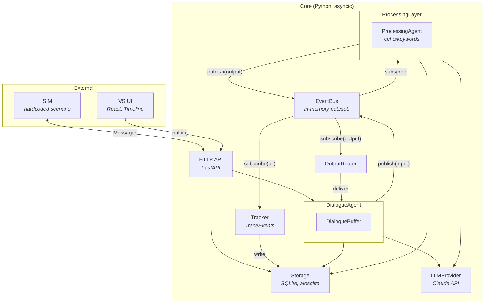
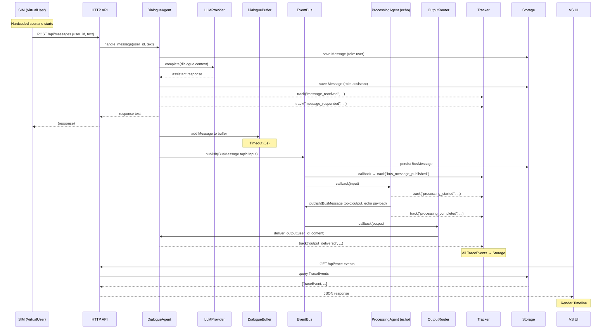
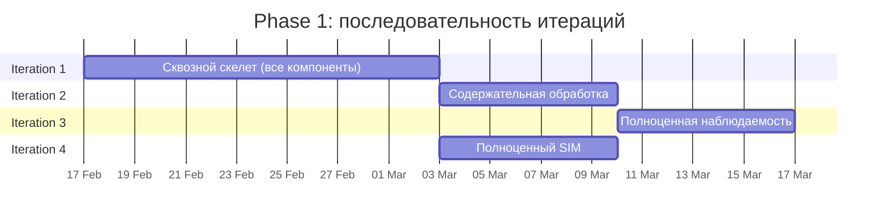

# Implementation Plan: Team Assistant — Phase 1

## Цель

Построить работающий прототип системы Team Assistant, в котором
данные проходят полный цикл от входа (SIM) до выхода (VS UI Timeline).
Phase 1 покрывает Core + наблюдаемость: базовый слой (Dialogue management,
Communication, Processing, Persistence) и слой визуализации (VS UI, Tracker).

Результат Phase 1: запускаем SIM, видим в VS UI Timeline как сообщения
проходят полный цикл от входа до выхода через все компоненты системы.

## Технологические решения

| Область | Технология | Обоснование |
|---------|-----------|-------------|
| Core + SIM | Python 3.12+ (asyncio) | AI/LLM-проект, богатая экосистема для LLM, async для pub/sub |
| VS UI | TypeScript + React + Vite | Стандартный стек для веб-визуализации |
| HTTP API | FastAPI | Асинхронный, лёгкий, автодокументация OpenAPI |
| Storage | SQLite через aiosqlite | Указано в архитектуре (MVP) |
| LLM | Anthropic Claude API | Основной провайдер для MVP |
| Тестирование | pytest + pytest-asyncio | Стандарт для async Python |

### Структура проекта

```
02_src/
├── core/                    # Core backend (Python)
│   ├── models/             # Dataclasses: Message, BusMessage, TraceEvent и т.д.
│   ├── storage/            # SQLite Storage implementation
│   ├── event_bus/          # EventBus pub/sub
│   ├── tracker/            # Tracker (TraceEvents)
│   ├── llm/               # LLMProvider
│   ├── dialogue/           # DialogueAgent + DialogueBuffer
│   ├── processing/         # ProcessingLayer + agents
│   ├── output_router/      # OutputRouter
│   ├── api/               # FastAPI HTTP API
│   └── app.py             # Application bootstrap
├── sim/                    # SIM module (Python)
│   └── sim.py             # Hardcoded scenario runner
└── vs_ui/                  # VS UI frontend (TypeScript/React)
    └── src/
        ├── api/           # Polling client
        └── views/         # Timeline и другие представления
```

---

## Обзор модулей

### Архитектурная схема



### Описание модулей

**Storage**
- Назначение: персистентное хранение всех данных системы (SQLite)
- Зависимости: нет
- Предоставляет: CRUD для Messages, DialogueState, AgentState, TraceEvents, BusMessages

**EventBus**
- Назначение: in-memory pub/sub для обмена BusMessages между компонентами
- Зависимости: Storage (для персистентности BusMessages)
- Предоставляет: publish/subscribe по Topics (input, processed, output)

**Tracker**
- Назначение: создание TraceEvents, мост между логикой и наблюдаемостью
- Зависимости: EventBus (подписка на все Topics), Storage (запись TraceEvents)
- Предоставляет: метод track() для явной записи событий из компонентов

**LLMProvider**
- Назначение: абстракция доступа к LLM (Claude API)
- Зависимости: внешний API Anthropic
- Предоставляет: метод complete() для генерации ответов

**DialogueAgent**
- Назначение: управление Dialogues, приём/ответ Messages, буферизация, публикация в EventBus
- Зависимости: LLMProvider, EventBus, Storage, Tracker
- Предоставляет: handle_message(), deliver_output()
- Содержит: DialogueBuffer (вычисляемый подмассив Messages)

**ProcessingLayer + ProcessingAgent**
- Назначение: управление жизненным циклом ProcessingAgents
- Зависимости: EventBus, Storage, LLMProvider, Tracker
- В Iteration 1: один ProcessingAgent (echo/keyword extraction)

**OutputRouter**
- Назначение: предобработка output перед доставкой пользователям
- Зависимости: EventBus (подписка на output), DialogueAgent (доставка)
- В Iteration 1: прямая пересылка без логики

**HTTP API**
- Назначение: интерфейс для VS UI и SIM
- Зависимости: Storage (чтение TraceEvents), DialogueAgent (Messaging), Application (Control)
- Предоставляет: REST эндпоинты

**SIM**
- Назначение: генерация тестовых данных через VirtualUsers
- Зависимости: HTTP API (как внешний клиент)
- В Iteration 1: hardcoded сценарий, 2-3 VirtualUsers

**VS UI**
- Назначение: веб-интерфейс для наблюдения за системой
- Зависимости: HTTP API (polling TraceEvents)
- В Iteration 1: только Timeline view

---

## Iteration 1: Сквозной скелет

**Цель:** Все компоненты связаны, данные текут от SIM через Core до VS UI Timeline.
Запускаем SIM — видим в VS UI полный цикл прохождения сообщений.

**Это ОДИН блок разработки** (одна задача для команды analyst-developer-reviewer).
Разделение на части создаст проблемы стыковки. Скелет собирается
одной командой для бесшовности прохождения данных.

### Модели данных

```python
from dataclasses import dataclass, field
from datetime import datetime
from enum import Enum
from typing import Literal


class Topic(str, Enum):
    INPUT = "input"
    PROCESSED = "processed"
    OUTPUT = "output"


@dataclass
class Team:
    id: str
    name: str


@dataclass
class User:
    id: str
    team_id: str
    name: str


@dataclass
class Attachment:
    id: str
    message_id: str
    type: str            # "file", "image", "audio"
    data: bytes | None = None
    url: str | None = None


@dataclass
class Message:
    id: str
    dialogue_id: str
    role: Literal["user", "assistant", "system"]
    content: str
    timestamp: datetime
    attachments: list[Attachment] = field(default_factory=list)


@dataclass
class DialogueState:
    user_id: str
    dialogue_id: str
    last_published_timestamp: datetime | None = None


@dataclass
class AgentState:
    agent_id: str
    data: dict                                      # key-value
    sgr_traces: list[dict] = field(default_factory=list)


@dataclass
class BusMessage:
    id: str
    topic: Topic
    payload: dict       # varies by topic
    source: str         # component that published
    timestamp: datetime


@dataclass
class TraceEvent:
    id: str
    event_type: str     # e.g. "message_received", "bus_published", "processing_started"
    actor: str          # who created this event
    data: dict          # full self-contained data for display
    timestamp: datetime
```

### Интерфейсы компонентов

#### Storage

```python
from typing import Protocol


class IStorage(Protocol):
    """Персистентное хранение всех данных системы (SQLite)."""

    async def init(self) -> None: ...
    async def close(self) -> None: ...

    # Messages
    async def save_message(self, message: Message) -> None: ...
    async def get_messages(
        self, dialogue_id: str, after: datetime | None = None
    ) -> list[Message]: ...

    # DialogueState
    async def save_dialogue_state(self, state: DialogueState) -> None: ...
    async def get_dialogue_state(self, user_id: str) -> DialogueState | None: ...

    # AgentState
    async def save_agent_state(self, agent_id: str, state: AgentState) -> None: ...
    async def get_agent_state(self, agent_id: str) -> AgentState | None: ...

    # TraceEvents
    async def save_trace_event(self, event: TraceEvent) -> None: ...
    async def get_trace_events(
        self,
        after: datetime | None = None,
        event_types: list[str] | None = None,
        actor: str | None = None,
        limit: int = 100,
    ) -> list[TraceEvent]: ...

    # BusMessages
    async def save_bus_message(self, message: BusMessage) -> None: ...

    # Users / Teams
    async def save_team(self, team: Team) -> None: ...
    async def save_user(self, user: User) -> None: ...
    async def get_user(self, user_id: str) -> User | None: ...

    # Lifecycle
    async def clear(self) -> None: ...
```

#### EventBus

```python
from typing import Callable, Awaitable

TopicHandler = Callable[[BusMessage], Awaitable[None]]


class IEventBus(Protocol):
    """In-memory pub/sub для обмена BusMessages."""

    def subscribe(self, topic: Topic, handler: TopicHandler) -> None: ...
    async def publish(self, message: BusMessage) -> None:
        """Публикует BusMessage: вызывает callback'и подписчиков,
        персистирует через Storage."""
        ...
```

#### Tracker

```python
class ITracker(Protocol):
    """Создание TraceEvents. Два канала: подписка на EventBus + прямые вызовы."""

    async def track(self, event_type: str, actor: str, data: dict) -> None:
        """Создаёт TraceEvent и сохраняет в Storage.
        data должен содержать ПОЛНЫЕ данные для отображения в VS UI."""
        ...
```

#### LLMProvider

```python
class ILLMProvider(Protocol):
    """Абстракция доступа к LLM."""

    async def complete(
        self,
        messages: list[dict],   # [{"role": "user", "content": "..."}]
        system: str | None = None,
        max_tokens: int = 1024,
    ) -> str: ...
```

#### DialogueAgent

```python
class IDialogueAgent(Protocol):
    """Управление всеми Dialogues."""

    async def handle_message(self, user_id: str, text: str) -> str:
        """Принимает Message от User, генерирует ответ через LLM,
        сохраняет оба в Storage, добавляет в DialogueBuffer.
        Возвращает текст ответа."""
        ...

    async def deliver_output(self, user_id: str, content: str) -> None:
        """Доставляет output от OutputRouter пользователю.
        Сохраняет как system Message."""
        ...

    async def start(self) -> None:
        """Восстанавливает DialogueState из Storage."""
        ...

    async def stop(self) -> None:
        """Сохраняет DialogueState, прекращает приём."""
        ...
```

#### ProcessingAgent

```python
class IProcessingAgent(Protocol):
    """Один агент обработки."""

    @property
    def agent_id(self) -> str: ...

    async def start(self) -> None:
        """Подписывается на нужные Topics в EventBus."""
        ...

    async def stop(self) -> None: ...
```

#### ProcessingLayer

```python
class IProcessingLayer(Protocol):
    """Управление жизненным циклом ProcessingAgents."""

    async def start(self) -> None:
        """Запускает все зарегистрированные агенты."""
        ...

    async def stop(self) -> None:
        """Останавливает все агенты."""
        ...

    def register_agent(self, agent: IProcessingAgent) -> None: ...
```

#### OutputRouter

```python
class IOutputRouter(Protocol):
    """Предобработка output перед доставкой."""

    async def start(self) -> None:
        """Подписывается на EventBus topic: output."""
        ...

    async def stop(self) -> None: ...
```

#### Application

```python
class IApplication(Protocol):
    """Bootstrap и lifecycle."""

    async def start(self) -> None:
        """Инициализация в порядке зависимостей:
        Storage → EventBus → Tracker → LLMProvider →
        OutputRouter → ProcessingLayer → DialogueAgent → HTTP API."""
        ...

    async def stop(self) -> None:
        """Обратный порядок."""
        ...

    async def reset(self) -> None:
        """Сброс данных между тестовыми запусками."""
        ...
```

#### HTTP API

```
Messaging:
  POST /api/messages
    Body: { "user_id": str, "text": str }
    Response: { "response": str }

Observability:
  GET /api/trace-events?after=<iso-timestamp>&limit=<n>&event_type=<type>&actor=<actor>
    Response: [ TraceEvent, ... ]

Control:
  POST /api/control/reset
    Response: { "status": "ok" }
  POST /api/control/sim/start
    Response: { "status": "ok" }
  POST /api/control/sim/stop
    Response: { "status": "ok" }
```

### Стратегия моков для Iteration 1

Iteration 1 реализует все компоненты, но в **минимальной** версии:

| Компонент | Минимальная реализация | Что отложено |
|-----------|----------------------|-------------|
| Storage | SQLite, полная схема для всех сущностей | Ротация TraceEvents, TTL для BusMessages |
| EventBus | In-memory pub/sub + persist BusMessages | Гарантии доставки, retry |
| Tracker | Подписка на EventBus + track() | Связи между TraceEvents (correlation_id) |
| LLMProvider | Anthropic Claude, один провайдер | Мультипровайдерность, fallback |
| DialogueAgent | Приём, ответ через LLM, буфер по таймауту | Распознавание смысловых блоков |
| ProcessingAgent | Один агент: echo (возвращает input как output) | Осмысленная обработка |
| OutputRouter | Прямая пересылка (passthrough) | Адресация, агрегация, дедупликация |
| SIM | Hardcoded сценарий, 2-3 VirtualUsers, фиксированные Messages | Profile + Scenario модель |
| VS UI | Timeline view, polling | Swimlanes, Dialogues, Agent Reasoning |
| HTTP API | Все эндпоинты из таблицы выше | Пагинация, аутентификация |

**DialogueBuffer:** реализуется по таймауту (например, 5 секунд неактивности).
Смысловое распознавание блоков — отложено.

**ProcessingAgent (echo):** подписывается на topic: input,
публикует topic: output с содержимым `"Echo: <original payload summary>"`.
Цель — проверить, что данные проходят полный цикл, не делать осмысленную обработку.

### Визуализация потока данных в Iteration 1



### Внутренний порядок реализации

Хотя Iteration 1 — один блок, внутри него рекомендуется следующий порядок:

1. **Models** — все dataclasses из раздела "Модели данных"
2. **Storage** — SQLite схема и CRUD для всех сущностей
3. **EventBus** — in-memory pub/sub + персистентность через Storage
4. **Tracker** — подписка на EventBus + track()
5. **LLMProvider** — адаптер для Claude API
6. **DialogueAgent + DialogueBuffer** — приём, ответ, буферизация, публикация
7. **ProcessingAgent (echo)** — подписка на input, публикация output
8. **OutputRouter** — подписка на output, пересылка в DialogueAgent
9. **Application** — bootstrap, shutdown, reset
10. **HTTP API** — FastAPI эндпоинты (Messaging, Observability, Control)
11. **SIM** — hardcoded сценарий, 2-3 VirtualUsers
12. **VS UI** — React app, polling client, Timeline view
13. **Интеграционный тест** — запуск SIM, проверка TraceEvents в VS UI

### Критерии готовности Iteration 1

- [ ] Все компоненты Core запускаются и связаны (Application bootstrap)
- [ ] SIM отправляет Messages через HTTP API
- [ ] DialogueAgent принимает Messages, отвечает через LLM, буферизует
- [ ] DialogueBuffer публикует в EventBus по таймауту
- [ ] ProcessingAgent (echo) получает input, публикует output
- [ ] OutputRouter пересылает output в DialogueAgent
- [ ] DialogueAgent доставляет output пользователю
- [ ] Tracker записывает TraceEvents через оба канала (EventBus + track())
- [ ] VS UI отображает Timeline с TraceEvents
- [ ] HTTP API возвращает TraceEvents по polling
- [ ] Reset работает: очистка данных между тестовыми запусками
- [ ] Unit-тесты для каждого компонента
- [ ] Интеграционный тест: SIM → Core → VS UI (end-to-end)

---

## Iteration 2: Содержательная обработка

**Цель:** Заменить echo-агент на ProcessingAgent с осмысленной логикой.
Система не просто прогоняет данные, а извлекает полезную информацию.

**Модули для реализации:**
1. ProcessingAgent: извлечение задач (TaskExtractor)
2. ProcessingAgent: анализ контекста (ContextAnalyzer) — опционально
3. Обновление OutputRouter: доставка результатов обработки конкретным адресатам

**Интерфейсы:**

```python
class TaskExtractorAgent(IProcessingAgent):
    """Подписывается на topic: input.
    Извлекает задачи из фрагмента диалога через LLM.
    Публикует topic: output с извлечёнными задачами."""

    agent_id = "task_extractor"

    async def handle_input(self, bus_message: BusMessage) -> None:
        # 1. Прочитать AgentState (контекст предыдущих извлечений)
        # 2. Отправить payload + контекст в LLM
        # 3. Получить структурированный ответ (список задач)
        # 4. Обновить AgentState
        # 5. Публиковать BusMessage(topic: output)
        # 6. Track каждый шаг
        ...
```

**Стратегия моков:**
- LLMProvider — реальный (Claude API), не мок
- Storage — реальный SQLite
- EventBus — реальный

**Критерии готовности:**
- [ ] TaskExtractor извлекает задачи из диалогов
- [ ] Результаты обработки видны в VS UI Timeline
- [ ] AgentState сохраняет контекст между обработками
- [ ] SGR-трейсы (рассуждения агента) записываются

---

## Iteration 3: Полноценная наблюдаемость

**Цель:** VS UI отображает все четыре представления:
Timeline (уже есть), Swimlanes, Dialogues, Agent Reasoning.

**Модули для реализации:**
1. VS UI: Swimlanes view (группировка TraceEvents по акторам)
2. VS UI: Dialogues view (просмотр конкретных диалогов)
3. VS UI: Agent Reasoning view (SGR-трейсы из AgentState)
4. HTTP API: расширение фильтрации TraceEvents (по actor, по event_type)

**Интерфейсы:**

```
Расширение HTTP API:

GET /api/trace-events?actor=<actor_id>
  → TraceEvents filtered by actor (для Swimlanes)

GET /api/trace-events?event_type=message_received,message_responded&actor=user:<user_id>
  → TraceEvents для конкретного диалога (для Dialogues view)

GET /api/trace-events?event_type=processing_completed
  → TraceEvents с SGR-трейсами (для Agent Reasoning view)
```

**Стратегия моков:**
- Backend — реальный, без моков
- Данные для отладки VS UI: SIM + TaskExtractor из Iteration 2

**Зависимости:** Iteration 2 (нужны SGR-трейсы от реальных ProcessingAgents
для Agent Reasoning view).

**Критерии готовности:**
- [ ] Swimlanes отображает TraceEvents по акторам
- [ ] Dialogues показывает конкретные диалоги User ↔ Assistant
- [ ] Agent Reasoning показывает SGR-трейсы ProcessingAgents
- [ ] Фильтрация по типу и актору работает в API и в VS UI

---

## Iteration 4: Полноценный SIM

**Цель:** SIM генерирует реалистичные диалоги через двухуровневую модель
(Profile + Scenario), а не через hardcoded Messages.

**Модули для реализации:**
1. SIM: Profile model (характеристики VirtualUser)
2. SIM: Scenario model (поток событий для команды)
3. SIM: VirtualUser engine (генерация Messages по Profile + Scenario через LLM)
4. SIM: конфигурация через файлы (JSON/YAML)

**Интерфейсы:**

```python
@dataclass
class VirtualUserProfile:
    """Профиль VirtualUser."""
    user_id: str
    name: str
    role: str                   # "developer", "manager", "designer"
    communication_style: str    # "brief", "detailed", "formal", "informal"
    behavior_patterns: dict     # domain-specific patterns


@dataclass
class ScenarioEvent:
    """Одно событие в сценарии."""
    description: str            # "Руководитель ставит задачу"
    target_users: list[str]     # user_ids кому адресовано
    delay_seconds: float        # задержка перед событием


@dataclass
class Scenario:
    """Командный сценарий."""
    name: str
    team: Team
    events: list[ScenarioEvent]


class ISim(Protocol):
    async def load_scenario(self, path: str) -> None: ...
    async def start(self) -> None: ...
    async def stop(self) -> None: ...
    async def pause(self) -> None: ...
    async def resume(self) -> None: ...
```

**Стратегия моков:**
- LLMProvider — реальный (для генерации сообщений VirtualUsers)
- Всё остальное — реальное

**Критерии готовности:**
- [ ] VirtualUsers генерируют Messages через LLM на основе Profile
- [ ] Scenario управляет потоком событий
- [ ] Диалоги содержательны (не "Lorem ipsum")
- [ ] Конфигурация через JSON/YAML файлы
- [ ] TraceEvents от SIM видны в VS UI

---

## Критический путь



**Критическая цепочка:**
1. **Iteration 1** (скелет) — блокирует всё остальное
2. **Iteration 2** (обработка) → **Iteration 3** (наблюдаемость) — последовательно,
   т.к. для Agent Reasoning нужны SGR-трейсы от реальных ProcessingAgents

**Параллельные работы:**
- **Iteration 4** (SIM) может выполняться параллельно с Iteration 2 и 3,
  т.к. не зависит от содержательной обработки

---

## Типы TraceEvents

Каждый TraceEvent имеет `event_type`, определяющий его семантику.
VS UI использует `event_type` для распределения по представлениям.

| event_type | Актор | Данные | VS UI views |
|-----------|-------|--------|------------|
| `message_received` | `dialogue_agent` | user_id, dialogue_id, message text | Timeline, Dialogues |
| `message_responded` | `dialogue_agent` | user_id, dialogue_id, response text | Timeline, Dialogues |
| `buffer_published` | `dialogue_agent` | user_id, dialogue_id, message_count | Timeline |
| `bus_message_published` | `event_bus` | topic, source, payload summary | Timeline, Swimlanes |
| `processing_started` | `agent:<agent_id>` | agent_id, input summary | Timeline, Swimlanes, Agent Reasoning |
| `processing_completed` | `agent:<agent_id>` | agent_id, output summary, sgr_trace | Timeline, Swimlanes, Agent Reasoning |
| `output_routed` | `output_router` | target user_id, content summary | Timeline, Swimlanes |
| `output_delivered` | `dialogue_agent` | user_id, content | Timeline, Dialogues |
| `sim_started` | `sim` | scenario name, user count | Timeline |
| `sim_completed` | `sim` | scenario name, message count | Timeline |

**Принцип:** `data` в каждом TraceEvent содержит **полные данные**,
а не ссылки. VS UI не обращается к другим сущностям Storage.

---

## Стратегия наблюдаемости

**Логирование (Python logging):**
- Структурированные логи (JSON формат)
- Уровни: DEBUG, INFO, WARN, ERROR
- Каждый компонент логирует входы/выходы

**TraceEvents (основной механизм наблюдаемости):**
- Tracker записывает ВСЕ события без фильтрации
- Два канала: подписка на EventBus (автоматически) + track() (явно из компонентов)
- VS UI фильтрует на стороне клиента

**Метрики (отложено до production):**
- Время обработки, количество Messages, ошибки — не в MVP
