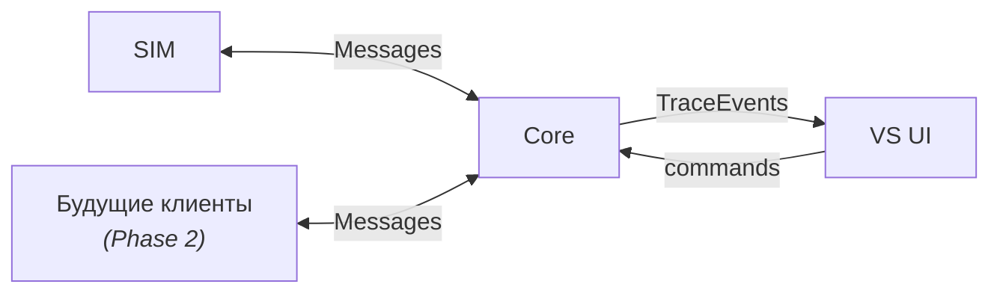

# Interfaces — интерфейсы на границе Core

> Этот документ описывает интерфейсы на внешней границе Core:
> что пересекает границу, в каком направлении и через какой механизм.
>
> Верхнеуровневая декомпозиция на три части (Core, VS UI, SIM)
> задана в components.md, раздел 1. Здесь раскрываются связи между ними.
>
> Уровень детализации: принципы, направления, механизмы.
> Форматы данных и сигнатуры API — в документах спецификации.

---

## 1. Обзор

Core выставляет три интерфейса на своей границе:

| Интерфейс | Направление | Кто использует | Что пересекает границу |
|-----------|-------------|----------------|----------------------|
| Messaging | двунаправленный | SIM, будущие клиенты | Messages |
| Observability | Core → наружу | VS UI | TraceEvents |
| Control | снаружи → Core | VS UI, CLI | команды управления |

---

## 2. Messaging

Интерфейс обмена сообщениями между клиентами и Core.

### Принцип единой абстракции

Всё, что входит в Core извне — это Message.
Всё, что Core отдаёт клиенту — ттоже Message.

Message — единая абстракция входа и выхода:
текст и опционально Attachments (файлы, изображения и т.д.).

Если исходный вход — не текстовое сообщение
(документ, изображение, письмо), преобразование в Message —
ответственность клиента, не Core. Core не знает
и не должен знать, откуда пришёл Message.

Аналогично на выходе: Core формирует Message
(ответ, возможно с Attachments — сгенерированными артефактами),
а клиент решает, как его доставить пользователю.

### Два паттерна взаимодействия

**Запрос-ответ.**
Клиент отправляет Message → DialogueAgent отвечает
(через LLMProvider). С точки зрения клиента — синхронный обмен.

**Проактивный output.**
Core отправляет Message клиенту без предшествующего запроса.
Это результат обработки: ProcessingLayer → OutputRouter → DialogueAgent → клиент.
С точки зрения клиента — асинхронное получение.

### Кто использует

- **SIM** (MVP) — VirtualUsers отправляют Messages как обычные пользователи
- **Будущие клиенты** (Phase 2) — Telegram-бот, web-app и т.д.

SIM и будущие клиенты используют один и тот же интерфейс.
Core не различает источник.

---

## 3. Observability

Интерфейс наблюдения за работой системы.

**Что пересекает границу:** TraceEvents — записи наблюдаемости,
содержащие полные данные (текст сообщений, рассуждения агентов,
содержимое output).

**Направление:** однонаправленный, read-only. VS UI только читает.

**Механизм:** HTTP polling. VS UI периодически запрашивает
новые TraceEvents из Storage через API, предоставляемый Core.

**Кто использует:** VS UI.

**Принцип полноты:** TraceEvents — единственный источник данных
для VS UI. Всё необходимое вложено в каждый TraceEvent
через Tracker. VS UI не обращается к Messages, AgentState
или другим сущностям Storage напрямую.

---

## 4. Control

Интерфейс управления системой.

**Что пересекает границу:** команды управления жизненным циклом.

**Операции:**
- **Reset** — сброс данных между тестовыми запусками
  (см. scenarios.md, сценарий B2)
- **Управление SIM** — запуск / остановка / пауза симуляции

**Кто использует:** VS UI (управление SIM), CLI (системные операции).

**Механизм:** HTTP API (те же эндпоинты, что Core предоставляет
для Observability).

---

## 5. Открытые вопросы

- **Проактивный output — механизм доставки.**
  Для паттерна "проактивный output" Core должен уметь отправить
  Message клиенту по своей инициативе. Для SIM (in-process) —
  тривиально. Для будущих клиентов (Telegram) — через API бота.
  Нужна ли абстракция канала доставки на этапе MVP?
  Отложено до Phase 2.

- **Управление SIM через Core.**
  VS UI управляет SIM (запуск/остановка), при этом VS UI и SIM
  не зависят друг от друга (components.md). Проходят ли команды
  управления SIM через Core? Или SIM управляется отдельно?
  Определится при реализации.
