# Runtime Architecture
## Сквозные сценарии работы системы

**Версия:** 1.0
**Дата:** 2025-02-07

**Связанные документы:**
- `00_docs/architecture/overview.md` — общая архитектура системы
- `00_docs/architecture/visualization_architecture.md` — архитектура VS UI

---

## 1. Введение

### 1.1. Назначение документа

Документ описывает сквозные сценарии работы Team Assistant — полные пути обработки сообщений от пользователей до доставки ответов. Сценарии верифицируют архитектуру и демонстрируют взаимодействие компонентов в динамике.

### 1.2. Краткое напоминание

**Компоненты (из overview.md):**
- **DialogueAgent** — ведение диалогов с пользователями
- **ProcessingLayer** — массив Processing Agents
- **ContextAgent** — big picture + доставка уведомлений
- **Event Bus** — шина событий (raw, processed, notification)
- **Storage** — персистентное хранение
- **SIM** — генератор тестовых данных
- **VS UI** — визуализация

### 1.3. Сценарии в скоупе

| Сценарий | Описание | Статус |
|----------|----------|--------|
| A | Обработка входящего сообщения пользователя | MVP |
| B | Таймаут диалога и публикация фрагмента | MVP |
| C | Уведомление от Processing Agent → Пользователь | MVP |
| D | Запуск системы (bootstrap) | MVP |
| E | SIM симуляция | MVP |

---

## 2. Глоссарий

### 2.1. Участники процессов

| Термин | Определение |
|--------|-------------|
| Пользователь | Реальный пользователь или SIM-профиль |
| DialogueAgent | Единый инстанс, управляющий всеми диалогами |
| ProcessingAgent | Любой агент из ProcessingLayer (TaskManager, ContextManager, ...) |
| ContextAgent | Агент big picture, подписанный на notification |
| EventBus | Шина событий с топиками raw, processed, notification |
| Storage | Персистентное хранение |
| VS UI | Визуализационный сервис (polling) |

### 2.2. Артефакты

| Термин | Определение |
|--------|-------------|
| Message | Сообщение от пользователя (текст) |
| DialogueFragment | Накопленные сообщения диалога за сессию |
| BusMessage | Сообщение в Event Bus с топиком, payload, links |
| Notification | Уведомление для доставки пользователю |
| DialogueState | Состояние активного диалога (buffer, last_activity) |

---

## 3. Сценарий A: Обработка входящего сообщения

### 3.1. Описание

**Входные данные:**
- user_id (или SIM-профиль)
- message (текст)

**Ожидаемый результат:**
- Ответ пользователю
- Фиксация сообщений в Storage
- Публикация в Event Bus для Processing Agents

### 3.2. Диаграмма

**Фаза 1: Сохранение и генерация ответа**

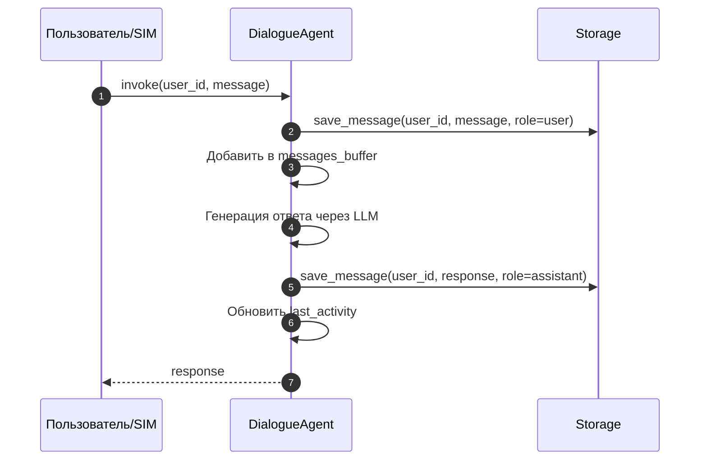

**Фаза 2-4: Публикация фрагмента и обработка агентами**

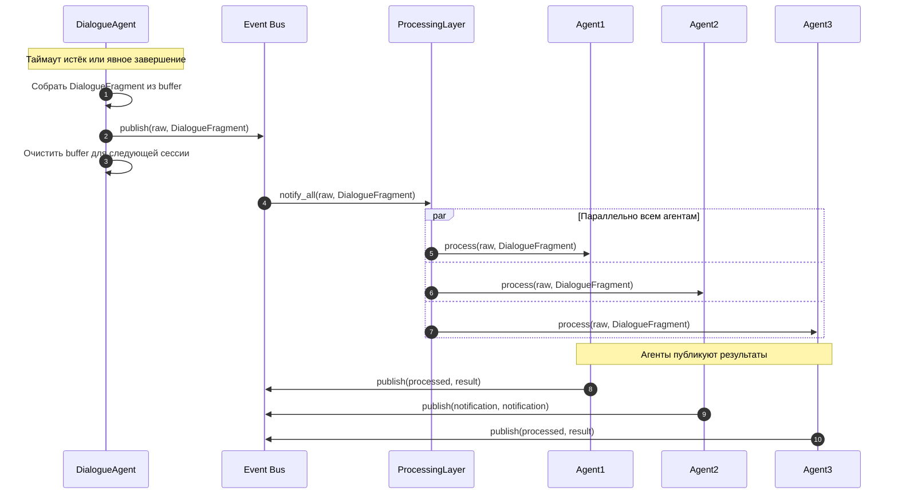

### 3.3. Фазы сценария

| Фаза | Описание | Артефакты |
|------|----------|-----------|
| 1 | Сохранение и генерация ответа | Message в Storage, обновление DialogueState |
| 2 | Публикация фрагмента | BusMessage(raw, DialogueFragment) |
| 3 | Обработка агентами | Вызов process() для всех Processing Agents |
| 4 | Результаты обработки | BusMessage(processed), BusMessage(notification) |

---

## 4. Сценарий B: Таймаут диалога

### 4.1. Описание

**Предусловия:**
- Активный диалог с пользователем (есть messages_buffer)
- Время неактивности > timeout_minutes

**Триггер:**
- Периодическая проверка check_timeouts()

**Ожидаемый результат:**
- Фрагмент диалога опубликован в Event Bus
- Buffer очищен для следующей сессии

### 4.2. Диаграмма

**Фаза 1: Триггер проверки таймаутов**

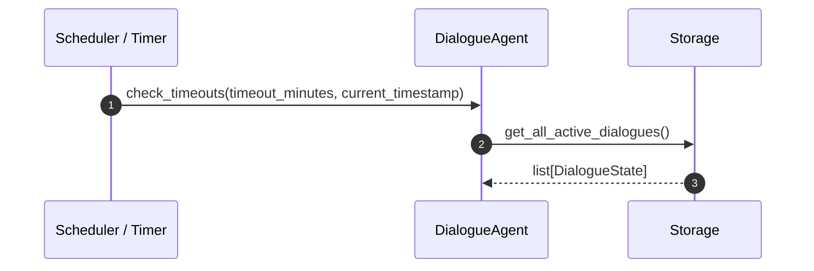

**Фаза 2: Обработка истекших диалогов**

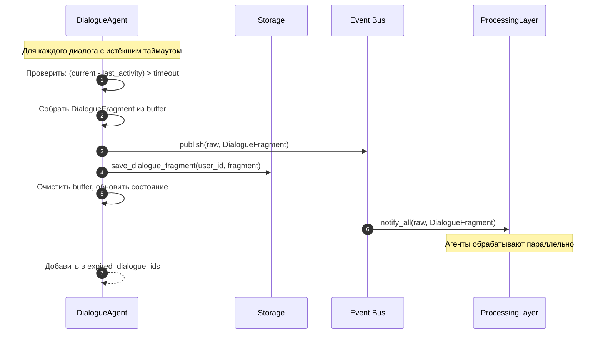

### 4.3. Параметры

| Параметр | Описание | Значение (по умолчанию) |
|----------|----------|-------------------------|
| timeout_minutes | Время неактивности для фиксации фрагмента | 30 (настраиваемый) |
| check_interval | Периодичность проверки | 60 секунд (настраиваемый) |

---

## 5. Сценарий C: Уведомление от Processing Agent

### 5.1. Описание

**Предусловия:**
- Processing Agent опубликовал notification в Event Bus
- ContextAgent подписан на топик notification

**Входные данные:**
- BusMessage(topic=notification, payload={to_user, message, context})

**Ожидаемый результат:**
- Пользователь получает уведомление через DialogueAgent

### 5.2. Диаграмма

**Фаза 1: Публикация уведомления и анализ ContextAgent**

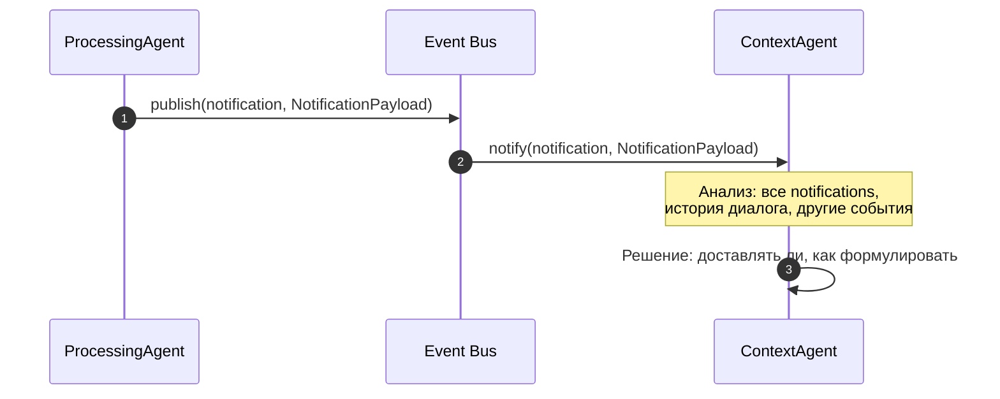

**Фаза 2: Доставка пользователю (если оправдана)**

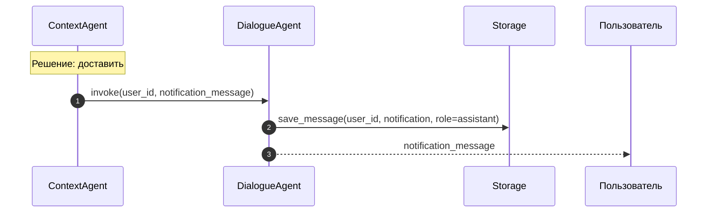

**Фаза 3: Визуализация**

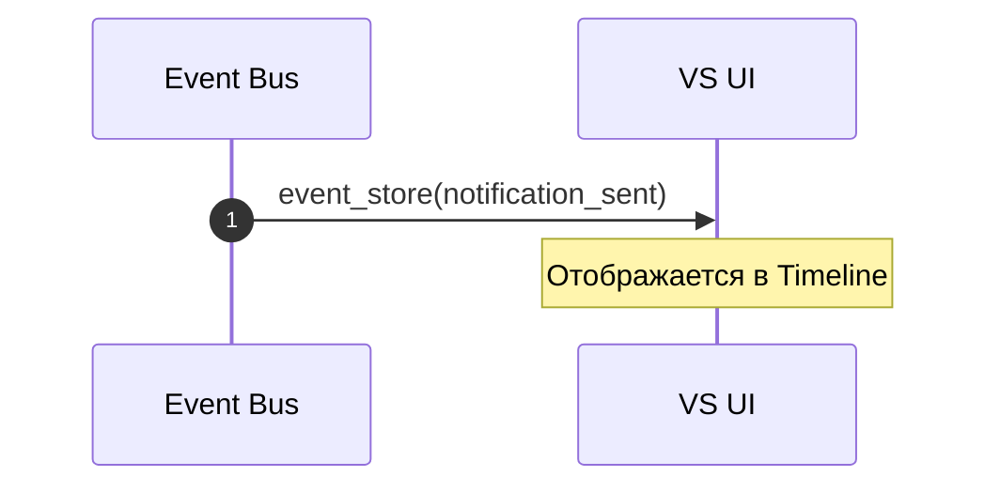

### 5.3. Логика ContextAgent

**Вход:**
- Все notification события от разных Processing Agents
- История диалога с пользователем
- Другие события в Event Bus

**Решение:**
- Доставлять ли уведомление
- Как формулировать (перефразирование)
- Когда доставить (немедленно / отложенно)

**Выход:**
- invoke(user_id, message) — доставка
- ignore — пропуск

---

## 6. Сценарий D: Запуск системы (Bootstrap)

### 6.1. Описание

**Входные данные:**
- Команда запуска системы

**Ожидаемый результат:**
- Все компоненты инициализированы
- Processing Agents зарегистрированы
- Система готова к работе

### 6.2. Диаграмма

**Фаза 1: Инициализация инфраструктуры**

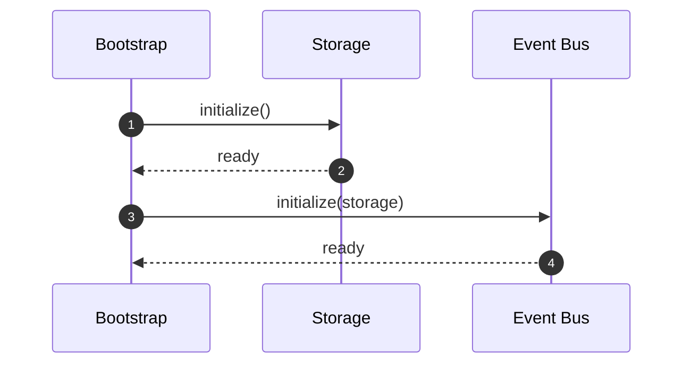

**Фаза 2: Регистрация Processing Agents**

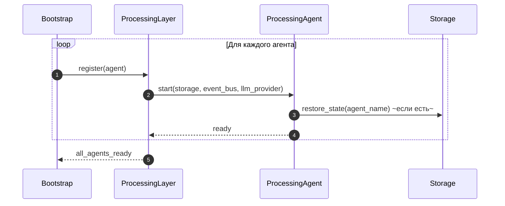

**Фаза 3: Запуск диалоговой системы**

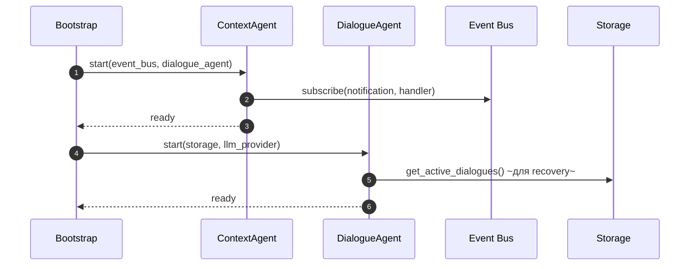

**Фаза 4: Запуск VS UI (опционально)**

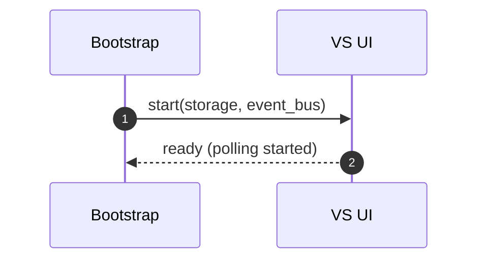

### 6.3. Порядок зависимостей

| Порядок | Компонент | Зависимости |
|---------|-----------|-------------|
| 1 | Storage | — |
| 2 | Event Bus | Storage |
| 3 | Processing Agents | Storage, Event Bus |
| 4 | ContextAgent | Event Bus, DialogueAgent (ref) |
| 5 | DialogueAgent | Storage, LLM Provider |
| 6 | VS UI | Storage, Event Bus |

---

## 7. Сценарий E: SIM симуляция

### 7.1. Описание

**Входные данные:**
- Команда start SIM

**Ожидаемый результат:**
- SIM генерирует сообщения от виртуальных пользователей
- Система обрабатывает как реальные сообщения

### 7.2. Диаграмма

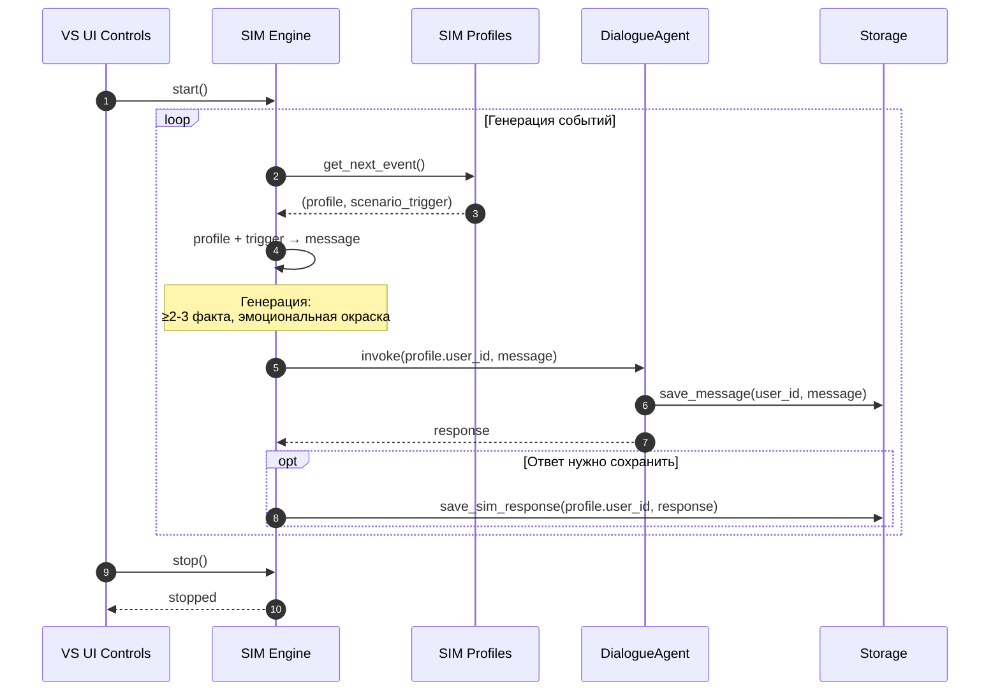

### 7.3. Компоненты SIM

| Компонент | Описание |
|-----------|----------|
| SIM.profiles | Профили виртуальных пользователей (роль, характер, зона ответственности) |
| SIM.scenario | События внешнего мира как триггеры |
| SIM.engine | Генератор: профиль + событие → сообщение |

---

## 8. Graceful Shutdown

### 8.1. Описание

**Триггеры:**
- SIGTERM / SIGINT
- Критическая ошибка (опционально)

**Ожидаемый результат:**
- Активные диалогы корректно завершены
- Состояния сохранены
- Ресурсы освобождены

### 8.2. Диаграмма

**Фаза 1: Прекратить прием новых сообщений**

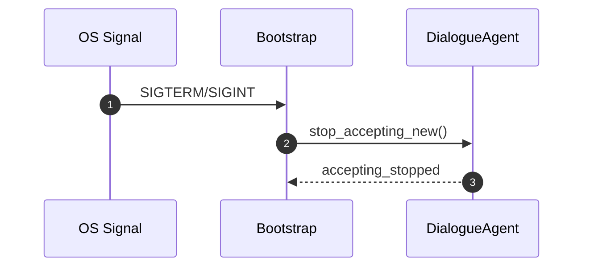

**Фаза 2: Завершить активные диалоги**

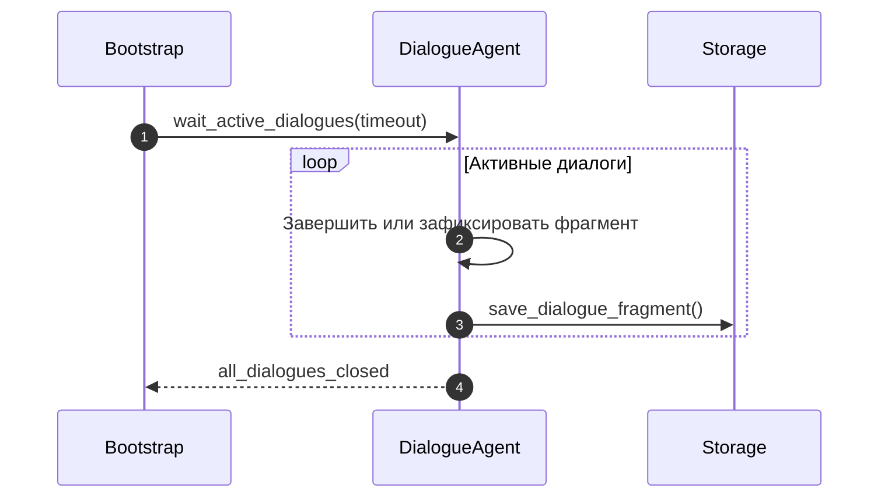

**Фаза 3: Остановить агенты**

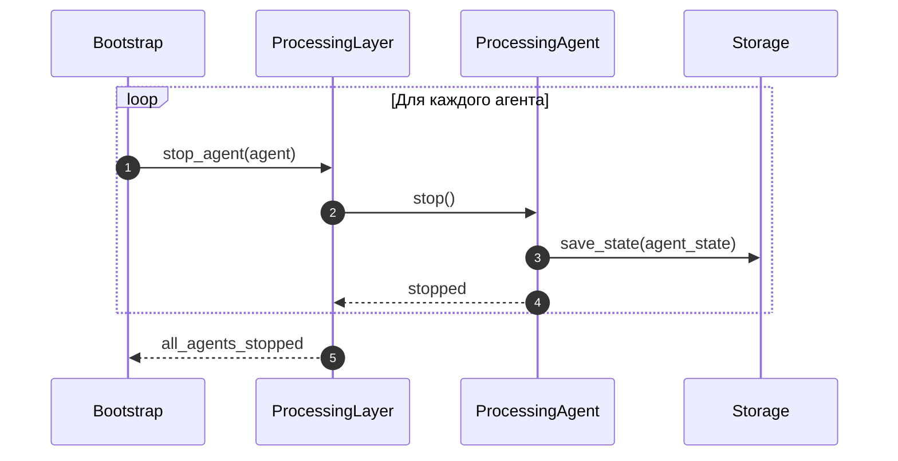

**Фаза 4: Завершение работы**

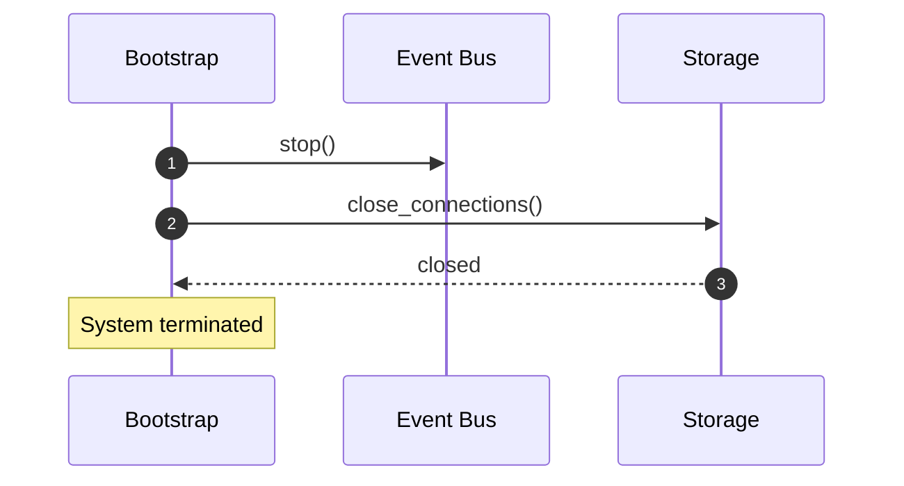

### 8.3. Параметры

| Параметр | Описание | Значение (по умолчанию) |
|----------|----------|-------------------------|
| dialogue_timeout | Макс. время ожидания завершения диалогов | 10 секунд |
| agent_stop_timeout | Макс. время ожидания остановки агентов | 5 секунд |

---

## 9. Recovery после crash

### 9.1. Описание

**Предусловия:**
- Система запускается после неожиданного завершения

**Ожидаемый результат:**
- Состояния компонентов восстановлены
- Активные диалоги могут быть продолжены

### 9.2. Диаграмма

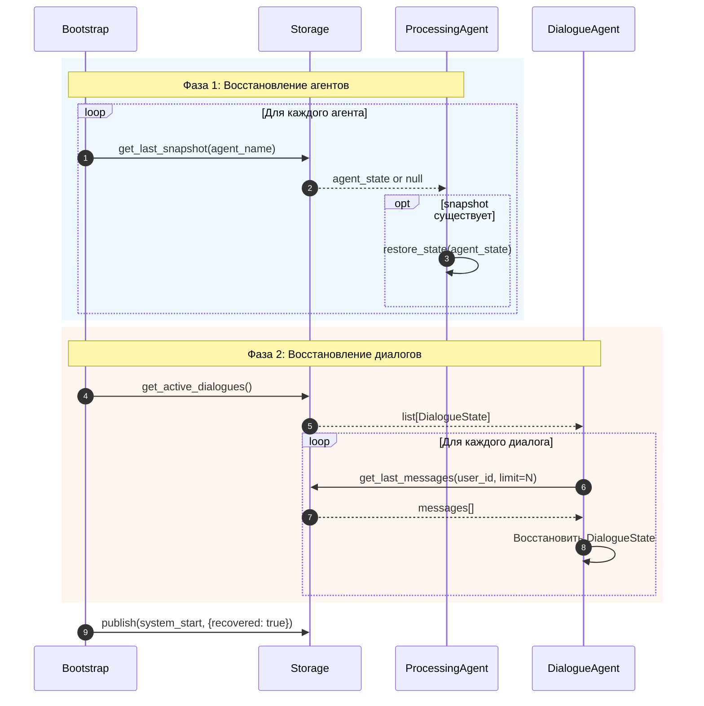

---

## 10. Сводная таблица сценариев

| Сценарий | Вход | Выход | Статус |
|----------|------|-------|--------|
| A | user_id + message | Ответ + события в Event Bus | MVP |
| B | Таймаут диалога | DialogueFragment в raw | MVP |
| C | Notification от агента | Доставка пользователю | MVP |
| D | Команда запуска | Система готова | MVP |
| E | Start SIM | Симуляция сообщений | MVP |
| Shutdown | SIGTERM | Graceful shutdown | MVP |
| Recovery | Запуск после crash | Состояния восстановлены | MVP |

---

**Документ:** `00_docs/architecture/runtime_architecture.md`
**Последнее обновление:** 2025-02-07
