# Runtime Architecture
## Сквозные сценарии работы системы

**Версия:** 1.1
**Дата:** 2025-02-07

**Связанные документы:**
- `00_docs/architecture/overview.md` — общая архитектура системы
- `00_docs/architecture/visualization_architecture.md` — архитектура VS UI

---

## 1. Введение

### 1.1. Назначение документа

Документ описывает сквозные сценарии работы Team Assistant — полные пути обработки сообщений от пользователей до доставки ответов. Сценарии верифицируют архитектуру и демонстрируют взаимодействие компонентов в динамике.

### 1.2. Краткое напоминание

**Компоненты (из overview.md):**
- **DialogueAgent** — ведение диалогов с пользователями
- **ProcessingLayer** — массив Processing Agents
- **ContextAgent** — big picture + доставка уведомлений
- **Event Bus** — шина событий (raw, processed, notification) с push-моделью уведомлений
- **Event Tracker** — фиксирует события для VS UI в Storage (events table)
- **Storage** — персистентное хранение (messages, events, agent_data)
- **SIM** — генератор тестовых данных
- **VS UI** — визуализация через polling API

### 1.3. Сценарии в скоупе

| Сценарий | Описание | Статус |
|----------|----------|--------|
| A | Обработка входящего сообщения пользователя | MVP |
| B | Таймаут диалога и публикация фрагмента | MVP |
| C | Уведомление от Processing Agent → Пользователь | MVP |
| D | Запуск системы (Bootstrap) | MVP |
| E | SIM симуляция | MVP |

---

## 2. Глоссарий

### 2.1. Участники процессов

| Термин | Определение |
|--------|-------------|
| Пользователь | Реальный пользователь или SIM-профиль |
| DialogueAgent | Единый инстанс, управляющий всеми диалогами. Хранит буферы в памяти (in-memory) |
| ProcessingAgent | Любой агент из ProcessingLayer (TaskManager, ContextManager, ...) |
| ContextAgent | Агент big picture, подписанный на notification |
| EventBus | Шина событий с push-моделью: publish → уведомление подписчиков |
| EventTracker | Компонент, фиксирующий события для VS UI в Storage.events |
| Storage | Персистентное хранение: messages, events, agent_data |
| VS UI | Визуализационный сервис (polling Storage.events) |

### 2.2. Артефакты

| Термин | Определение |
|--------|-------------|
| Message | Сообщение от пользователя (текст) |
| DialogueBuffer | In-memory буфер накопленных сообщений (до фиксации фрагмента) |
| DialogueFragment | Фрагмент диалога для обработки Processing Agents |
| BusMessage | Сообщение в Event Bus с топиком, payload, links |
| Notification | Уведомление для доставки пользователю |
| DialogueState | Состояние активного диалога (buffer, last_activity, is_active) |
| TimelineEvent | Событие для VS UI (в Storage.events) |

### 2.3. Event Bus: Push-модель

**Принцип работы:**
```python
# Подписка
event_bus.subscribe(topic, handler)  # handler — async callback

# Публикация
await event_bus.publish(topic, message)
# → Event Bus вызывает все handler-ы асинхронно
```

**Подписчики:**
- `raw` → ProcessingLayer (все агенты)
- `notification` → ContextAgent
- `all topics` → EventTracker (для VS UI)

---

## 3. Сценарий A: Обработка входящего сообщения

### 3.1. Описание

**Входные данные:**
- user_id (или SIM-профиль)
- message (текст)

**Ожидаемый результат:**
- Ответ пользователю
- Сохранение в Storage.messages
- Публикация в Event Bus для Processing Agents
- Фиксация в Storage.events для VS UI

### 3.2. Диаграмма

**Фаза 1: Сохранение и генерация ответа**

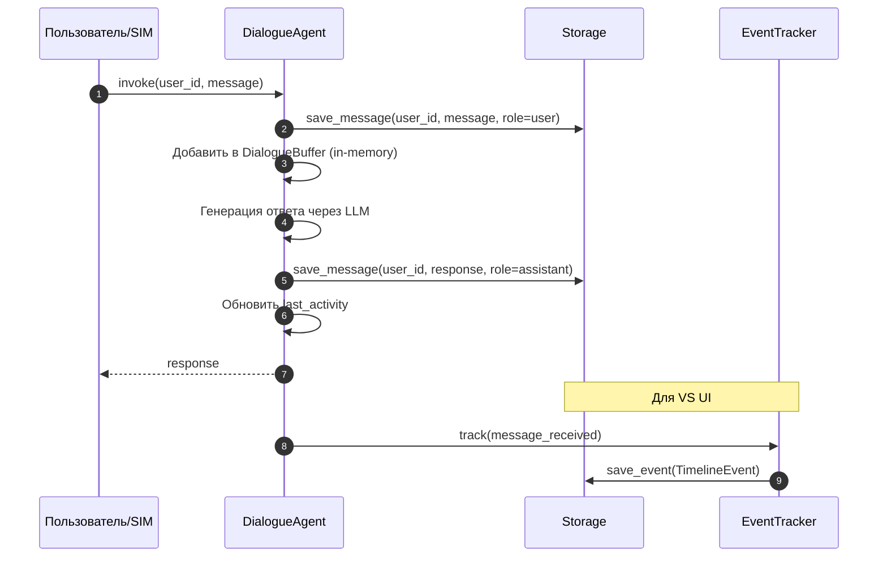

**Фаза 2-4: Публикация фрагмента и обработка агентами**

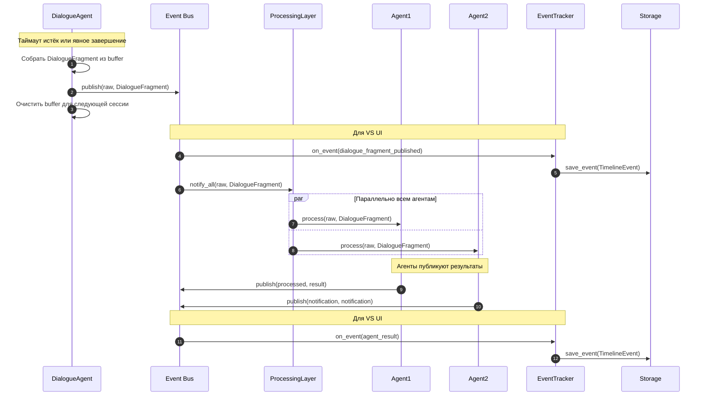

### 3.3. Фазы сценария

| Фаза | Описание | Артефакты |
|------|----------|-----------|
| 1 | Сохранение и генерация ответа | Message в Storage.messages, TimelineEvent в Storage.events |
| 2 | Публикация фрагмента | BusMessage(raw), TimelineEvent |
| 3 | Обработка агентами | Вызов process() для всех Processing Agents |
| 4 | Результаты обработки | BusMessage(processed), BusMessage(notification), TimelineEvents |

### 3.4. DialogueBuffer: детали

**MVP (in-memory):**
```python
class DialogueAgent:
    _dialogues: dict[user_id, DialogueState]  # in-memory

class DialogueState:
    buffer: list[Message]      # in-memory accumulation
    last_activity: datetime
    is_active: bool
```

**Публичный деплой (ADR):**
При завершении диалога — сравнение текущих сообщений с последним опубликованным фрагментом для идентификации буфера. Избегает двойного отслеживания состояния.

---

## 4. Сценарий B: Таймаут диалога

### 4.1. Описание

**Предусловия:**
- Активный диалог с пользователем (есть DialogueBuffer)
- Время неактивности > timeout_minutes

**Триггер:**
- Периодическая проверка check_timeouts()

**Ожидаемый результат:**
- Фрагмент диалога опубликован в Event Bus
- Buffer очищен для следующей сессии
- Агенты обработали фрагмент

### 4.2. Диаграмма

**Фаза 1: Триггер проверки таймаутов**


**Фаза 2: Обработка истекших диалогов**

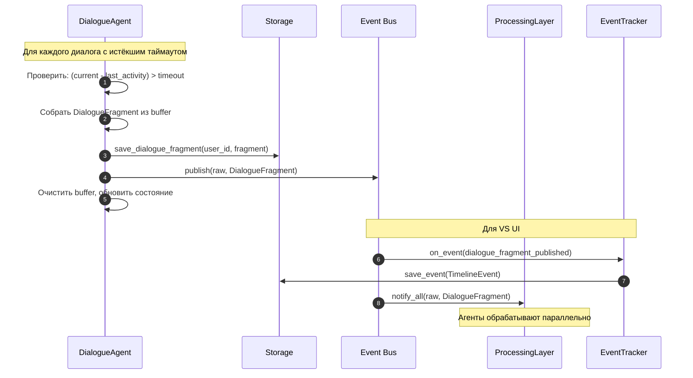

### 4.3. Параметры

| Параметр | Описание | Значение (по умолчанию) |
|----------|----------|-------------------------|
| timeout_minutes | Время неактивности для фиксации фрагмента | 30 (настраиваемый) |
| check_interval | Периодичность проверки | 60 секунд (настраиваемый) |

---

## 5. Сценарий C: Уведомление от Processing Agent

### 5.1. Описание

**Предусловия:**
- Processing Agent опубликовал notification в Event Bus
- ContextAgent подписан на топик notification

**Входные данные:**
- BusMessage(topic=notification, payload={to_user, message, context})

**Ожидаемый результат:**
- Пользователь получает уведомление через DialogueAgent
- Служебные сообщения НЕ сохраняются в Storage.messages
- Ответ пользователя сохраняется с metadata о полученном уведомлении

### 5.2. Логика скрытых сообщений

**Проблема:** Служебные инструкции в истории искажают диалог

**Решение:** Системные уведомления не сохраняются в истории диалога

```
Storage (фактически):
[ai:native]
[user:native]
[ai:native]
[user: metadata (got notification X, responded): response]
```

**Скрытый поток:**
```
ContextAgent → DialogueAgent(system_message=True)
DialogueAgent → НЕ сохраняет в Storage
DialogueAgent → User (notification)
User → DialogueAgent (response)
DialogueAgent → Storage (сохраняет с metadata)
```

### 5.3. Диаграмма

**Фаза 1: Публикация уведомления и анализ ContextAgent**

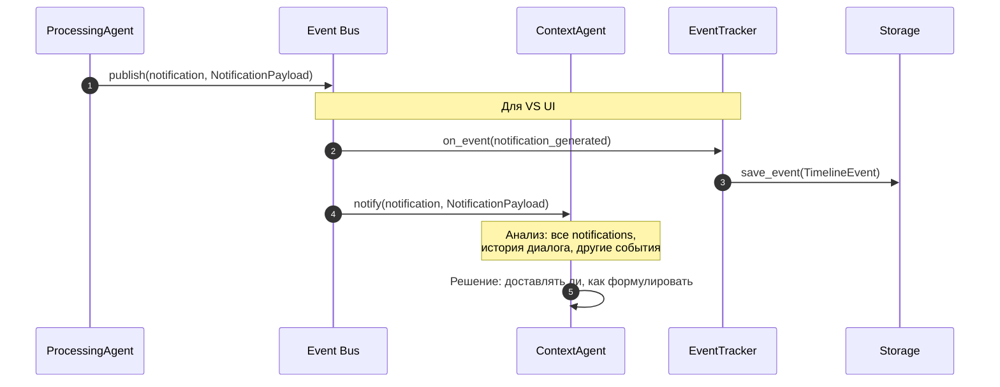

**Фаза 2: Доставка пользователю (скрытый поток)**

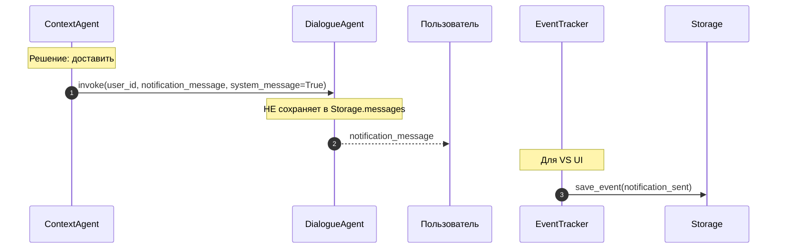

**Фаза 3: Ответ пользователя**

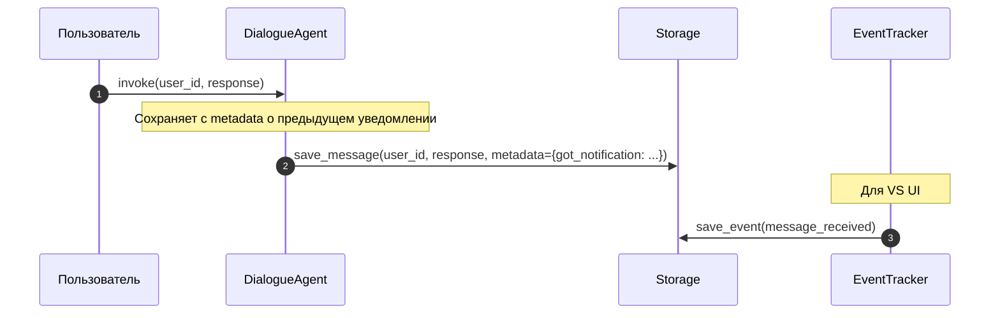

### 5.4. Логика ContextAgent

**Вход:**
- Все notification события от разных Processing Agents
- История диалога с пользователем
- Другие события в Event Bus

**Решение:**
- Доставлять ли уведомление
- Как формулировать (перефразирование)
- Когда доставить (немедленно / отложенно)

**Выход:**
- `invoke(user_id, message, system_message=True)` — доставка
- ignore — пропуск

---

## 6. Сценарий D: Запуск системы (Bootstrap)

### 6.1. Что происходит при запуске

**Пользователь запускает:**
```bash
uvicorn main:app --reload
```

**Под капотом:**
```
1. FastAPI startup event → bootstrap()
2. Инициализация Storage
3. Инициализация Event Bus
4. Регистрация Processing Agents
5. Запуск ContextAgent + DialogueAgent
6. Запуск Event Tracker
7. VS UI доступен через polling API
```

**До запуска ничего делать не нужно.**

### 6.2. Диаграмма

**Фаза 1: Инициализация инфраструктуры**


**Фаза 2: Регистрация Processing Agents**

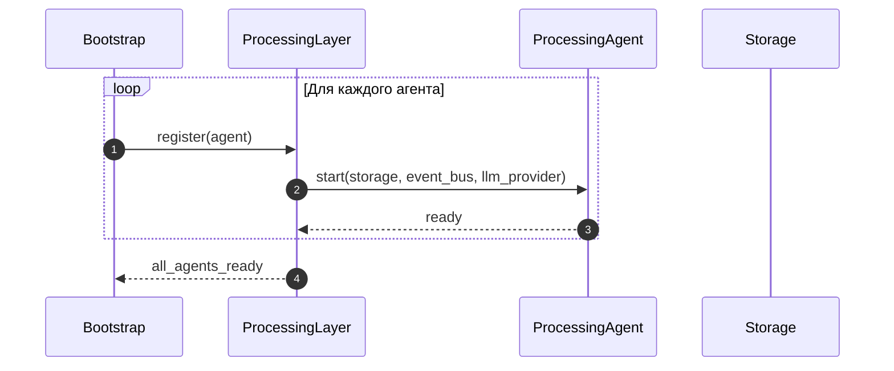

**Фаза 3: Запуск диалоговой системы**


**Фаза 4: Запуск VS UI компонентов**

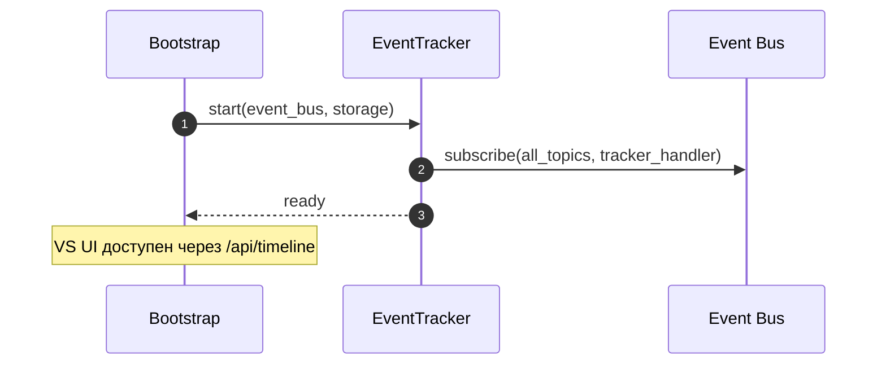

### 6.3. Порядок зависимостей

| Порядок | Компонент | Зависимости |
|---------|-----------|-------------|
| 1 | Storage | — |
| 2 | Event Bus | Storage |
| 3 | Processing Agents | Storage, Event Bus |
| 4 | ContextAgent | Event Bus, DialogueAgent (ref) |
| 5 | DialogueAgent | Storage, LLM Provider |
| 6 | Event Tracker | Event Bus, Storage |
| 7 | VS UI (API) | Storage |

---

## 7. Сценарий E: SIM симуляция

### 7.1. Описание

**Входные данные:**
- Команда start SIM (через VS UI Controls)

**Ожидаемый результат:**
- SIM генерирует сообщения от виртуальных пользователей
- Система обрабатывает как реальные сообщения
- Все события видны в VS UI

### 7.2. Диаграмма

**Фаза 1: Запуск SIM**

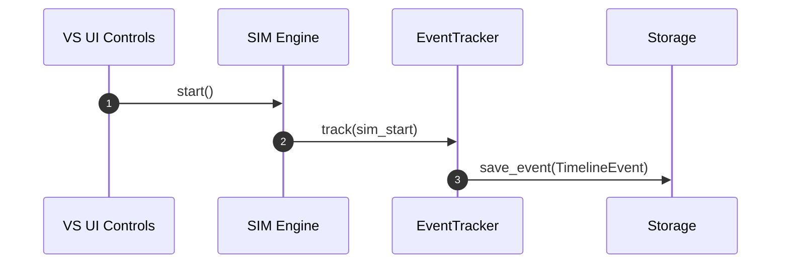

**Фаза 2: Генерация и обработка сообщений**

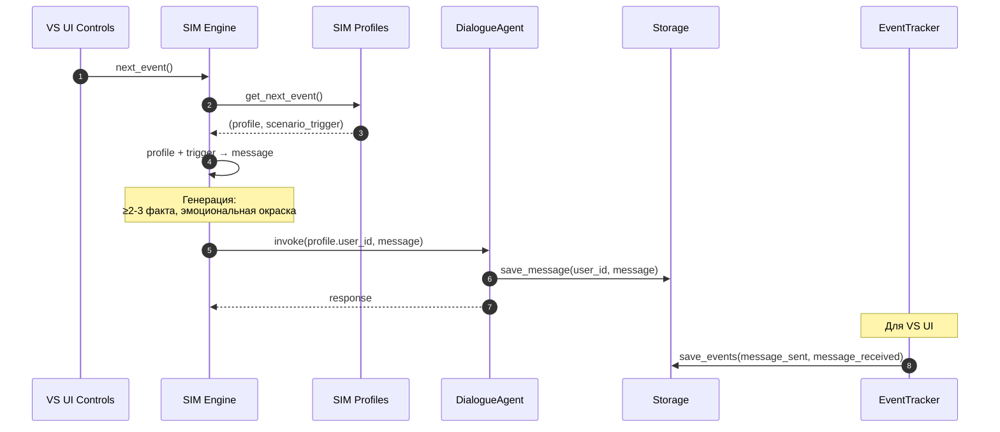

**Фаза 3: Остановка SIM**

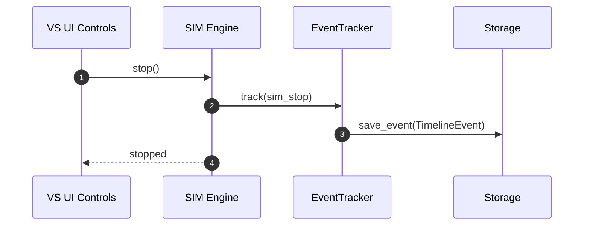

### 7.3. Компоненты SIM

| Компонент | Описание |
|-----------|----------|
| SIM.profiles | Профили виртуальных пользователей (роль, характер, зона ответственности) |
| SIM.scenario | События внешнего мира как триггеры |
| SIM.engine | Генератор: профиль + событие → сообщение |

---

## 8. Очистка перед запуском

### 8.1. Описание

**Для MVP:**
- Очистка Storage перед запуском (для чистоты тестов)
- Graceful shutdown не реализуется
- Recovery после crash не реализуется

### 8.2. Диаграмма


---

## 9. Сводная таблица сценариев

| Сценарий | Вход | Выход | Статус |
|----------|------|-------|--------|
| A | user_id + message | Ответ + события в Event Bus + TimelineEvents | MVP |
| B | Таймаут диалога | DialogueFragment в raw + TimelineEvents | MVP |
| C | Notification от агента | Доставка пользователю (скрытый поток) + TimelineEvents | MVP |
| D | Команда запуска | Система готова | MVP |
| E | Start SIM | Симуляция сообщений + TimelineEvents | MVP |
| Clear | Перед запуском | Storage очищен | MVP |

---

**Документ:** `00_docs/architecture/runtime_architecture.md`
**Последнее обновление:** 2025-02-07
