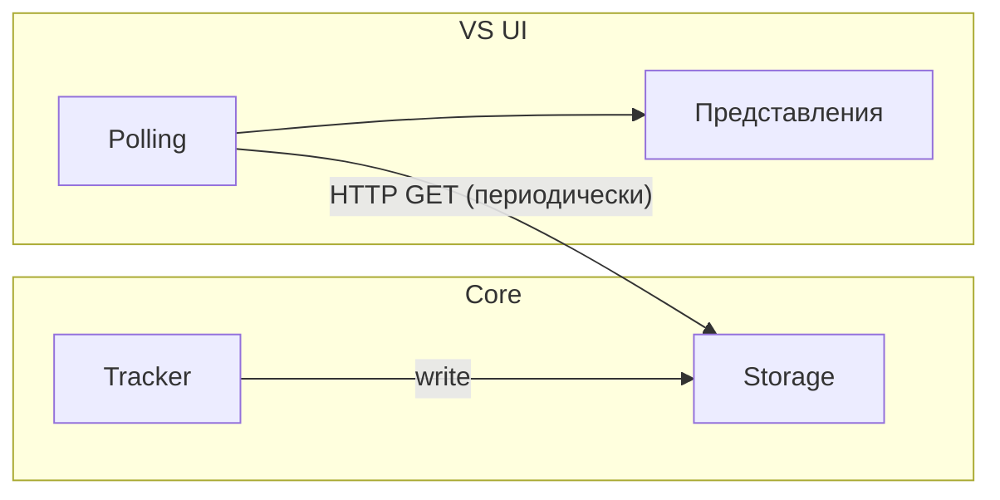
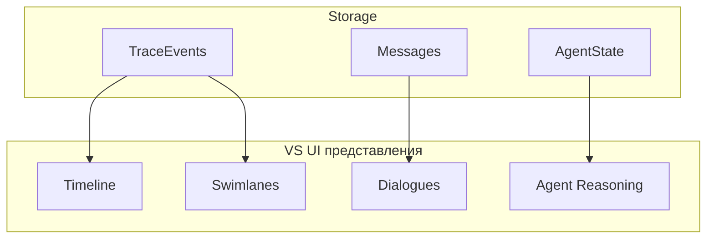

# Visualization — слой визуализации

> Этот документ описывает VS UI на архитектурном уровне:
> назначение, представления, источники данных, связь с Core.
>
> Детальная спецификация представлений (layout, компоненты интерфейса,
> API-контракты) — в отдельных документах уровня спецификации.

---

## 1. Назначение

VS UI — веб-интерфейс для наблюдения за работой системы.
Не является пользовательским продуктом — это инструмент
для разработчиков и стейкхолдеров.

**Сценарии использования:**

| Кто | Зачем |
|-----|-------|
| Разработчик | Отладка: видеть, как BusMessages проходят через систему, что делают ProcessingAgents, какие TraceEvents порождаются |
| Стейкхолдер | Демонстрация: наглядно показать, что система делает с диалогами, какие задачи извлекает, как формирует output |
| Тестировщик | Верификация: убедиться, что SIM-сценарий порождает ожидаемое поведение системы |

---

## 2. Связь с Core

**Паттерн: polling.**
VS UI периодически запрашивает данные из Storage через HTTP API,
предоставляемый Core. Это однонаправленная связь: VS UI только читает.

**Почему не WebSocket / SSE:**
Для MVP polling достаточен. Система рассчитана на <50 пользователей,
частота обновления не критична. При необходимости можно перейти
на push-модель позже без изменения архитектуры Core.

**Что VS UI НЕ делает:**
- Не пишет данные в Core
- Не влияет на поведение системы
- Не имеет собственного хранилища (stateless)

Исключение: управление SIM (запуск/остановка сценариев)
может осуществляться через VS UI, но это управляющее
воздействие на SIM, а не на Core.

---

## 3. Представления

VS UI отображает четыре представления. Все они питаются
из Storage, но используют разные сущности и разные
способы отображения.

### Timeline

**Назначение:** хронологическая лента всех значимых событий в системе.

**Источник данных:** TraceEvents из Storage.

**Что отображает:**
- Последовательность TraceEvents во времени (новые сверху)
- Тип события (input получен, обработка начата/завершена, output доставлен)
- Актор (кто породил событие)
- Данные события (краткая сводка)

**Фильтрация:**
VS UI фильтрует TraceEvents на стороне клиента —
Tracker записывает всё, VS UI показывает то, что выбрал пользователь.

---

### Swimlanes

**Назначение:** группировка событий по акторам для параллельного
просмотра активности нескольких компонентов/пользователей.

**Источник данных:** TraceEvents из Storage (те же данные, что Timeline).

**Что отображает:**
- Вертикальные дорожки, каждая — один актор
  (User, конкретный ProcessingAgent, OutputRouter и т.д.)
- Внутри дорожки — TraceEvents этого актора, хронологически
- Визуально видно, что происходит параллельно

**Связь с Timeline:** Swimlanes — это альтернативная проекция
тех же TraceEvents. Не отдельные данные.

---

### Dialogues (визуализация диалогов)

**Назначение:** просмотр конкретных Dialogues между Users
(реальными или VirtualUsers) и их AI-ассистентами.

**Источник данных:** Messages из Storage.

**Что отображает:**
- Список Users (с индикацией активности)
- Выбранный Dialogue: полная лента Messages (user / assistant / system)
- Временны́е метки, статус доставки

**Отличие от Timeline:** Timeline показывает TraceEvents (системную
активность), Dialogues показывает Messages (пользовательский контент).
Это разные сущности из Storage.

---

### Agent Reasoning (рассуждения агентов)

**Назначение:** просмотр внутренних рассуждений ProcessingAgents —
как именно агент пришёл к тому или иному результату.

**Источник данных:** AgentState из Storage (SGR-трейсы в формате JSON).

**Что отображает:**
- Какой агент обрабатывал какой input
- Цепочка рассуждений (SGR trace)
- Какой output был порождён в результате

**Ценность:** позволяет понять не только **что** система сделала,
но и **почему**. Критично для отладки и для демонстрации стейкхолдерам.

---

## 4. Источники данных — сводка

| Представление | Сущность Storage | Что берёт |
|---------------|------------------|-----------|
| Timeline | TraceEvents | Все TraceEvents, хронологически |
| Swimlanes | TraceEvents | Те же TraceEvents, сгруппированные по актору |
| Dialogues | Messages | Реплики конкретного Dialogue |
| Agent Reasoning | AgentState | SGR-трейсы конкретного ProcessingAgent |

---

## 5. Управление SIM из VS UI

VS UI может предоставлять интерфейс для управления SIM:
- Выбор и запуск Scenario
- Создание/настройка Profiles для VirtualUsers
- Запуск/остановка/пауза симуляции
- Мониторинг хода симуляции

Это управляющее воздействие на SIM (отдельную подсистему),
а не на Core. Core не знает о существовании VS UI.

---

## 6. Открытые вопросы

- **Частота polling:** какой интервал оптимален для MVP?
  Определится при реализации.

- **Объём данных:** при длительной работе TraceEvents
  могут накапливаться. Нужна ли пагинация или временно́е окно?
  Определится при реализации.

- **Связь Timeline ↔ Dialogues:** можно ли из TraceEvent
  на Timeline перейти к конкретному Message в Dialogues?
  Зависит от механизма связей между TraceEvents (отложено).
