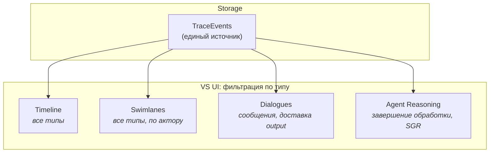

# Visualization — слой визуализации

> Этот документ описывает VS UI на архитектурном уровне:
> назначение, представления, источники данных, связь с Core.
>
> Детальная спецификация представлений (layout, компоненты интерфейса,
> API-контракты) — в отдельных документах уровня спецификации.

---

## 1. Назначение

VS UI — веб-интерфейс для наблюдения за работой системы.
Не является пользовательским продуктом — это инструмент
для разработчиков и стейкхолдеров.

**Сценарии использования:**

| Кто | Зачем |
|-----|-------|
| Разработчик | Отладка: видеть, как BusMessages проходят через систему, что делают ProcessingAgents, какие TraceEvents порождаются |
| Стейкхолдер | Демонстрация: наглядно показать, что система делает с диалогами, какие задачи извлекает, как формирует output |
| Тестировщик | Верификация: убедиться, что SIM-сценарий порождает ожидаемое поведение системы |

---

## 2. Связь с Core

**Единый источник данных: TraceEvents.**
VS UI получает все данные исключительно из TraceEvents.
Tracker записывает полную информацию в каждый TraceEvent,
включая текст сообщений, рассуждения агентов и т.д.
VS UI фильтрует и распределяет TraceEvents по представлениям
на основе типа события.

**Паттерн: polling.**
VS UI периодически запрашивает TraceEvents через HTTP API,
предоставляемый Core. Это однонаправленная связь: VS UI только читает.

**Почему не WebSocket / SSE:**
Для MVP polling достаточен. Система рассчитана на <50 пользователей,
частота обновления не критична. При необходимости можно перейти
на push-модель позже без изменения архитектуры Core.

**Что VS UI НЕ делает:**
- Не читает Messages, AgentState или другие сущности Storage напрямую
- Не пишет данные в Core
- Не влияет на поведение системы
- Не имеет собственного хранилища (stateless)

---

## 3. Принцип распределения TraceEvents по представлениям

Tracker записывает все TraceEvents в единый поток.
VS UI распределяет их по представлениям на основе типа события.

**Принцип:** каждый TraceEvent имеет тип, определяющий его семантику.
VS UI использует тип для выбора представления (или нескольких),
в котором событие будет отображено. Один TraceEvent может быть
релевантен нескольким представлениям одновременно.

Конкретные типы TraceEvents и их маппинг на представления
определяются на уровне спецификации (data_model.md).

---

## 4. Представления

VS UI отображает четыре представления. Все питаются
из одного источника (TraceEvents), но фильтруют и отображают
их по-разному.

### Timeline

**Назначение:** хронологическая лента всех значимых событий в системе.

**Какие TraceEvents:** все типы.

**Что отображает:**
- Последовательность TraceEvents во времени (новые сверху)
- Тип события (input получен, обработка начата/завершена, output доставлен)
- Актор (кто породил событие)
- Данные события (краткая сводка)

**Фильтрация:**
На стороне VS UI — по типу, по актору, по временно́му диапазону.

---

### Swimlanes

**Назначение:** группировка событий по акторам для параллельного
просмотра активности нескольких компонентов/пользователей.

**Какие TraceEvents:** все типы, сгруппированные по актору.

**Что отображает:**
- Вертикальные дорожки, каждая — один актор
  (User, конкретный ProcessingAgent, OutputRouter и т.д.)
- Внутри дорожки — TraceEvents этого актора, хронологически
- Визуально видно, что происходит параллельно

**Связь с Timeline:** Swimlanes — это альтернативная проекция
тех же TraceEvents. Не отдельные данные.

---

### Dialogues (визуализация диалогов)

**Назначение:** просмотр конкретных Dialogues между Users
(реальными или VirtualUsers) и их AI-ассистентами.

**Какие TraceEvents:** типы, связанные с обменом сообщениями
и доставкой output — отфильтрованные по конкретному user_id.

**Что отображает:**
- Список Users (с индикацией активности)
- Выбранный Dialogue: лента сообщений (user / assistant / system)
- Временны́е метки

**Важно:** текст сообщений содержится внутри TraceEvents.
VS UI не обращается к таблице Messages напрямую.

---

### Agent Reasoning (рассуждения агентов)

**Назначение:** просмотр внутренних рассуждений ProcessingAgents —
как именно агент пришёл к тому или иному результату.

**Какие TraceEvents:** типы, связанные с завершением обработки
(содержат SGR-трейс в данных события).

**Что отображает:**
- Какой агент обрабатывал какой input
- Цепочка рассуждений (SGR trace)
- Какой output был порождён в результате

**Ценность:** позволяет понять не только **что** система сделала,
но и **почему**. Критично для отладки и для демонстрации стейкхолдерам.

---

## 5. Источники данных — сводка

---

## 6. Управление SIM

VS UI предоставляет базовое управление SIM:
- Запуск / остановка / пауза симуляции

Настройка SIM (Scenarios, Profiles) выполняется **вне VS UI** —
через конфигурационные файлы. VS UI не является инструментом
для создания и редактирования сценариев или профилей.

---

## 7. Открытые вопросы

- **Частота polling:** какой интервал оптимален для MVP?
  Определится при реализации.

- **Объём данных:** TraceEvents включают полные данные (тексты
  сообщений, SGR-трейсы), что увеличивает объём хранения.
  Нужна ли ротация, пагинация или временно́е окно?
  Определится при реализации.
