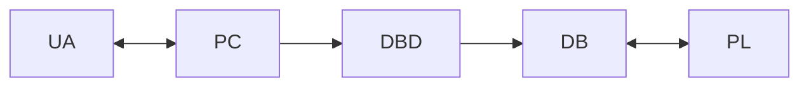
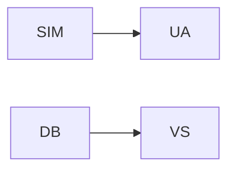
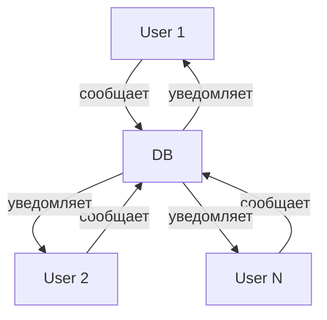
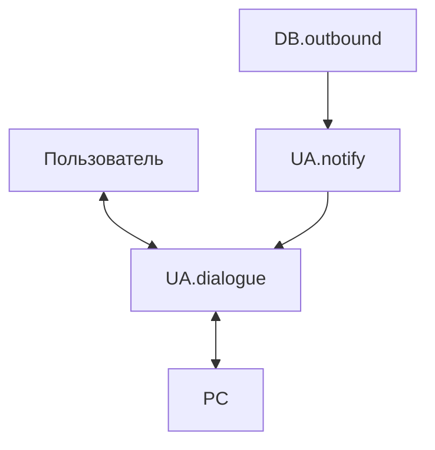
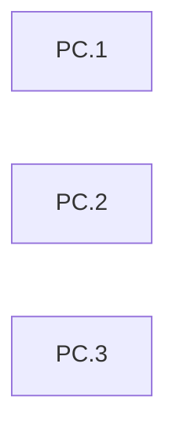
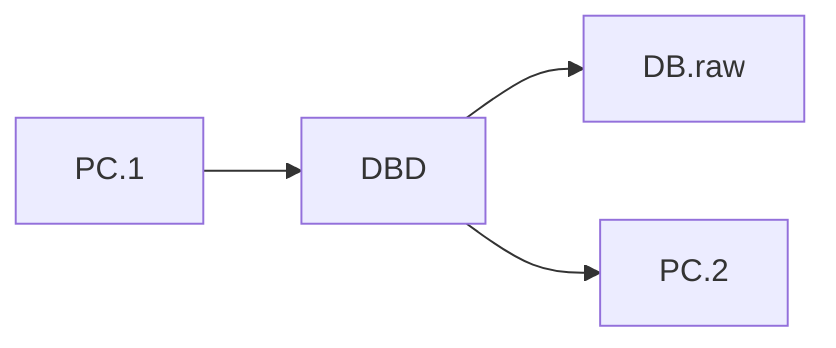
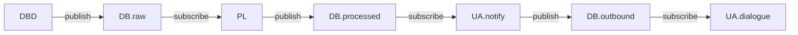
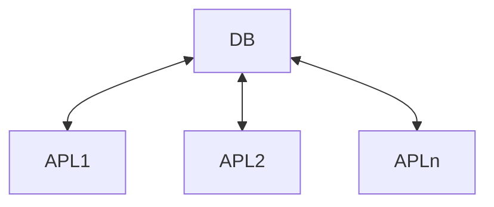
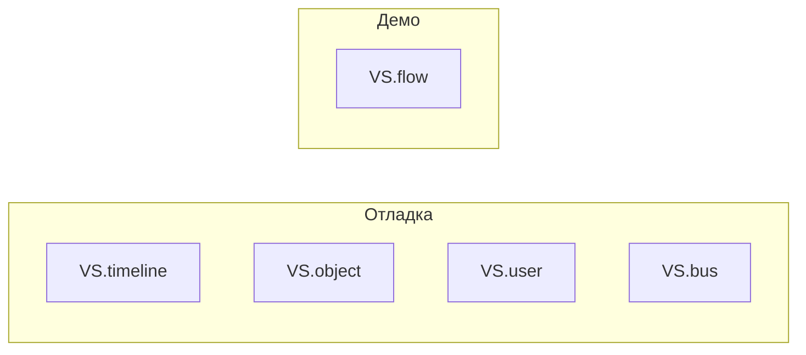
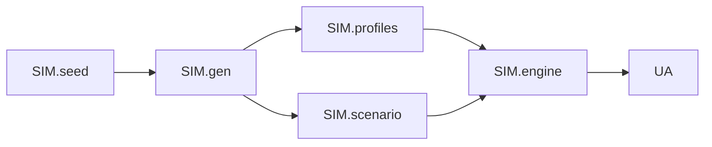

# Архитектура сервиса коллективной работы

## Введение

### Проблема

Существующие инструменты командной работы (Trello, Teamly, task trackers) требуют от пользователей адаптации к заданным онтологиям: проекты, задачи, workflow, доски. Это создаёт трение между реальной работой и инструментом. Люди устают от необходимости «жить» в очередной системе и часто откатываются к примитивным средствам (Google Docs, чаты).

### Решение

Инверсия модели: не человек адаптируется к инструменту, а инструмент формируется вокруг естественных коммуникаций. Каждый участник команды взаимодействует со своим AI-ассистентом (голос, текст, Telegram, приложение). Ассистенты обмениваются информацией через общую шину данных. Структуры (задачи, сроки, связи) формируются автоматически средствами AI.

### Ключевые принципы

- **Минимальный порог входа** — взаимодействие через естественный диалог
- **Онтология формируется под команду** — не команда под онтологию
- **Традиционный интерфейс — второй слой** — веб-интерфейс для систематизации доступен, но не обязателен

### Стратегия разработки

Сначала — ядро системы и визуализация для отладки. Фронтенд (Telegram-бот, приложение) — после того, как логика ядра отлажена и проверена на симуляции с виртуальными пользователями.

---

## 1. Ядро системы (production)

| Тикер | Название | Назначение |
|-------|----------|------------|
| UA | User Assistant | Ведение диалога с пользователем, доставка уведомлений |
| PC | Personal Context | Контекст пользователя: буфер диалога, история, профиль |
| DBD | Dialogue Boundary Detector | Определение момента упаковки диалога в шину |
| DB | Data Bus | Общая шина данных команды (pub/sub + хранение) |
| PL | Processing Layer | Агенты обработки данных |

---

## 2. Слой тестирования и наблюдения

| Тикер | Название | Назначение |
|-------|----------|------------|
| SIM | Simulation Layer | Эмуляция пользователей для тестирования |
| VS | Visualization Service | Визуализация для отладки и демо |

---

## 3. Поток данных между пользователями

Информация от одного пользователя через шину данных достигает других участников команды. Это ключевая механика сервиса.

---

## 4. UA — User Assistant

Композитный модуль с изолированными подагентами.

| Подмодуль | Назначение |
|-----------|------------|
| UA.dialogue | Ведёт диалог с пользователем, работает с PC.1 |
| UA.notify | Читает DB.outbound, фильтрует через PC.2, семантическая дедупликация |

---

## 5. PC — Personal Context

Один экземпляр на каждого пользователя.

| Компонент | Содержимое |
|-----------|------------|
| PC.1 | Текущий открытый диалог (ещё не упакован). Метки времени сообщений. |
| PC.2 | Резюме завершённых диалогов (по предмету, не «ты сказал — я ответил»). Лог доставленных пользователю сообщений. |
| PC.3 | Роль в команде, текущий фокус, выявленные интересы. Формируется динамически. |

---

## 6. DBD — Dialogue Boundary Detector

DBD мониторит состояние PC.1 и принимает решение об упаковке.

**Триггеры срабатывания (на старте — первые два):**
- Явный маркер от пользователя («всё, спасибо»)
- Таймаут (пауза > N минут с момента последнего сообщения)

**Варианты реализации (определяются позже):**
1. DBD видит в PC.1 сообщение с явным маркером завершения
2. DBD посылает PC.1 внешнему агенту, который оценивает статус завершения диалога
3. Сервер периодически пингует DBD; тот сравнивает текущее время с временем последнего сообщения в PC.1 и принимает решение

**Результат срабатывания:**
- Упакованный диалог → DB.raw
- Резюме → PC.2

---

## 7. DB — Data Bus

Pub/sub модель с персистентным хранением. Три топика.

| Топик | Публикует | Подписчики |
|-------|-----------|------------|
| DB.raw | DBD | APL-агенты |
| DB.processed | APL-агенты | UA.notify |
| DB.outbound | UA.notify | UA.dialogue |

---

## 8. PL — Processing Layer

**Архитектурные принципы:**
- Каждый APL имеет собственную персистентную память
- APL читают весь контекст DB (не только изолированный объект)
- Добавление нового APL = регистрация подписки на топик
- Состав агентов определяется позже, архитектура не ограничивает

---

## 9. VS — Visualization Service

| Компонент | Назначение |
|-----------|------------|
| VS.timeline | Swimlanes: дорожки по пользователям, DB в центре, время по горизонтали |
| VS.object | Трассировка конкретного объекта через систему |
| VS.user | Срез по пользователю: PC.1, PC.2, доставленное |
| VS.bus | Текущее состояние DB |
| VS.flow | Анимированный граф для демо (пользователи по краям, DB в центре) |

**VS.timeline (swimlanes)** — основной вид. Видно, как событие у User A порождает объект в DB, который затем «всплывает» у User B.

**VS.flow** — для демо: схватывается за 3-5 секунд.

---

## 10. SIM — Simulation Layer

| Компонент | Назначение |
|-----------|------------|
| SIM.seed | Реальный чат как источник паттернов коммуникации |
| SIM.gen | Генерация + фильтрация generic + усложнение |
| SIM.profiles | Детальные профили: роль, характер, зона ответственности, типичные проблемы |
| SIM.scenario | События внешнего мира как триггеры для сообщений |
| SIM.engine | Генератор: профиль + событие + история → сообщение |

**Критерий качества сообщения:**
- ≥ 2-3 конкретных факта (имена, сроки, суммы)
- Эмоциональная окраска или проблема

❌ «Обсудили задачу, всё хорошо»  
✓ «Иван из закупок сообщил об отставании поставки X на 2 недели, конфликт с логистикой обострился»

---

## Сводная карта модулей

| Тикер | Модуль | Подмодули / Компоненты |
|-------|--------|------------------------|
| UA | User Assistant | UA.dialogue, UA.notify |
| PC | Personal Context | PC.1, PC.2, PC.3 |
| DBD | Dialogue Boundary Detector | — |
| DB | Data Bus | DB.raw, DB.processed, DB.outbound |
| PL | Processing Layer | APL1...APLn (каждый со своей памятью) |
| VS | Visualization Service | VS.timeline, VS.object, VS.user, VS.bus, VS.flow |
| SIM | Simulation Layer | SIM.seed, SIM.gen, SIM.profiles, SIM.scenario, SIM.engine |
