# Интерфейсы и стратегия моков

## Принцип: Ports & Adapters

Каждый модуль определяет **порт** (интерфейс) — контракт взаимодействия. **Адаптер** — конкретная реализация: in-memory для разработки, production для деплоя.

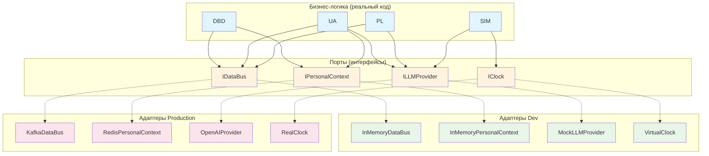
```mermaid
graph TB
    subgraph "Бизнес-логика (реальный код)"
        DBD[DBD]
        UA[UA]
        PL[PL]
        SIM[SIM]
    end
    
    subgraph "Порты (интерфейсы)"
        IDB[IDataBus]
        IPC[IPersonalContext]
        ILLM[ILLMProvider]
        IClock[IClock]
    end
    
    subgraph "Адаптеры Dev"
        IMDB[InMemoryDataBus]
        IMPC[InMemoryPersonalContext]
        MockLLM[MockLLMProvider]
        VClock[VirtualClock]
    end
    
    subgraph "Адаптеры Production"
        Kafka[KafkaDataBus]
        Redis[RedisPersonalContext]
        OpenAI[OpenAIProvider]
        RClock[RealClock]
    end
    
    DBD --> IDB
    DBD --> IPC
    UA --> IDB
    UA --> IPC
    UA --> ILLM
    PL --> IDB
    PL --> ILLM
    SIM --> ILLM
    SIM --> IClock
    
    IDB -.-> IMDB
    IDB -.-> Kafka
    IPC -.-> IMPC
    IPC -.-> Redis
    ILLM -.-> MockLLM
    ILLM -.-> OpenAI
    IClock -.-> VClock
    IClock -.-> RClock
    
    style DBD fill:#e1f5fe
    style UA fill:#e1f5fe
    style PL fill:#e1f5fe
    style SIM fill:#e1f5fe
    style IDB fill:#fff3e0
    style IPC fill:#fff3e0
    style ILLM fill:#fff3e0
    style IClock fill:#fff3e0
    style IMDB fill:#e8f5e9
    style IMPC fill:#e8f5e9
    style MockLLM fill:#e8f5e9
    style VClock fill:#e8f5e9
    style Kafka fill:#fce4ec
    style Redis fill:#fce4ec
    style OpenAI fill:#fce4ec
    style RClock fill:#fce4ec
```

---

## 1. Интерфейсы модулей

### 1.1 IDataBus (DB)

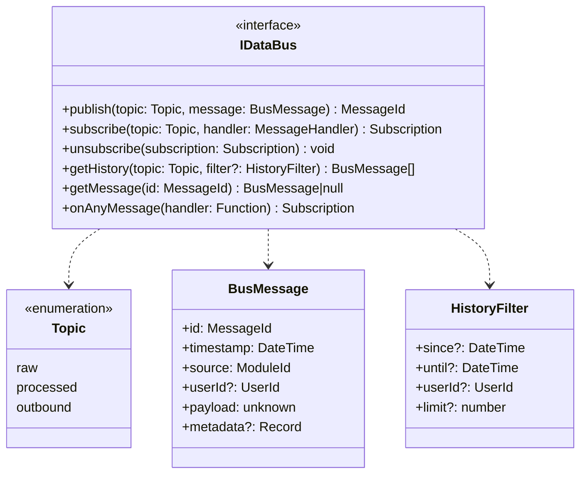
```mermaid
classDiagram
    class IDataBus {
        <<interface>>
        +publish(topic: Topic, message: BusMessage) MessageId
        +subscribe(topic: Topic, handler: MessageHandler) Subscription
        +unsubscribe(subscription: Subscription) void
        +getHistory(topic: Topic, filter?: HistoryFilter) BusMessage[]
        +getMessage(id: MessageId) BusMessage|null
        +onAnyMessage(handler: Function) Subscription
    }
    
    class Topic {
        <<enumeration>>
        raw
        processed
        outbound
    }
    
    class BusMessage {
        +id: MessageId
        +timestamp: DateTime
        +source: ModuleId
        +userId?: UserId
        +payload: unknown
        +metadata?: Record
    }
    
    class HistoryFilter {
        +since?: DateTime
        +until?: DateTime
        +userId?: UserId
        +limit?: number
    }
    
    IDataBus ..> Topic
    IDataBus ..> BusMessage
    IDataBus ..> HistoryFilter
```

**Контракт:**

```typescript
interface IDataBus {
  // Публикация
  publish(topic: Topic, message: BusMessage): Promise<MessageId>
  
  // Подписка
  subscribe(topic: Topic, handler: MessageHandler): Subscription
  unsubscribe(subscription: Subscription): void
  
  // Чтение истории (для VS и дедупликации)
  getHistory(topic: Topic, filter?: HistoryFilter): Promise<BusMessage[]>
  getMessage(id: MessageId): Promise<BusMessage | null>
  
  // Наблюдение (для VS)
  onAnyMessage(handler: (topic: Topic, message: BusMessage) => void): Subscription
}

type Topic = 'raw' | 'processed' | 'outbound'

interface BusMessage {
  id: MessageId
  timestamp: DateTime
  source: ModuleId
  userId?: UserId
  payload: unknown
  metadata?: Record<string, unknown>
}

interface HistoryFilter {
  since?: DateTime
  until?: DateTime
  userId?: UserId
  limit?: number
}
```

---

### 1.2 IPersonalContext (PC)

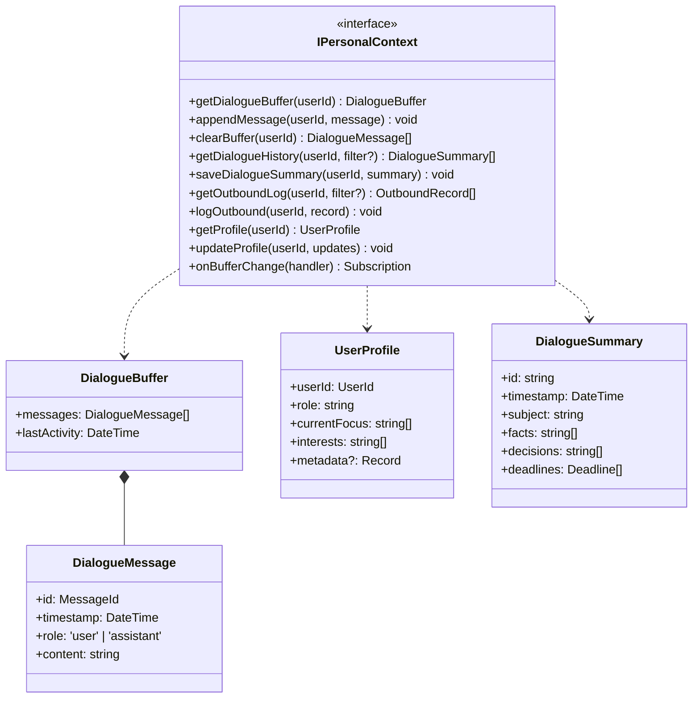
```mermaid
classDiagram
    class IPersonalContext {
        <<interface>>
        +getDialogueBuffer(userId) DialogueBuffer
        +appendMessage(userId, message) void
        +clearBuffer(userId) DialogueMessage[]
        +getDialogueHistory(userId, filter?) DialogueSummary[]
        +saveDialogueSummary(userId, summary) void
        +getOutboundLog(userId, filter?) OutboundRecord[]
        +logOutbound(userId, record) void
        +getProfile(userId) UserProfile
        +updateProfile(userId, updates) void
        +onBufferChange(handler) Subscription
    }
    
    class DialogueBuffer {
        +messages: DialogueMessage[]
        +lastActivity: DateTime
    }
    
    class DialogueMessage {
        +id: MessageId
        +timestamp: DateTime
        +role: 'user' | 'assistant'
        +content: string
    }
    
    class UserProfile {
        +userId: UserId
        +role: string
        +currentFocus: string[]
        +interests: string[]
        +metadata?: Record
    }
    
    class DialogueSummary {
        +id: string
        +timestamp: DateTime
        +subject: string
        +facts: string[]
        +decisions: string[]
        +deadlines: Deadline[]
    }
    
    IPersonalContext ..> DialogueBuffer
    IPersonalContext ..> UserProfile
    IPersonalContext ..> DialogueSummary
    DialogueBuffer *-- DialogueMessage
```

**Контракт:**

```typescript
interface IPersonalContext {
  // PC.1 — Dialogue Buffer
  getDialogueBuffer(userId: UserId): Promise<DialogueBuffer>
  appendMessage(userId: UserId, message: DialogueMessage): Promise<void>
  clearBuffer(userId: UserId): Promise<DialogueMessage[]>
  
  // PC.2 — History & Outbound Log
  getDialogueHistory(userId: UserId, filter?: HistoryFilter): Promise<DialogueSummary[]>
  saveDialogueSummary(userId: UserId, summary: DialogueSummary): Promise<void>
  
  getOutboundLog(userId: UserId, filter?: HistoryFilter): Promise<OutboundRecord[]>
  logOutbound(userId: UserId, record: OutboundRecord): Promise<void>
  
  // PC.3 — User Profile
  getProfile(userId: UserId): Promise<UserProfile>
  updateProfile(userId: UserId, updates: Partial<UserProfile>): Promise<void>
  
  // Наблюдение (для VS)
  onBufferChange(handler: (userId: UserId, buffer: DialogueBuffer) => void): Subscription
}

interface DialogueBuffer {
  messages: DialogueMessage[]
  lastActivity: DateTime
}

interface DialogueMessage {
  id: MessageId
  timestamp: DateTime
  role: 'user' | 'assistant'
  content: string
}

interface UserProfile {
  userId: UserId
  role: string
  currentFocus: string[]
  interests: string[]
  metadata?: Record<string, unknown>
}
```

---

### 1.3 IDialogueBoundaryDetector (DBD)

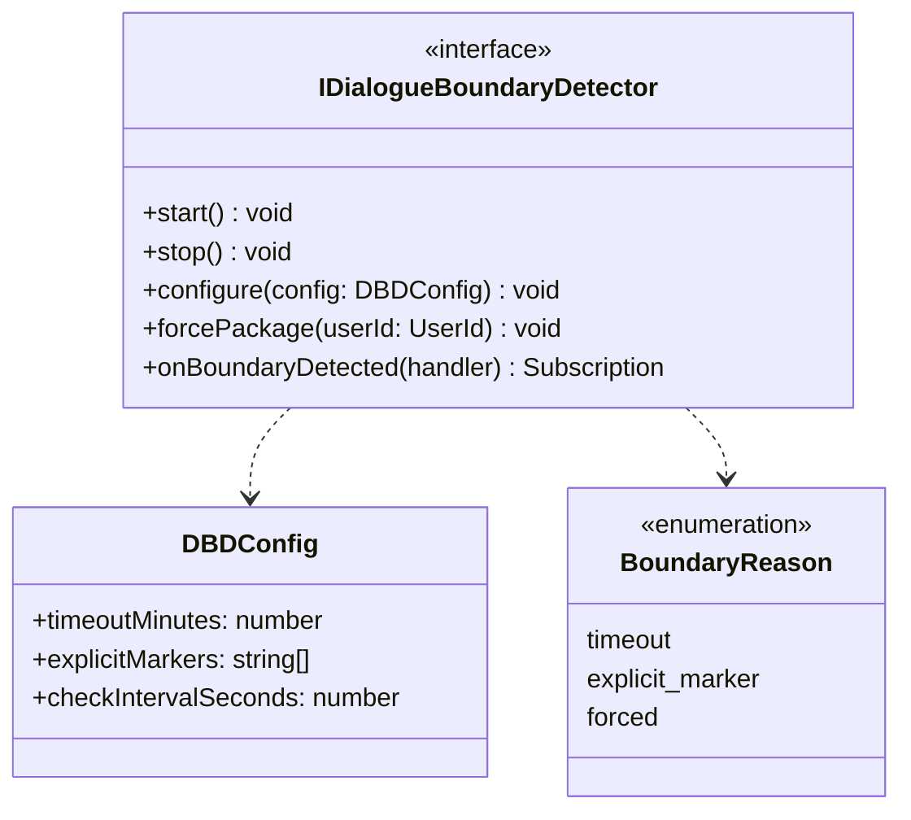
```mermaid
classDiagram
    class IDialogueBoundaryDetector {
        <<interface>>
        +start() void
        +stop() void
        +configure(config: DBDConfig) void
        +forcePackage(userId: UserId) void
        +onBoundaryDetected(handler) Subscription
    }
    
    class DBDConfig {
        +timeoutMinutes: number
        +explicitMarkers: string[]
        +checkIntervalSeconds: number
    }
    
    class BoundaryReason {
        <<enumeration>>
        timeout
        explicit_marker
        forced
    }
    
    IDialogueBoundaryDetector ..> DBDConfig
    IDialogueBoundaryDetector ..> BoundaryReason
```

**Контракт:**

```typescript
interface IDialogueBoundaryDetector {
  // Запуск мониторинга
  start(): void
  stop(): void
  
  // Конфигурация
  configure(config: DBDConfig): void
  
  // Ручной триггер (для тестирования)
  forcePackage(userId: UserId): Promise<void>
  
  // Наблюдение
  onBoundaryDetected(handler: (userId: UserId, reason: BoundaryReason) => void): Subscription
}

interface DBDConfig {
  timeoutMinutes: number
  explicitMarkers: string[]
  checkIntervalSeconds: number
}

type BoundaryReason = 'timeout' | 'explicit_marker' | 'forced'
```

---

### 1.4 IProcessingAgent (APL)

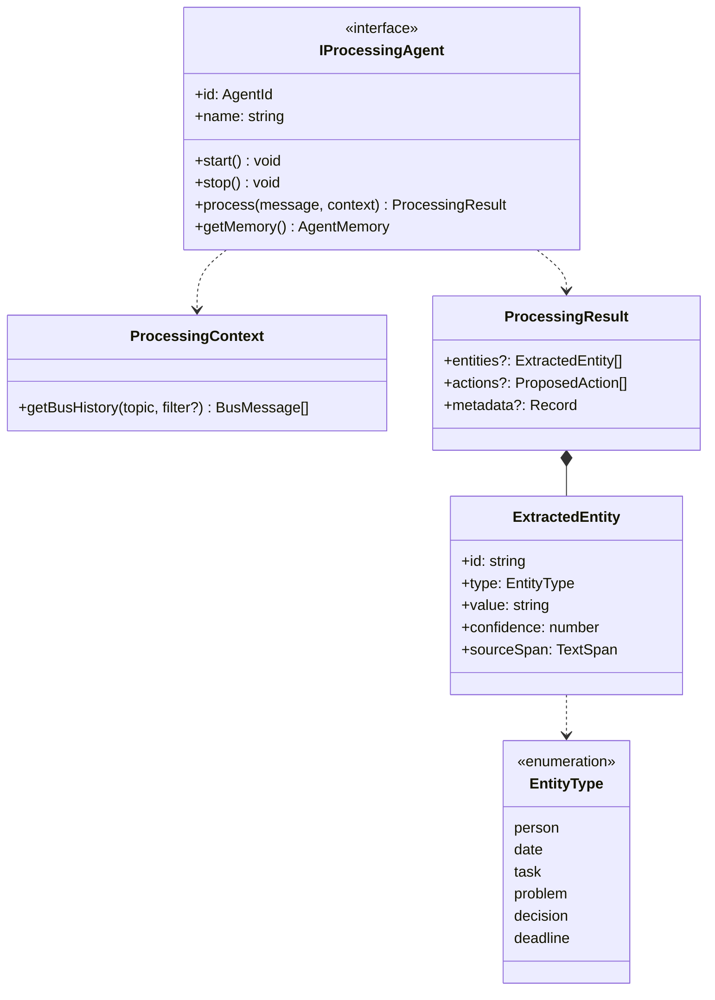
```mermaid
classDiagram
    class IProcessingAgent {
        <<interface>>
        +id: AgentId
        +name: string
        +start() void
        +stop() void
        +process(message, context) ProcessingResult
        +getMemory() AgentMemory
    }
    
    class ProcessingContext {
        +getBusHistory(topic, filter?) BusMessage[]
    }
    
    class ProcessingResult {
        +entities?: ExtractedEntity[]
        +actions?: ProposedAction[]
        +metadata?: Record
    }
    
    class ExtractedEntity {
        +id: string
        +type: EntityType
        +value: string
        +confidence: number
        +sourceSpan: TextSpan
    }
    
    class EntityType {
        <<enumeration>>
        person
        date
        task
        problem
        decision
        deadline
    }
    
    IProcessingAgent ..> ProcessingContext
    IProcessingAgent ..> ProcessingResult
    ProcessingResult *-- ExtractedEntity
    ExtractedEntity ..> EntityType
```

**Контракт:**

```typescript
interface IProcessingAgent {
  id: AgentId
  name: string
  
  // Жизненный цикл
  start(): Promise<void>
  stop(): Promise<void>
  
  // Обработка (вызывается при получении сообщения из DB.raw)
  process(message: BusMessage, context: ProcessingContext): Promise<ProcessingResult>
  
  // Память агента
  getMemory(): Promise<AgentMemory>
}

interface ProcessingContext {
  // Доступ к истории DB для контекста
  getBusHistory(topic: Topic, filter?: HistoryFilter): Promise<BusMessage[]>
}

interface ProcessingResult {
  entities?: ExtractedEntity[]
  actions?: ProposedAction[]
  metadata?: Record<string, unknown>
}

interface AgentMemory {
  // Структура определяется конкретным агентом
  [key: string]: unknown
}
```

---

### 1.5 IUserAssistant (UA)

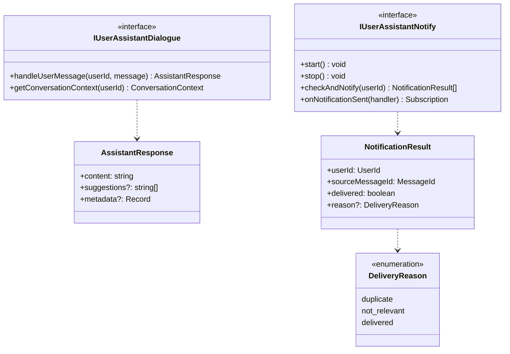
```mermaid
classDiagram
    class IUserAssistantDialogue {
        <<interface>>
        +handleUserMessage(userId, message) AssistantResponse
        +getConversationContext(userId) ConversationContext
    }
    
    class IUserAssistantNotify {
        <<interface>>
        +start() void
        +stop() void
        +checkAndNotify(userId) NotificationResult[]
        +onNotificationSent(handler) Subscription
    }
    
    class AssistantResponse {
        +content: string
        +suggestions?: string[]
        +metadata?: Record
    }
    
    class NotificationResult {
        +userId: UserId
        +sourceMessageId: MessageId
        +delivered: boolean
        +reason?: DeliveryReason
    }
    
    class DeliveryReason {
        <<enumeration>>
        duplicate
        not_relevant
        delivered
    }
    
    IUserAssistantDialogue ..> AssistantResponse
    IUserAssistantNotify ..> NotificationResult
    NotificationResult ..> DeliveryReason
```

**Контракт:**

```typescript
interface IUserAssistantDialogue {
  // Обработка входящего сообщения от пользователя
  handleUserMessage(userId: UserId, message: string): Promise<AssistantResponse>
  
  // Контекст для генерации ответа
  getConversationContext(userId: UserId): Promise<ConversationContext>
}

interface IUserAssistantNotify {
  // Запуск/остановка
  start(): void
  stop(): void
  
  // Ручная проверка (для тестирования)
  checkAndNotify(userId: UserId): Promise<NotificationResult[]>
  
  // Наблюдение
  onNotificationSent(handler: (userId: UserId, notification: Notification) => void): Subscription
}

interface NotificationResult {
  userId: UserId
  sourceMessageId: MessageId
  delivered: boolean
  reason?: 'duplicate' | 'not_relevant' | 'delivered'
}
```

---

### 1.6 ISimulation (SIM)

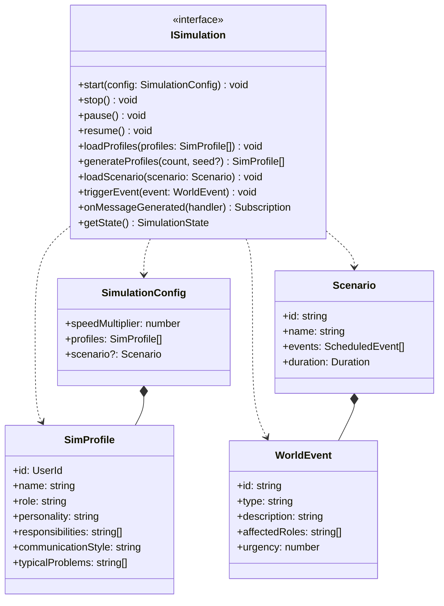
```mermaid
classDiagram
    class ISimulation {
        <<interface>>
        +start(config: SimulationConfig) void
        +stop() void
        +pause() void
        +resume() void
        +loadProfiles(profiles: SimProfile[]) void
        +generateProfiles(count, seed?) SimProfile[]
        +loadScenario(scenario: Scenario) void
        +triggerEvent(event: WorldEvent) void
        +onMessageGenerated(handler) Subscription
        +getState() SimulationState
    }
    
    class SimulationConfig {
        +speedMultiplier: number
        +profiles: SimProfile[]
        +scenario?: Scenario
    }
    
    class SimProfile {
        +id: UserId
        +name: string
        +role: string
        +personality: string
        +responsibilities: string[]
        +communicationStyle: string
        +typicalProblems: string[]
    }
    
    class Scenario {
        +id: string
        +name: string
        +events: ScheduledEvent[]
        +duration: Duration
    }
    
    class WorldEvent {
        +id: string
        +type: string
        +description: string
        +affectedRoles: string[]
        +urgency: number
    }
    
    ISimulation ..> SimulationConfig
    ISimulation ..> SimProfile
    ISimulation ..> Scenario
    ISimulation ..> WorldEvent
    SimulationConfig *-- SimProfile
    Scenario *-- WorldEvent
```

**Контракт:**

```typescript
interface ISimulation {
  // Управление
  start(config: SimulationConfig): void
  stop(): void
  pause(): void
  resume(): void
  
  // Профили
  loadProfiles(profiles: SimProfile[]): void
  generateProfiles(count: number, seed?: SeedData): Promise<SimProfile[]>
  
  // Сценарии
  loadScenario(scenario: Scenario): void
  triggerEvent(event: WorldEvent): void
  
  // Наблюдение
  onMessageGenerated(handler: (profile: SimProfile, message: string) => void): Subscription
  
  // Состояние
  getState(): SimulationState
}

interface SimulationConfig {
  speedMultiplier: number  // 1.0 = реальное время, 10.0 = ускорение в 10 раз
  profiles: SimProfile[]
  scenario?: Scenario
}

interface SimProfile {
  id: UserId
  name: string
  role: string
  personality: string
  responsibilities: string[]
  communicationStyle: string
  typicalProblems: string[]
}
```

---

### 1.7 IVisualization (VS)

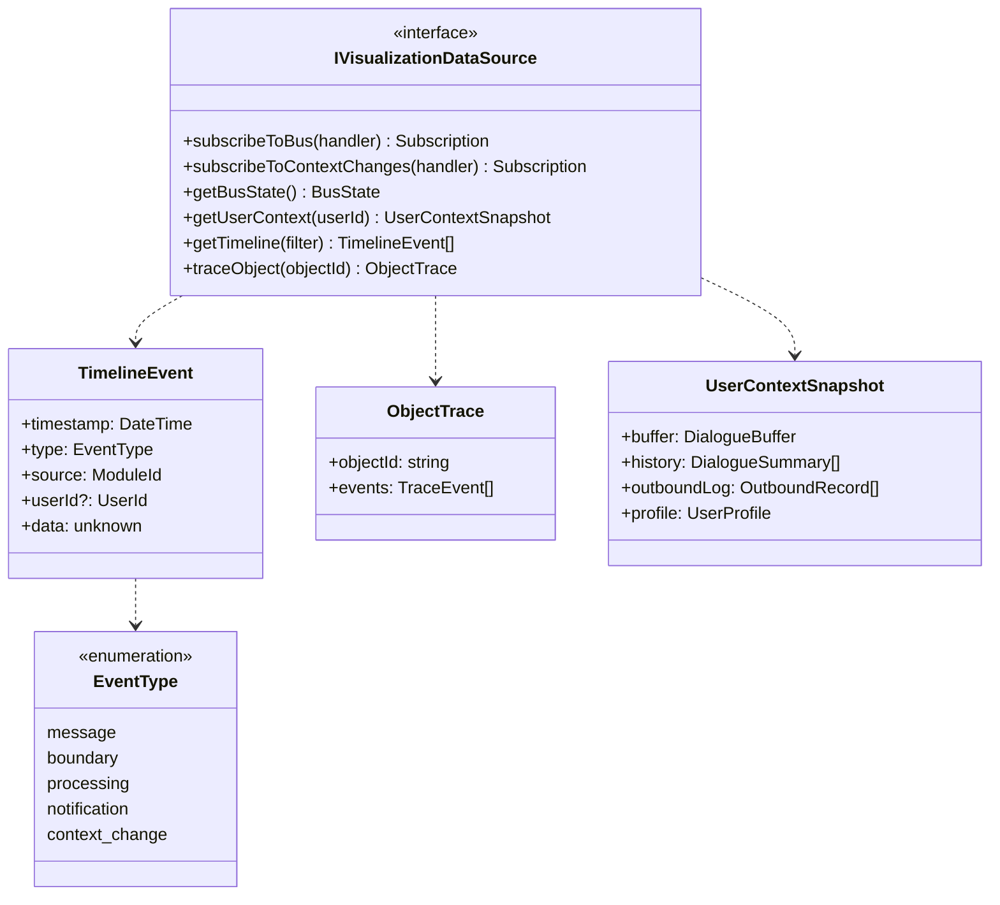
```mermaid
classDiagram
    class IVisualizationDataSource {
        <<interface>>
        +subscribeToBus(handler) Subscription
        +subscribeToContextChanges(handler) Subscription
        +getBusState() BusState
        +getUserContext(userId) UserContextSnapshot
        +getTimeline(filter) TimelineEvent[]
        +traceObject(objectId) ObjectTrace
    }
    
    class TimelineEvent {
        +timestamp: DateTime
        +type: EventType
        +source: ModuleId
        +userId?: UserId
        +data: unknown
    }
    
    class EventType {
        <<enumeration>>
        message
        boundary
        processing
        notification
        context_change
    }
    
    class ObjectTrace {
        +objectId: string
        +events: TraceEvent[]
    }
    
    class UserContextSnapshot {
        +buffer: DialogueBuffer
        +history: DialogueSummary[]
        +outboundLog: OutboundRecord[]
        +profile: UserProfile
    }
    
    IVisualizationDataSource ..> TimelineEvent
    IVisualizationDataSource ..> ObjectTrace
    IVisualizationDataSource ..> UserContextSnapshot
    TimelineEvent ..> EventType
```

**Контракт:**

```typescript
interface IVisualizationDataSource {
  // Подписка на события (real-time)
  subscribeToBus(handler: BusEventHandler): Subscription
  subscribeToContextChanges(handler: ContextChangeHandler): Subscription
  
  // Запрос данных
  getBusState(): Promise<BusState>
  getUserContext(userId: UserId): Promise<UserContextSnapshot>
  getTimeline(filter: TimelineFilter): Promise<TimelineEvent[]>
  traceObject(objectId: string): Promise<ObjectTrace>
}

interface TimelineEvent {
  timestamp: DateTime
  type: 'message' | 'boundary' | 'processing' | 'notification'
  source: ModuleId
  userId?: UserId
  data: unknown
}

interface ObjectTrace {
  objectId: string
  events: TraceEvent[]
}
```

---

## 2. Стратегия моков

### 2.1 Матрица: что мокируем, что реальное

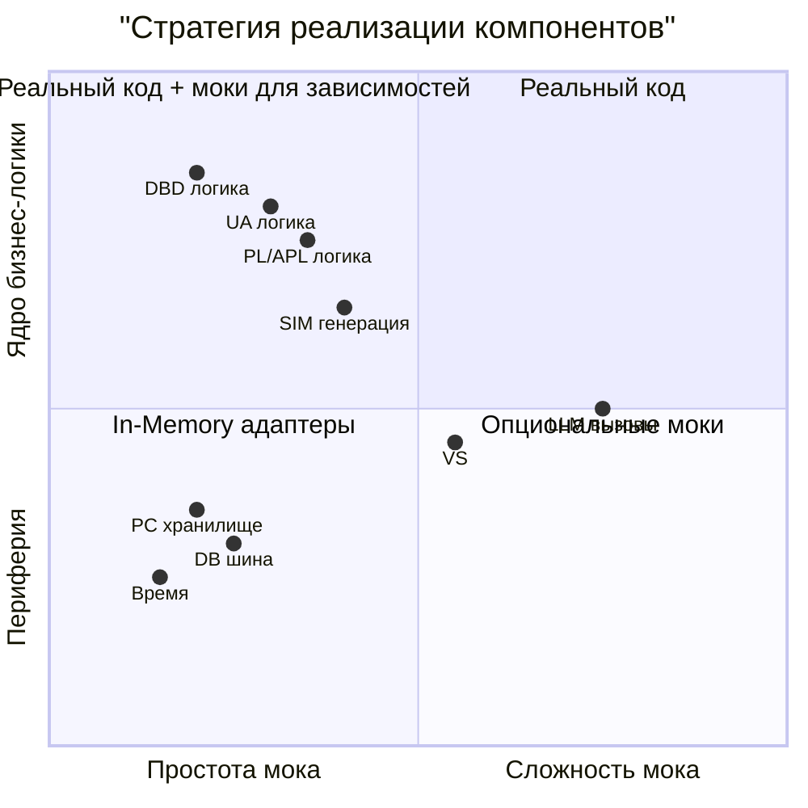
```mermaid
quadrantChart
    title "Стратегия реализации компонентов"
    x-axis "Простота мока" --> "Сложность мока"
    y-axis "Периферия" --> "Ядро бизнес-логики"
    quadrant-1 "Реальный код"
    quadrant-2 "Реальный код + моки для зависимостей"
    quadrant-3 "In-Memory адаптеры"
    quadrant-4 "Опциональные моки"
    
    "DBD логика": [0.2, 0.85]
    "UA логика": [0.3, 0.80]
    "PL/APL логика": [0.35, 0.75]
    "SIM генерация": [0.4, 0.65]
    "DB шина": [0.25, 0.30]
    "PC хранилище": [0.20, 0.35]
    "LLM вызовы": [0.75, 0.50]
    "Время": [0.15, 0.25]
    "VS": [0.55, 0.45]
```

| Компонент | Dev-режим | Обоснование |
|-----------|-----------|-------------|
| **DB (шина)** | In-Memory | Не нужен Kafka — достаточно EventEmitter + массив |
| **DB (персистентность)** | In-Memory (Map) | Данные живут в памяти процесса |
| **PC (хранилище)** | In-Memory (Map) | Один объект на пользователя |
| **DBD (логика)** | Реальный код | Это бизнес-логика, её и тестируем |
| **UA (логика)** | Реальный код | Бизнес-логика |
| **PL/APL (логика)** | Реальный код | Бизнес-логика |
| **LLM-вызовы** | Опционально мок | Для быстрых тестов — заглушки, для интеграционных — реальные |
| **SIM** | Реальный код | Генерация данных — часть тестирования |
| **VS** | Реальный код | Подключается к in-memory хранилищам |
| **Время** | Виртуальное | Для ускорения симуляции |

---

### 2.2 In-Memory реализации

#### Поток данных в In-Memory режиме

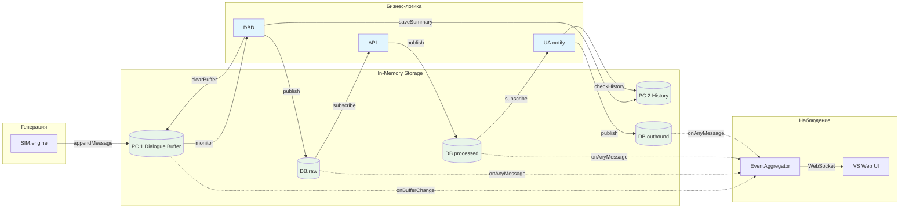
```mermaid
flowchart LR
    subgraph "Генерация"
        SIM[SIM.engine]
    end
    
    subgraph "In-Memory Storage"
        PC1[("PC.1 Dialogue Buffer")]
        PC2[("PC.2 History")]
        DB_RAW[("DB.raw")]
        DB_PROC[("DB.processed")]
        DB_OUT[("DB.outbound")]
    end
    
    subgraph "Бизнес-логика"
        DBD[DBD]
        APL[APL]
        NOTIFY[UA.notify]
    end
    
    subgraph "Наблюдение"
        EA[EventAggregator]
        VS[VS Web UI]
    end
    
    SIM -->|appendMessage| PC1
    PC1 -->|monitor| DBD
    DBD -->|clearBuffer| PC1
    DBD -->|publish| DB_RAW
    DBD -->|saveSummary| PC2
    
    DB_RAW -->|subscribe| APL
    APL -->|publish| DB_PROC
    
    DB_PROC -->|subscribe| NOTIFY
    NOTIFY -->|checkHistory| PC2
    NOTIFY -->|publish| DB_OUT
    
    PC1 -.->|onBufferChange| EA
    DB_RAW -.->|onAnyMessage| EA
    DB_PROC -.->|onAnyMessage| EA
    DB_OUT -.->|onAnyMessage| EA
    
    EA -->|WebSocket| VS
    
    style PC1 fill:#e8f5e9
    style PC2 fill:#e8f5e9
    style DB_RAW fill:#e8f5e9
    style DB_PROC fill:#e8f5e9
    style DB_OUT fill:#e8f5e9
    style DBD fill:#e1f5fe
    style APL fill:#e1f5fe
    style NOTIFY fill:#e1f5fe
```

#### InMemoryDataBus

```typescript
class InMemoryDataBus implements IDataBus {
  private messages: Map<Topic, BusMessage[]> = new Map()
  private subscribers: Map<Topic, Set<MessageHandler>> = new Map()
  private globalListeners: Set<(topic: Topic, msg: BusMessage) => void> = new Set()
  
  async publish(topic: Topic, message: BusMessage): Promise<MessageId> {
    const id = generateId()
    const msg = { ...message, id, timestamp: this.clock.now() }
    
    // Сохраняем
    if (!this.messages.has(topic)) this.messages.set(topic, [])
    this.messages.get(topic)!.push(msg)
    
    // Уведомляем подписчиков
    this.subscribers.get(topic)?.forEach(handler => handler(msg))
    this.globalListeners.forEach(listener => listener(topic, msg))
    
    return id
  }
  
  async getHistory(topic: Topic, filter?: HistoryFilter): Promise<BusMessage[]> {
    const messages = this.messages.get(topic) || []
    return this.applyFilter(messages, filter)
  }
  
  // ... остальные методы
  
  // Для тестов: сброс состояния
  reset(): void {
    this.messages.clear()
  }
  
  // Для VS: снапшот всего состояния
  getSnapshot(): Record<Topic, BusMessage[]> {
    return Object.fromEntries(this.messages)
  }
}
```

#### InMemoryPersonalContext

```typescript
class InMemoryPersonalContext implements IPersonalContext {
  private buffers: Map<UserId, DialogueBuffer> = new Map()
  private history: Map<UserId, DialogueSummary[]> = new Map()
  private outboundLogs: Map<UserId, OutboundRecord[]> = new Map()
  private profiles: Map<UserId, UserProfile> = new Map()
  private changeListeners: Set<(userId: UserId, buffer: DialogueBuffer) => void> = new Set()
  
  async getDialogueBuffer(userId: UserId): Promise<DialogueBuffer> {
    if (!this.buffers.has(userId)) {
      this.buffers.set(userId, { messages: [], lastActivity: this.clock.now() })
    }
    return this.buffers.get(userId)!
  }
  
  async appendMessage(userId: UserId, message: DialogueMessage): Promise<void> {
    const buffer = await this.getDialogueBuffer(userId)
    buffer.messages.push(message)
    buffer.lastActivity = this.clock.now()
    
    // Уведомляем слушателей (для VS)
    this.changeListeners.forEach(listener => listener(userId, buffer))
  }
  
  // ... остальные методы
  
  // Для тестов
  reset(): void {
    this.buffers.clear()
    this.history.clear()
    this.outboundLogs.clear()
    this.profiles.clear()
  }
  
  // Для VS
  getAllUsers(): UserId[] {
    return [...new Set([
      ...this.buffers.keys(),
      ...this.profiles.keys()
    ])]
  }
}
```

---

### 2.3 Виртуальное время

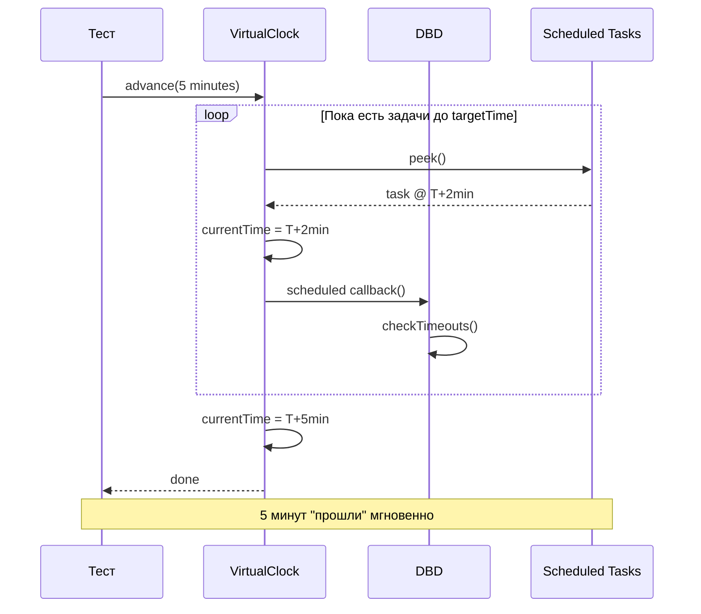
```mermaid
sequenceDiagram
    participant Test as Тест
    participant Clock as VirtualClock
    participant DBD as DBD
    participant Queue as Scheduled Tasks
    
    Test->>Clock: advance(5 minutes)
    
    loop Пока есть задачи до targetTime
        Clock->>Queue: peek()
        Queue-->>Clock: task @ T+2min
        Clock->>Clock: currentTime = T+2min
        Clock->>DBD: scheduled callback()
        DBD->>DBD: checkTimeouts()
    end
    
    Clock->>Clock: currentTime = T+5min
    Clock-->>Test: done
    
    Note over Test,Queue: 5 минут "прошли" мгновенно
```

```typescript
interface IClock {
  now(): DateTime
  advance(duration: Duration): void
  setSpeed(multiplier: number): void
  
  // Планирование
  schedule(delay: Duration, callback: () => void): TimerId
  cancel(timerId: TimerId): void
}

class VirtualClock implements IClock {
  private currentTime: DateTime
  private speed: number = 1.0
  private scheduled: PriorityQueue<ScheduledTask>
  
  now(): DateTime {
    return this.currentTime
  }
  
  advance(duration: Duration): void {
    const targetTime = this.currentTime.plus(duration)
    
    // Выполняем все запланированные задачи до targetTime
    while (this.scheduled.peek()?.time <= targetTime) {
      const task = this.scheduled.pop()!
      this.currentTime = task.time
      task.callback()
    }
    
    this.currentTime = targetTime
  }
  
  // Для реального времени с ускорением
  startRealtime(): void {
    setInterval(() => {
      this.advance(Duration.milliseconds(100 * this.speed))
    }, 100)
  }
}
```

---

### 2.4 LLM-моки

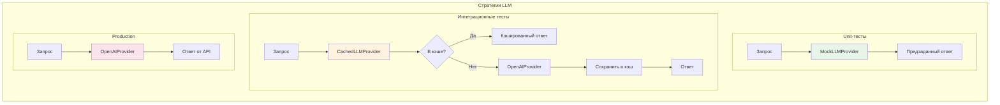
```mermaid
flowchart TB
    subgraph "Стратегии LLM"
        direction TB
        
        subgraph "Unit-тесты"
            UT_REQ[Запрос] --> MOCK[MockLLMProvider]
            MOCK --> UT_RESP[Предзаданный ответ]
        end
        
        subgraph "Интеграционные тесты"
            IT_REQ[Запрос] --> CACHED[CachedLLMProvider]
            CACHED --> CACHE_CHECK{В кэше?}
            CACHE_CHECK -->|Да| CACHE_HIT[Кэшированный ответ]
            CACHE_CHECK -->|Нет| REAL[OpenAIProvider]
            REAL --> SAVE[Сохранить в кэш]
            SAVE --> IT_RESP[Ответ]
        end
        
        subgraph "Production"
            PROD_REQ[Запрос] --> OPENAI[OpenAIProvider]
            OPENAI --> PROD_RESP[Ответ от API]
        end
    end
    
    style MOCK fill:#e8f5e9
    style CACHED fill:#fff3e0
    style OPENAI fill:#fce4ec
```

```typescript
interface ILLMProvider {
  complete(prompt: string, options?: LLMOptions): Promise<string>
  chat(messages: ChatMessage[], options?: LLMOptions): Promise<string>
}

// Для быстрых unit-тестов
class MockLLMProvider implements ILLMProvider {
  private responses: Map<string, string> = new Map()
  
  // Предзаданные ответы по паттернам
  addResponse(pattern: RegExp | string, response: string): void {
    this.responses.set(pattern.toString(), response)
  }
  
  async complete(prompt: string): Promise<string> {
    for (const [pattern, response] of this.responses) {
      if (new RegExp(pattern).test(prompt)) {
        return response
      }
    }
    return '[MOCK: No matching response]'
  }
}

// Для интеграционных тестов — реальный провайдер
class OpenAIProvider implements ILLMProvider {
  // Реальные вызовы API
}

// Гибрид: кэширование + реальные вызовы
class CachedLLMProvider implements ILLMProvider {
  constructor(
    private real: ILLMProvider,
    private cache: Map<string, string> = new Map()
  ) {}
  
  async complete(prompt: string): Promise<string> {
    const hash = this.hashPrompt(prompt)
    if (this.cache.has(hash)) {
      return this.cache.get(hash)!
    }
    const response = await this.real.complete(prompt)
    this.cache.set(hash, response)
    return response
  }
}
```

---

## 3. Наблюдаемость через VS

### 3.1 Архитектура VS в dev-режиме

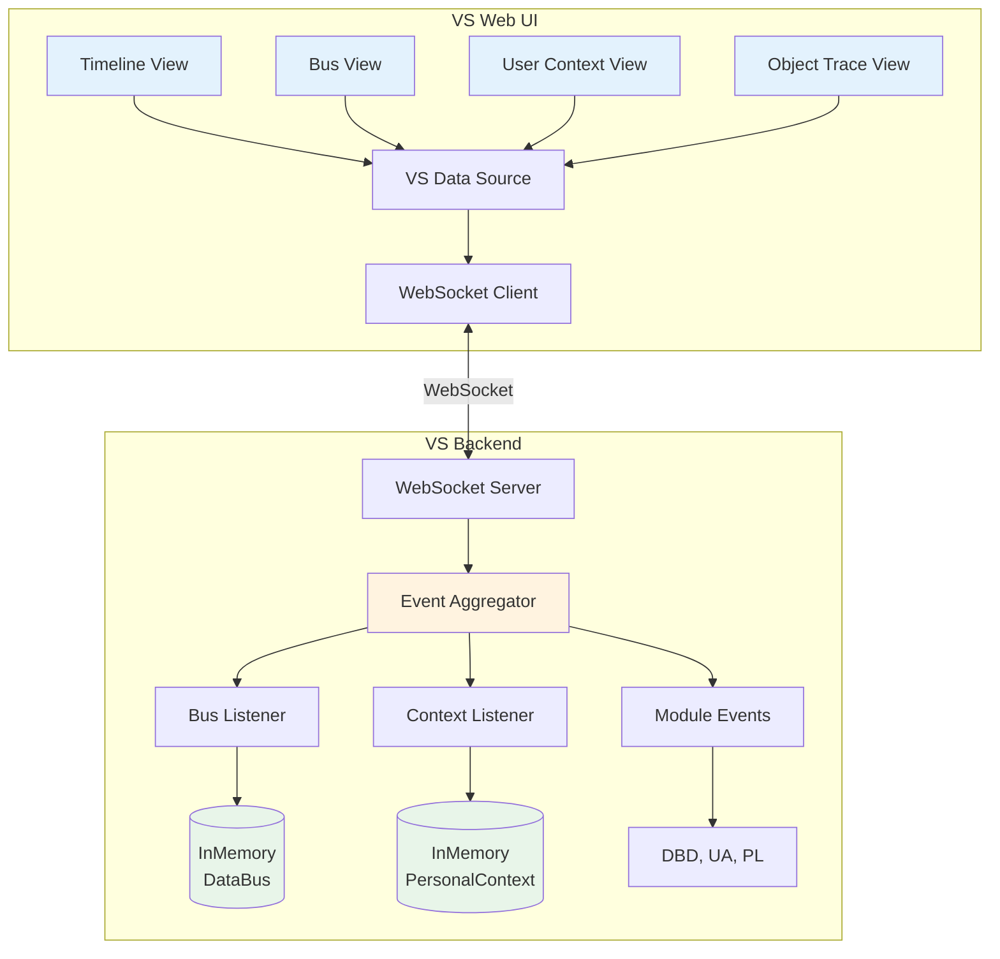
```mermaid
flowchart TB
    subgraph "VS Web UI"
        TL[Timeline View]
        BV[Bus View]
        UV[User Context View]
        OT[Object Trace View]
        
        TL & BV & UV & OT --> DS[VS Data Source]
        DS --> WS[WebSocket Client]
    end
    
    WS <-->|WebSocket| WSS[WebSocket Server]
    
    subgraph "VS Backend"
        WSS --> EA[Event Aggregator]
        
        EA --> BL[Bus Listener]
        EA --> CL[Context Listener]
        EA --> ML[Module Events]
        
        BL --> IMDB[(InMemory\nDataBus)]
        CL --> IMPC[(InMemory\nPersonalContext)]
        ML --> MODULES[DBD, UA, PL]
    end
    
    style TL fill:#e3f2fd
    style BV fill:#e3f2fd
    style UV fill:#e3f2fd
    style OT fill:#e3f2fd
    style EA fill:#fff3e0
    style IMDB fill:#e8f5e9
    style IMPC fill:#e8f5e9
```

---

### 3.2 Event Aggregator

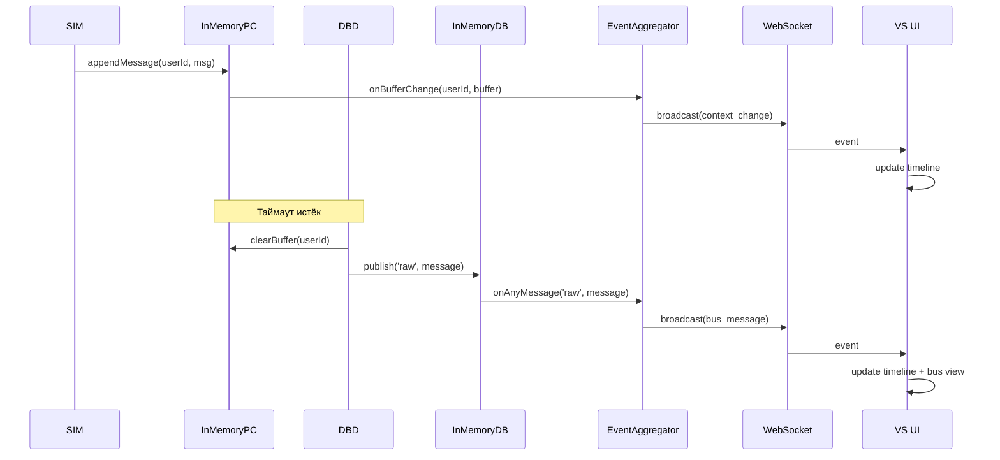
```mermaid
sequenceDiagram
    participant SIM as SIM
    participant PC as InMemoryPC
    participant DBD as DBD
    participant DB as InMemoryDB
    participant EA as EventAggregator
    participant WS as WebSocket
    participant VS as VS UI
    
    SIM->>PC: appendMessage(userId, msg)
    PC->>EA: onBufferChange(userId, buffer)
    EA->>WS: broadcast(context_change)
    WS->>VS: event
    VS->>VS: update timeline
    
    Note over PC,DBD: Таймаут истёк
    
    DBD->>PC: clearBuffer(userId)
    DBD->>DB: publish('raw', message)
    DB->>EA: onAnyMessage('raw', message)
    EA->>WS: broadcast(bus_message)
    WS->>VS: event
    VS->>VS: update timeline + bus view
```

```typescript
class EventAggregator implements IVisualizationDataSource {
  constructor(
    private bus: InMemoryDataBus,
    private context: InMemoryPersonalContext,
    private clock: IClock
  ) {
    this.setupListeners()
  }
  
  private events: TimelineEvent[] = []
  private wsClients: Set<WebSocket> = new Set()
  
  private setupListeners(): void {
    // Слушаем все события шины
    this.bus.onAnyMessage((topic, message) => {
      const event: TimelineEvent = {
        timestamp: message.timestamp,
        type: this.topicToEventType(topic),
        source: message.source,
        userId: message.userId,
        data: message
      }
      this.events.push(event)
      this.broadcast(event)
    })
    
    // Слушаем изменения контекста
    this.context.onBufferChange((userId, buffer) => {
      const event: TimelineEvent = {
        timestamp: this.clock.now(),
        type: 'context_change',
        source: 'PC',
        userId,
        data: { buffer }
      }
      this.events.push(event)
      this.broadcast(event)
    })
  }
  
  private broadcast(event: TimelineEvent): void {
    const payload = JSON.stringify(event)
    this.wsClients.forEach(ws => ws.send(payload))
  }
  
  // API для VS
  async getTimeline(filter: TimelineFilter): Promise<TimelineEvent[]> {
    return this.applyFilter(this.events, filter)
  }
  
  async getBusState(): Promise<BusState> {
    return {
      raw: await this.bus.getHistory('raw'),
      processed: await this.bus.getHistory('processed'),
      outbound: await this.bus.getHistory('outbound')
    }
  }
  
  async getUserContext(userId: UserId): Promise<UserContextSnapshot> {
    return {
      buffer: await this.context.getDialogueBuffer(userId),
      history: await this.context.getDialogueHistory(userId),
      outboundLog: await this.context.getOutboundLog(userId),
      profile: await this.context.getProfile(userId)
    }
  }
  
  async traceObject(objectId: string): Promise<ObjectTrace> {
    // Находим все события, связанные с объектом
    const related = this.events.filter(e => 
      this.extractObjectIds(e).includes(objectId)
    )
    return { objectId, events: related }
  }
}
```

---

### 3.3 VS получает данные без задержки

Ключевой момент: in-memory реализации синхронно вызывают слушателей при каждом изменении. VS видит события мгновенно.

```typescript
// При публикации в шину
async publish(topic: Topic, message: BusMessage): Promise<MessageId> {
  // ...
  // Синхронный вызов — VS получает данные сразу
  this.globalListeners.forEach(listener => listener(topic, msg))
  return id
}
```

---

### 3.4 Режимы работы VS

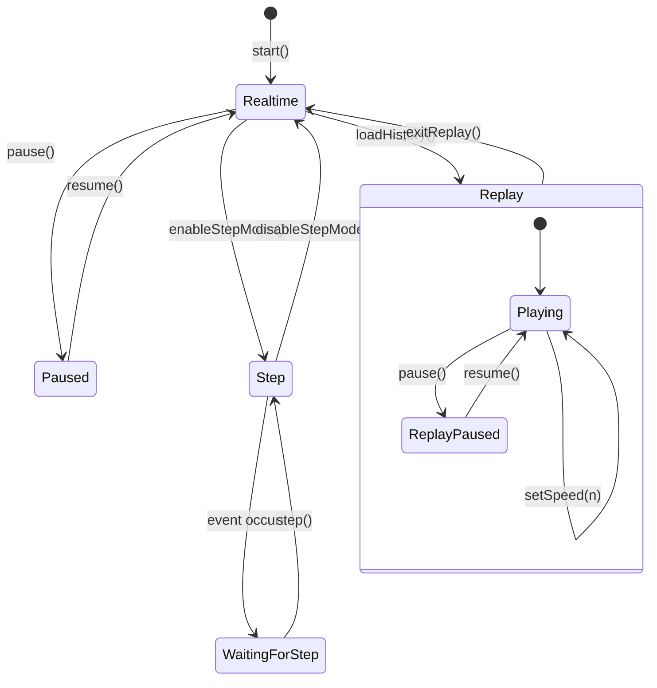
```mermaid
stateDiagram-v2
    [*] --> Realtime: start()
    
    Realtime --> Paused: pause()
    Paused --> Realtime: resume()
    
    Realtime --> Step: enableStepMode()
    Step --> Realtime: disableStepMode()
    
    Step --> WaitingForStep: event occurs
    WaitingForStep --> Step: step()
    
    Realtime --> Replay: loadHistory()
    Replay --> Realtime: exitReplay()
    
    state Replay {
        [*] --> Playing
        Playing --> ReplayPaused: pause()
        ReplayPaused --> Playing: resume()
        Playing --> Playing: setSpeed(n)
    }
```

```typescript
interface VSConfig {
  mode: 'realtime' | 'replay' | 'step'
  
  // Для replay
  replaySpeed?: number
  replayFrom?: DateTime
  
  // Для step
  stepTrigger?: 'manual' | 'on_event'
}

// Step-режим для отладки: система останавливается после каждого события
class StepController {
  private paused: boolean = true
  private pendingResolve?: () => void
  
  async waitForStep(): Promise<void> {
    if (!this.paused) return
    return new Promise(resolve => {
      this.pendingResolve = resolve
    })
  }
  
  step(): void {
    this.pendingResolve?.()
    this.pendingResolve = undefined
  }
}
```

---

## 4. Dependency Injection Container

### 4.1 Конфигурация окружений

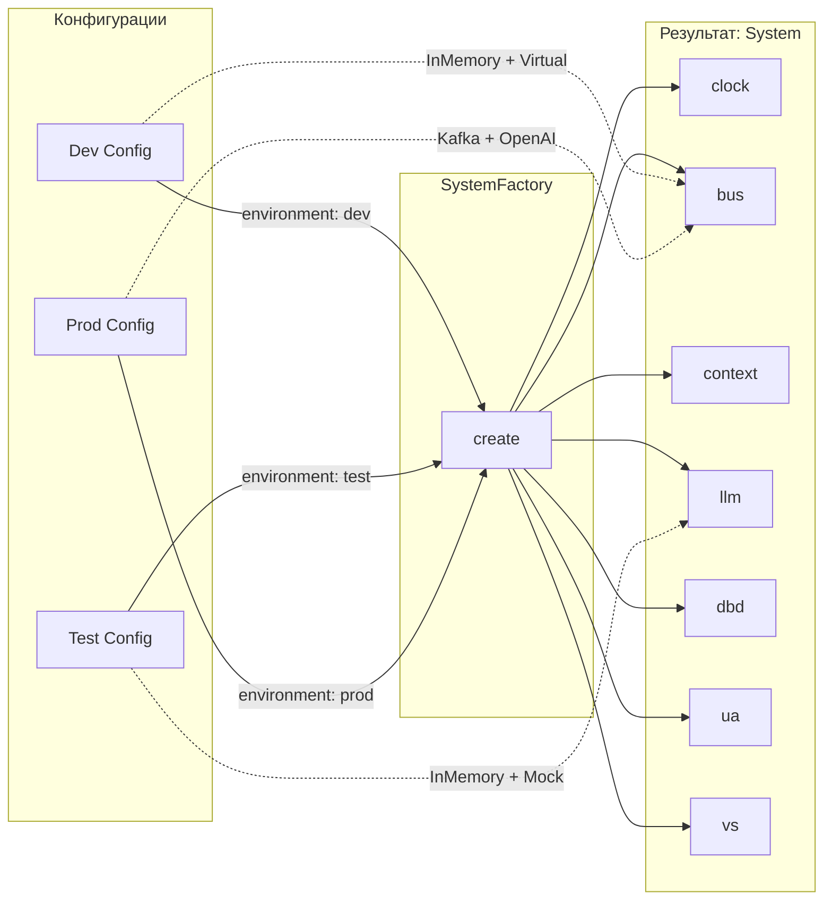
```mermaid
flowchart LR
    subgraph "Конфигурации"
        DEV[Dev Config]
        TEST[Test Config]
        PROD[Prod Config]
    end
    
    subgraph "SystemFactory"
        FACTORY[create]
    end
    
    subgraph "Результат: System"
        direction TB
        SYS_CLOCK[clock]
        SYS_BUS[bus]
        SYS_CTX[context]
        SYS_LLM[llm]
        SYS_DBD[dbd]
        SYS_UA[ua]
        SYS_VS[vs]
    end
    
    DEV -->|environment: dev| FACTORY
    TEST -->|environment: test| FACTORY
    PROD -->|environment: prod| FACTORY
    
    FACTORY --> SYS_CLOCK & SYS_BUS & SYS_CTX & SYS_LLM & SYS_DBD & SYS_UA & SYS_VS
    
    DEV -.->|InMemory + Virtual| SYS_BUS
    TEST -.->|InMemory + Mock| SYS_LLM
    PROD -.->|Kafka + OpenAI| SYS_BUS
```

```typescript
interface SystemConfig {
  environment: 'dev' | 'test' | 'production'
  
  // Компоненты
  dataBus: 'inmemory' | 'kafka'
  personalContext: 'inmemory' | 'redis'
  llmProvider: 'mock' | 'cached' | 'openai'
  clock: 'virtual' | 'real'
  
  // Параметры
  llmCachePath?: string
  virtualTimeSpeed?: number
}

const devConfig: SystemConfig = {
  environment: 'dev',
  dataBus: 'inmemory',
  personalContext: 'inmemory',
  llmProvider: 'cached',  // Кэшируем реальные ответы
  clock: 'virtual'
}

const testConfig: SystemConfig = {
  environment: 'test',
  dataBus: 'inmemory',
  personalContext: 'inmemory',
  llmProvider: 'mock',    // Предсказуемые ответы
  clock: 'virtual'
}

const productionConfig: SystemConfig = {
  environment: 'production',
  dataBus: 'kafka',
  personalContext: 'redis',
  llmProvider: 'openai',
  clock: 'real'
}
```

---

### 4.2 Фабрика системы

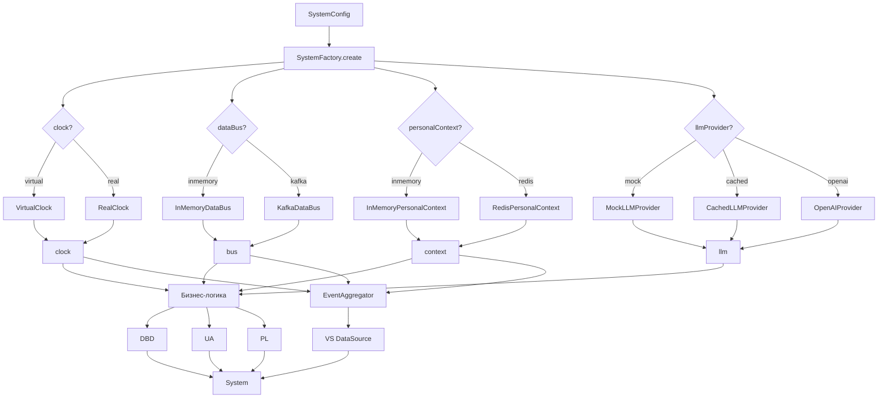
```mermaid
flowchart TB
    CONFIG[SystemConfig] --> FACTORY[SystemFactory.create]
    
    FACTORY --> CLOCK_CHECK{clock?}
    CLOCK_CHECK -->|virtual| VCLOCK[VirtualClock]
    CLOCK_CHECK -->|real| RCLOCK[RealClock]
    
    FACTORY --> BUS_CHECK{dataBus?}
    BUS_CHECK -->|inmemory| IMBUS[InMemoryDataBus]
    BUS_CHECK -->|kafka| KAFKA[KafkaDataBus]
    
    FACTORY --> CTX_CHECK{personalContext?}
    CTX_CHECK -->|inmemory| IMCTX[InMemoryPersonalContext]
    CTX_CHECK -->|redis| REDIS[RedisPersonalContext]
    
    FACTORY --> LLM_CHECK{llmProvider?}
    LLM_CHECK -->|mock| MOCKLLM[MockLLMProvider]
    LLM_CHECK -->|cached| CACHELLM[CachedLLMProvider]
    LLM_CHECK -->|openai| OPENAILLM[OpenAIProvider]
    
    VCLOCK & RCLOCK --> CLOCK_INST[clock]
    IMBUS & KAFKA --> BUS_INST[bus]
    IMCTX & REDIS --> CTX_INST[context]
    MOCKLLM & CACHELLM & OPENAILLM --> LLM_INST[llm]
    
    CLOCK_INST & BUS_INST & CTX_INST & LLM_INST --> BIZ[Бизнес-логика]
    
    BIZ --> DBD_INST[DBD]
    BIZ --> UA_INST[UA]
    BIZ --> PL_INST[PL]
    
    BUS_INST & CTX_INST & CLOCK_INST --> EA[EventAggregator]
    EA --> VS_INST[VS DataSource]
    
    DBD_INST & UA_INST & PL_INST & VS_INST --> SYSTEM[System]
```

```typescript
class SystemFactory {
  static create(config: SystemConfig): System {
    const clock = config.clock === 'virtual' 
      ? new VirtualClock() 
      : new RealClock()
    
    const bus = config.dataBus === 'inmemory'
      ? new InMemoryDataBus(clock)
      : new KafkaDataBus(config.kafkaConfig)
    
    const context = config.personalContext === 'inmemory'
      ? new InMemoryPersonalContext(clock)
      : new RedisPersonalContext(config.redisConfig)
    
    const llm = this.createLLMProvider(config)
    
    // Бизнес-логика — всегда реальная
    const dbd = new DialogueBoundaryDetector(context, bus, clock)
    const notify = new UserAssistantNotify(bus, context, llm)
    const dialogue = new UserAssistantDialogue(context, llm)
    
    // VS подключается к тому, что есть
    const vsDataSource = new EventAggregator(bus, context, clock)
    
    return new System({
      clock, bus, context, llm,
      dbd, notify, dialogue,
      vsDataSource
    })
  }
}
```

---

## 5. Сводка

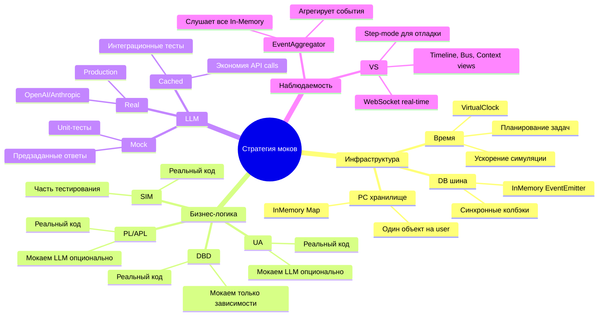
```mermaid
mindmap
  root((Стратегия моков))
    Инфраструктура
      DB шина
        InMemory EventEmitter
        Синхронные колбэки
      PC хранилище
        InMemory Map
        Один объект на user
      Время
        VirtualClock
        Ускорение симуляции
        Планирование задач
    Бизнес-логика
      DBD
        Реальный код
        Мокаем только зависимости
      UA
        Реальный код
        Мокаем LLM опционально
      PL/APL
        Реальный код
        Мокаем LLM опционально
      SIM
        Реальный код
        Часть тестирования
    LLM
      Mock
        Unit-тесты
        Предзаданные ответы
      Cached
        Интеграционные тесты
        Экономия API calls
      Real
        Production
        OpenAI/Anthropic
    Наблюдаемость
      EventAggregator
        Слушает все In-Memory
        Агрегирует события
      VS
        WebSocket real-time
        Timeline, Bus, Context views
        Step-mode для отладки
```

| Аспект | Решение |
|--------|---------|
| **Персистентность** | In-memory Map/Array, данные в памяти процесса |
| **Pub/Sub** | EventEmitter + синхронные колбэки |
| **Время** | VirtualClock с ускорением и планированием |
| **LLM** | Mock для unit-тестов, Cached для интеграционных |
| **VS** | Подключается напрямую к in-memory хранилищам через EventAggregator |
| **Переключение** | DI-контейнер с конфигами dev/test/prod |

**Ключевое преимущество:** бизнес-логика (DBD, UA, PL) пишется один раз и не знает, работает она с моками или production-инфраструктурой.
