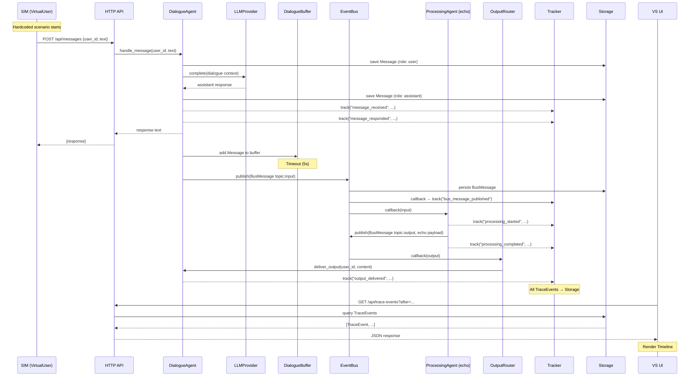

# Сквозной скелет: все компоненты в минимальной реализации

## Что нужно сделать

Реализовать сквозной скелет системы Team Assistant — все компоненты
в минимальной реализации, связанные в единый end-to-end поток.
Сообщение от SIM (VirtualUser) проходит полный цикл:
приём → ответ LLM → буферизация → публикация в шину →
обработка (echo) → output → доставка пользователю.
Параллельно: все события записываются как TraceEvents
и отображаются в VS UI Timeline.

## Зачем

Это первый вертикальный срез, валидирующий всю архитектуру:
все компоненты связаны, данные текут, наблюдаемость работает.
Без работающего скелета невозможно углублять отдельные части системы —
каждая доработка будет требовать стыковки, порождая проблемы интеграции.

## Acceptance Criteria

- [ ] AC-1: Application bootstrap запускает все компоненты Core в правильном порядке
- [ ] AC-2: SIM отправляет Messages через HTTP API (2-3 VirtualUsers, hardcoded сценарий)
- [ ] AC-3: DialogueAgent принимает Message, генерирует ответ через LLM, сохраняет в Storage
- [ ] AC-4: DialogueBuffer накапливает Messages и публикует в EventBus (topic: input) по таймауту (5с)
- [ ] AC-5: EventBus доставляет BusMessages подписчикам и персистирует их в Storage
- [ ] AC-6: ProcessingAgent (echo) получает input, публикует output
- [ ] AC-7: OutputRouter получает output, пересылает в DialogueAgent для доставки пользователю
- [ ] AC-8: Tracker записывает TraceEvents через оба канала (подписка EventBus + прямые track() вызовы)
- [ ] AC-9: HTTP API отдаёт TraceEvents по polling (GET /api/trace-events)
- [ ] AC-10: VS UI отображает Timeline с TraceEvents (новые сверху)
- [ ] AC-11: POST /api/control/reset очищает все данные между тестовыми запусками
- [ ] AC-12: Unit-тесты для каждого компонента
- [ ] AC-13: Интеграционный тест: SIM → Core → VS UI (end-to-end flow)

## Контекст

### Архитектурные решения

**Общая модель системы:**
- Core — long-running process (не serverless). Компоненты живут в едином процессе, взаимодействуют в памяти.
- BusMessage и TraceEvent — разные сущности. BusMessage — межкомпонентная коммуникация. TraceEvent — запись наблюдаемости.
- BusMessages персистентны через EventBus → Storage (возможен TTL, но для MVP не нужен).
- TraceEvents — единственный источник данных для VS UI. Содержат полные данные, не ссылки.
- DialogueBuffer — вычисляемый подмассив Messages (от границы публикации до последнего Message), не отдельная хранимая сущность.
- Storage — SQLite для MVP.

**Принцип единой абстракции (Messaging):**
- Всё, что входит в Core извне — это Message. Всё, что Core отдаёт клиенту — тоже Message.
- SIM и будущие клиенты используют один и тот же интерфейс. Core не различает источник.

**Два паттерна Messaging:**
- Запрос-ответ: клиент отправляет Message → DialogueAgent отвечает (синхронный для клиента).
- Проактивный output: Core отправляет Message клиенту без запроса (результат обработки ProcessingLayer → OutputRouter → DialogueAgent).

**Tracker — два канала:**
1. Подписка на EventBus (пассивный) — автоматически фиксирует все BusMessages
2. Прямые вызовы track() из компонентов (активный) — события, не проходящие через EventBus

**VS UI:**
- Получает данные исключительно из TraceEvents через HTTP polling
- Не читает Messages, AgentState или другие сущности Storage напрямую
- Stateless (нет собственного хранилища)

### Технологический стек

| Область | Технология |
|---------|-----------|
| Core + SIM | Python 3.12+ (asyncio) |
| VS UI | TypeScript + React + Vite |
| HTTP API | FastAPI |
| Storage | SQLite через aiosqlite |
| LLM | Anthropic Claude API |
| Тестирование | pytest + pytest-asyncio |

### Структура проекта

```
02_src/
├── core/
│   ├── models/             # Dataclasses
│   ├── storage/            # SQLite Storage
│   ├── event_bus/          # EventBus pub/sub
│   ├── tracker/            # Tracker
│   ├── llm/               # LLMProvider
│   ├── dialogue/           # DialogueAgent + DialogueBuffer
│   ├── processing/         # ProcessingLayer + agents
│   ├── output_router/      # OutputRouter
│   ├── api/               # FastAPI HTTP API
│   └── app.py             # Application bootstrap
├── sim/
│   └── sim.py             # Hardcoded scenario runner
└── vs_ui/
    └── src/
        ├── api/           # Polling client
        └── views/         # Timeline view
```

### Интерфейсы и контракты (ПОЛНОСТЬЮ)

#### Модели данных

```python
from dataclasses import dataclass, field
from datetime import datetime
from enum import Enum
from typing import Literal


class Topic(str, Enum):
    INPUT = "input"
    PROCESSED = "processed"
    OUTPUT = "output"


@dataclass
class Team:
    id: str
    name: str


@dataclass
class User:
    id: str
    team_id: str
    name: str


@dataclass
class Attachment:
    id: str
    message_id: str
    type: str            # "file", "image", "audio"
    data: bytes | None = None
    url: str | None = None


@dataclass
class Message:
    id: str
    dialogue_id: str
    role: Literal["user", "assistant", "system"]
    content: str
    timestamp: datetime
    attachments: list[Attachment] = field(default_factory=list)


@dataclass
class DialogueState:
    user_id: str
    dialogue_id: str
    last_published_timestamp: datetime | None = None


@dataclass
class AgentState:
    agent_id: str
    data: dict                                      # key-value
    sgr_traces: list[dict] = field(default_factory=list)


@dataclass
class BusMessage:
    id: str
    topic: Topic
    payload: dict       # varies by topic
    source: str         # component that published
    timestamp: datetime


@dataclass
class TraceEvent:
    id: str
    event_type: str     # e.g. "message_received", "bus_published"
    actor: str          # who created this event
    data: dict          # full self-contained data for display
    timestamp: datetime
```

#### Storage

```python
from typing import Protocol


class IStorage(Protocol):
    """Персистентное хранение всех данных системы (SQLite)."""

    async def init(self) -> None: ...
    async def close(self) -> None: ...

    # Messages
    async def save_message(self, message: Message) -> None: ...
    async def get_messages(
        self, dialogue_id: str, after: datetime | None = None
    ) -> list[Message]: ...

    # DialogueState
    async def save_dialogue_state(self, state: DialogueState) -> None: ...
    async def get_dialogue_state(self, user_id: str) -> DialogueState | None: ...

    # AgentState
    async def save_agent_state(self, agent_id: str, state: AgentState) -> None: ...
    async def get_agent_state(self, agent_id: str) -> AgentState | None: ...

    # TraceEvents
    async def save_trace_event(self, event: TraceEvent) -> None: ...
    async def get_trace_events(
        self,
        after: datetime | None = None,
        event_types: list[str] | None = None,
        actor: str | None = None,
        limit: int = 100,
    ) -> list[TraceEvent]: ...

    # BusMessages
    async def save_bus_message(self, message: BusMessage) -> None: ...

    # Users / Teams
    async def save_team(self, team: Team) -> None: ...
    async def save_user(self, user: User) -> None: ...
    async def get_user(self, user_id: str) -> User | None: ...

    # Lifecycle
    async def clear(self) -> None: ...
```

#### EventBus

```python
from typing import Callable, Awaitable

TopicHandler = Callable[[BusMessage], Awaitable[None]]


class IEventBus(Protocol):
    """In-memory pub/sub для обмена BusMessages."""

    def subscribe(self, topic: Topic, handler: TopicHandler) -> None: ...
    async def publish(self, message: BusMessage) -> None:
        """Публикует BusMessage: вызывает callback'и подписчиков,
        персистирует через Storage."""
        ...
```

#### Tracker

```python
class ITracker(Protocol):
    """Создание TraceEvents. Два канала: подписка на EventBus + прямые вызовы."""

    async def track(self, event_type: str, actor: str, data: dict) -> None:
        """Создаёт TraceEvent и сохраняет в Storage.
        data должен содержать ПОЛНЫЕ данные для отображения в VS UI."""
        ...
```

#### LLMProvider

```python
class ILLMProvider(Protocol):
    """Абстракция доступа к LLM."""

    async def complete(
        self,
        messages: list[dict],   # [{"role": "user", "content": "..."}]
        system: str | None = None,
        max_tokens: int = 1024,
    ) -> str: ...
```

#### DialogueAgent

```python
class IDialogueAgent(Protocol):
    """Управление всеми Dialogues."""

    async def handle_message(self, user_id: str, text: str) -> str:
        """Принимает Message от User, генерирует ответ через LLM,
        сохраняет оба в Storage, добавляет в DialogueBuffer.
        Возвращает текст ответа."""
        ...

    async def deliver_output(self, user_id: str, content: str) -> None:
        """Доставляет output от OutputRouter пользователю.
        Сохраняет как system Message."""
        ...

    async def start(self) -> None:
        """Восстанавливает DialogueState из Storage."""
        ...

    async def stop(self) -> None:
        """Сохраняет DialogueState, прекращает приём."""
        ...
```

#### ProcessingAgent

```python
class IProcessingAgent(Protocol):
    """Один агент обработки."""

    @property
    def agent_id(self) -> str: ...

    async def start(self) -> None:
        """Подписывается на нужные Topics в EventBus."""
        ...

    async def stop(self) -> None: ...
```

#### ProcessingLayer

```python
class IProcessingLayer(Protocol):
    """Управление жизненным циклом ProcessingAgents."""

    async def start(self) -> None:
        """Запускает все зарегистрированные агенты."""
        ...

    async def stop(self) -> None:
        """Останавливает все агенты."""
        ...

    def register_agent(self, agent: IProcessingAgent) -> None: ...
```

#### OutputRouter

```python
class IOutputRouter(Protocol):
    """Предобработка output перед доставкой.
    В Iteration 1: простая пересылка (passthrough)."""

    async def start(self) -> None:
        """Подписывается на EventBus topic: output."""
        ...

    async def stop(self) -> None: ...
```

#### Application (Bootstrap)

```python
class IApplication(Protocol):
    """Bootstrap и lifecycle."""

    async def start(self) -> None:
        """Инициализация в порядке зависимостей:
        1. Storage (нет зависимостей)
        2. EventBus (зависит от Storage для персистентности)
        3. Tracker (зависит от EventBus + Storage)
        4. LLMProvider (нет внутренних зависимостей)
        5. OutputRouter (зависит от EventBus)
        6. ProcessingLayer (зависит от EventBus, Storage, LLMProvider)
        7. DialogueAgent (зависит от LLMProvider, EventBus, Storage, Tracker)
        8. HTTP API (зависит от DialogueAgent, Storage, Application)"""
        ...

    async def stop(self) -> None:
        """Обратный порядок: DA → PL → OR → LLM → TR → EB → ST."""
        ...

    async def reset(self) -> None:
        """Сброс данных между тестовыми запусками:
        1. Pause DA и PL
        2. Clear Storage
        3. Reset DA buffers, PL agent states
        4. Resume PL и DA"""
        ...
```

#### HTTP API

```
Messaging:
  POST /api/messages
    Body: { "user_id": str, "text": str }
    Response: { "response": str }

Observability:
  GET /api/trace-events?after=<iso-timestamp>&limit=<n>&event_type=<type>&actor=<actor>
    Response: [ { "id": str, "event_type": str, "actor": str, "data": dict, "timestamp": str }, ... ]

Control:
  POST /api/control/reset
    Response: { "status": "ok" }
  POST /api/control/sim/start
    Response: { "status": "ok" }
  POST /api/control/sim/stop
    Response: { "status": "ok" }
```

#### SIM (hardcoded)

```python
class ISim(Protocol):
    """Генерация тестовых данных. В Iteration 1: hardcoded сценарий."""

    async def start(self) -> None:
        """Запускает hardcoded сценарий:
        - Создать 2-3 VirtualUsers
        - Каждый отправляет несколько Messages через HTTP API
        - Задержки между сообщениями для реалистичности"""
        ...

    async def stop(self) -> None: ...
```

#### VS UI (TypeScript/React)

```typescript
// Polling client
interface TraceEvent {
  id: string;
  event_type: string;
  actor: string;
  data: Record<string, unknown>;
  timestamp: string;  // ISO 8601
}

// GET /api/trace-events?after=<last_timestamp>&limit=50
// Poll every 2-3 seconds
// Timeline: display TraceEvents chronologically, newest on top
```

### Типы TraceEvents

| event_type | Актор | Данные в data | Когда записывается |
|-----------|-------|---------------|-------------------|
| `message_received` | `dialogue_agent` | user_id, dialogue_id, message_text | DialogueAgent принял Message от User |
| `message_responded` | `dialogue_agent` | user_id, dialogue_id, response_text | DialogueAgent отправил ответ User |
| `buffer_published` | `dialogue_agent` | user_id, dialogue_id, message_count | DialogueBuffer опубликовал фрагмент в EventBus |
| `bus_message_published` | `event_bus` | topic, source, payload_summary | EventBus доставил BusMessage подписчикам |
| `processing_started` | `agent:<agent_id>` | agent_id, input_summary | ProcessingAgent начал обработку |
| `processing_completed` | `agent:<agent_id>` | agent_id, output_summary | ProcessingAgent завершил обработку |
| `output_routed` | `output_router` | target_user_id, content_summary | OutputRouter переслал output |
| `output_delivered` | `dialogue_agent` | user_id, content | DialogueAgent доставил output User |
| `sim_started` | `sim` | scenario_name, user_count | SIM запущен |
| `sim_completed` | `sim` | scenario_name, message_count | SIM завершён |

### Стратегия минимальной реализации (что НЕ делать в этой задаче)

| Компонент | Минимальная реализация | Что отложено |
|-----------|----------------------|-------------|
| Storage | SQLite, полная схема | Ротация TraceEvents, TTL для BusMessages |
| EventBus | In-memory pub/sub + persist | Гарантии доставки, retry |
| Tracker | Подписка + track() | correlation_id, связи между TraceEvents |
| LLMProvider | Claude API, один провайдер | Мультипровайдерность, fallback |
| DialogueAgent | Приём, ответ, буфер по таймауту (5с) | Распознавание смысловых блоков |
| ProcessingAgent | Echo (возвращает input как output) | Осмысленная обработка |
| OutputRouter | Passthrough (прямая пересылка) | Адресация, агрегация, дедупликация |
| SIM | Hardcoded сценарий, 2-3 VirtualUsers | Profile + Scenario модель |
| VS UI | Timeline view только | Swimlanes, Dialogues, Agent Reasoning |
| HTTP API | Все эндпоинты без пагинации | Пагинация, аутентификация |

### Визуализация потока данных



### Рекомендуемый порядок реализации внутри задачи

1. Models — все dataclasses
2. Storage — SQLite схема и CRUD
3. EventBus — in-memory pub/sub + персистентность
4. Tracker — подписка на EventBus + track()
5. LLMProvider — адаптер Claude API
6. DialogueAgent + DialogueBuffer
7. ProcessingAgent (echo)
8. OutputRouter (passthrough)
9. Application — bootstrap, shutdown, reset
10. HTTP API — FastAPI эндпоинты
11. SIM — hardcoded сценарий
12. VS UI — React app, Timeline view
13. Интеграционный тест
